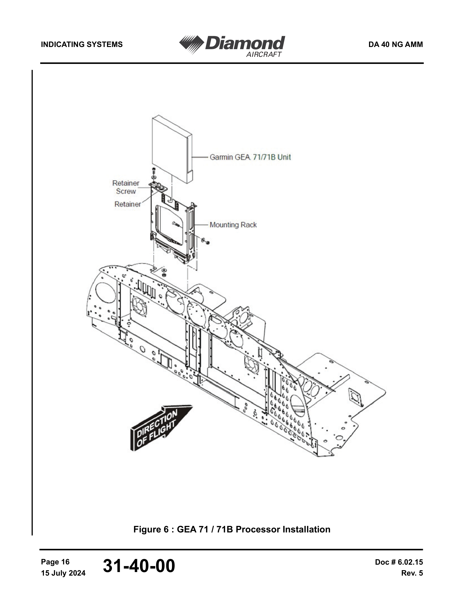
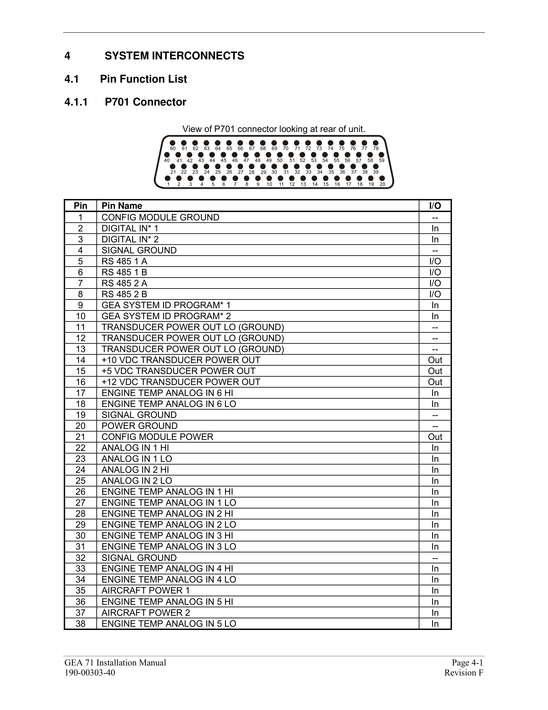

# N238PS — G1000 LOW VOLTS Troubleshooting Guide

**Aircraft:** N238PS (Diamond DA40NG, MAM40-858)
**Problem:** G1000 NXi displays lower voltage than actual bus voltage, causing intermittent LOW VOLTS annunciations
**Date:** February 2026
**Prepared by:** Aircraft Owner (Ingram Leedy)

---

## Table of Contents

1. [The Problem](#the-problem)
2. [How We Know It's Real](#how-we-know-its-real)
3. [When It Started and How It's Getting Worse](#when-it-started-and-how-its-getting-worse)
4. [What Has Already Been Tried](#what-has-already-been-tried-and-didnt-fix-it)
5. [What's Causing It](#whats-causing-it)
6. [Where to Look](#where-to-look)
7. [How to Test](#how-to-test)
8. [How to Verify the Fix](#how-to-verify-the-fix)
9. [AMM References](#amm-references)
10. [Summary](#summary)

---

## The Problem

The G1000 consistently reads **1–2 volts lower** than actual bus voltage, with transient dips up to **5.6 volts low** during high-current events. This causes false LOW VOLTS annunciations in flight even though the electrical system is charging normally.

### FlySto LOW VOLTS Events (In-Flight)

These FlySto screenshots show actual LOW VOLTS events captured from G1000 flight logs. The voltage drops below the 25V threshold repeatedly during normal flight operations:

**85 seconds below 25V** — approach and taxi at KBOW, voltage swinging wildly between 24–27V:


**18 seconds below 25V** — during landing, and **5 seconds below 25V** — at altitude during cruise:


These dips are **not real** — the independent VDL48 logger shows the bus voltage is steady at ~28V during these same periods. The G1000 is the only instrument seeing these drops.

## How We Know It's Real

Three independent measurements were taken on the same aircraft, on the same flights. Two agree. One doesn't.

| Source | Where It Measures | Average Reading | Verdict |
|--------|------------------|-----------------|---------|
| **VDL48 data logger** (plugged into AUX POWER) | Direct battery voltage | **28.3V** | Correct |
| **ECU battery voltage** (engine computer) | Separate bus and ground path | **27.8V** | Correct |
| **G1000 volt1** | Through instrument panel ground studs | **26.9V** | **Reads low** |

The VDL48 and ECU agree — the bus voltage is normal (~28V with alternator). The G1000 is the only instrument reading low.

### How the Data Was Collected

| Data Source | Collection Method | Sample Rate | Coverage |
|-------------|------------------|-------------|----------|
| **G1000 NXi flight logs** | Automatically collected every flight by the **Flight Stream 510 (AirSync)** and uploaded to [FlySto.net](https://flysto.net). CSV source files downloaded from FlySto. | 1 second | **184 flights**, Jul 2023 – Feb 2026 (entire aircraft history since delivery) |
| **AE300 ECU data logs** | Extracted from the ECU's built-in data logger via USB using **AustroWizard** software (Austro Engine's download tool). The encrypted `.ae3` binary log files were then decrypted and parsed into readable CSV using **AustroViewer** ([github.com/ingramleedy/AustroViewer](https://github.com/ingramleedy/AustroViewer), private repo). The ECU records 16 channels including battery voltage (channel 808) every engine run automatically. | 1 second | **265 sessions**, Oct 2023 – Feb 2026 |
| **VDL48 voltage logger** | Triplett VDL48 standalone data logger plugged into AUX POWER plug (HOT BUS, direct battery) | 2 seconds | **2 flights** on Feb 8, 2026 (3.5 hours flight time + 1.4 hours ground idle) |

- The **G1000 logs** `volt1` — the bus voltage displayed on the PFD/MFD, measured by the GEA 71S at its power pins
- The **ECU logs** `Battery Voltage` (channel 808) — the AE300 engine computer's own battery voltage reading, measured through a separate bus (ECU BUS) and separate ground path (GS-RP studs)
- The **VDL48** measures voltage at the AUX POWER plug on the HOT BUS — a direct connection to the battery through only a 5A fuse, no relays or breakers. This gives the cleanest reference of actual bus voltage.

All three sources were time-aligned and compared using paired statistical analysis. The full analysis scripts and raw data are available in the project repository at [github.com/ingramleedy/volts](https://github.com/ingramleedy/volts).

### Ground Test (Aug 18, 2025 — battery only, no engine)

| Condition | Meter at AUX POWER | G1000 Display | Difference |
|-----------|-------------------|---------------|------------|
| Master ON, G1000 on, no other loads | **25.2V** | **23.7V** | **-1.5V** |

The offset exists on the ground with battery only. This rules out the alternator, voltage regulator, and charging system entirely.

### Why the Battery Matters (but isn't the cause)

The ground path drops ~1.4V regardless of battery condition. But the higher the starting bus voltage, the more headroom the G1000 has before hitting the 25V LOW VOLTS threshold. A fully charged battery with alternator running keeps the bus at ~28V, so the G1000 reads ~26.6V — above the threshold most of the time. If the battery is weak or undercharged, the bus sits lower and the G1000 dips below 25V more easily.

The owner installed a **BatteryMinder** trickle charger and keeps the battery fully maintained between flights. This maximizes voltage headroom and keeps the G1000 reading within operational margins most of the time — but it's a workaround, not a fix. HIGH-current transient loads (radio TX, autopilot servos, flaps) still cause dips that break through even that margin, which is what triggers the LOW VOLTS annunciations seen in the FlySto screenshots above.

## When It Started and How It's Getting Worse

### The Problem Existed From Day One

Comparing N238PS to another DA40NG (N541SA) shows something was never right — even from the delivery flight:


N541SA's G1000 reads rock-steady voltage at ~27.8V with barely any fluctuation. N238PS has **never** been this stable:

| Metric | N541SA | N238PS Brand New (Jul 2023) | N238PS Pre-Feb 2024 | N238PS Post-Feb 2024 |
|--------|--------|---------------------------|--------------------|--------------------|
| Mean voltage | ~27.8V | 27.55V | 27.44V | 26.86V |
| Noise | ~0.05–0.10V | 0.36V | 0.38V | 0.51V |
| Peak-to-peak range | ~0.3V | 4.4V | 4.6V | 5.2V |
| Time below 27V | ~0% | 6.2% | 6.2% | **53.5%** |

Even from delivery, N238PS was reading **0.25V low** and had **4–5x more voltage noise** than N541SA. This suggests a marginal ground connection has existed since the factory — the Feb 2024 shop visit then made it significantly worse.

### The Change-Point: February 2024

Statistical analysis of **184 flight logs** (Jul 2023 – Feb 2026) pinpoints exactly when the readings shifted. A statistically significant change-point was detected on **February 29, 2024**:

| Period | Mean G1000 Voltage | Voltage Noise |
|--------|-------------------|---------------|
| Before shop visit (53 flights) | 27.44V | 0.25V |
| After shop visit (131 flights) | 26.90V | 0.39V |
| **Change** | **-0.54V** | **+55% noisier** |

The ECU voltage did NOT change — it reads a steady 27.82V throughout the entire period. The problem is G1000-specific. The Feb 2024 shop visit made a pre-existing marginal connection worse, pushing it into LOW VOLTS territory.


**How to read this chart:**

- **Top panel** — Each dot is one flight's average voltage. Green = before Feb 2024, red = after. The ECU dots along the top stay flat at ~27.8V the entire time — the actual bus voltage never changed. Only the G1000 dropped.
- **Middle panel** — A trend line showing the problem is getting progressively worse over time, with a clear inflection at Feb 2024.
- **Bottom panel** — Voltage noise (how much the reading jumps around during each flight). After Feb 2024, noise increased 55% — consistent with a loose or corroded connection that vibration makes worse.

### What Happened During That Shop Visit (Feb 2024)

The engine R&R (oil leak) was not the only work performed. During the same visit:

1. **Engine removed and reinstalled** — oil sump gasket and cylinder head cover (firewall connectors disconnected/reconnected)
2. **Alternator #2 replaced** — the RACC (AC system) wasn't turning on and wasn't getting power to the AUX switch
3. **RACC relay troubleshooting** — relays in the **aft avionics bay** were inspected to diagnose the RACC power issue
4. **GSA 91 pitch servo replaced** — autopilot pitch servo (also in the aft area)

The scope of this visit was extensive — engine R&R, alternator swap, relay troubleshooting in the aft bay, servo replacement. Panels were opened, harnesses were moved, and connectors were handled throughout the aircraft. Something during this visit disturbed a ground connection, and nobody noticed the G1000 was now reading a volt low.

A second engine R&R in Jul 2025 (piston crack) did **not** fix the problem, ruling out the firewall pass-through connectors (which were reconnected during that work). The GSA 91 pitch servo was also replaced a second time — also with no improvement.

## What Has Already Been Tried (and didn't fix it)

| Date | Action | Result |
|------|--------|--------|
| Feb 2024 | Replaced alternator #2 (RACC) + RACC relay troubleshooting | Fixed RACC — but G1000 voltage problem started here |
| Feb 2024 | Replaced GSA 91 pitch servo | No improvement on voltage |
| Apr 2024 | Replaced voltage regulator | No improvement |
| Jun 2024 | Replaced voltage regulator again + repaired wire at P2208 | No improvement |
| Jul 2024 | Replaced P2413 connector (repinned HSDB harness) | Fixed COM/NAV/GPS cycling issue — no improvement on voltage |
| Feb 2025 | Replaced main alternator AND voltage regulator (3rd time) | No improvement |
| Jul 2025 | Engine R&R #2 + new battery + GSA 91 pitch servo replaced again | No improvement |
| Feb 2026 | Cleaned GDL 69A pins (CH.23) | No improvement — wrong unit |

None of these addressed the ground path. The alternator and regulators were never the problem — the ECU confirms the charging system works correctly.

The Feb 2026 pin cleaning targeted the **GDL 69A** (SiriusXM datalink transceiver, CH.23). The voltage measurement comes from the **GEA 71S** (Engine/Airframe unit, connector P701) — its power ground pin (Pin 20, wire 77016A22N to GS-IP-14) was not inspected.

**Note:** This aircraft has a history of connector/pin problems. In May 2023, the G1000 experienced repeated COM/NAV/GPS/AHRS cycling and autopilot disconnects during an IFR flight — that issue was resolved by cleaning pins and reseating the P2413 HSDB harness connector (Jul 2024). Connector issues are a known problem on this airframe. The voltage problem is the same type of issue — a bad connection — just at a different connector/stud that hasn't been addressed yet.

## What's Causing It

**A high-resistance ground connection** somewhere in the GEA 71S's ground return path.

### Where the Voltage Is Actually Measured

The G1000 bus voltage ("volt1") is measured by the **GEA 71S** (Engine/Airframe unit), which is mounted on the **instrument panel shelf** (AMM 31-40-00, p.985, Figure 6):

**GEA 71S Installation Location (AMM 31-40-00, Figure 6):**



**AMM Schematic — G1000 NXi GEA 71S Wiring (D44-9231-60-03_01, Sheet 4/6):**


- The GEA 71S **measures its own power supply voltage internally** — there is no separate external sense wire
- **Power input:** Pin 35 (AIRCRAFT POWER) via wire **77015A22** from the Essential Bus through the **5A ENG INST** breaker
- **Ground reference:** Pin 20 (POWER GROUND) via wire **77016A22N** to ground stud **GS-IP-14**
- The displayed voltage = what arrives at Pin 35 minus what's at Pin 20

No software calibration or correction is applied — the G1000 displays exactly what the GEA 71S hardware measures. The offset is a **hardware voltage drop**, not a calibration or firmware problem. Adjusting the software offset would only mask the symptom — the underlying problem would remain and continue to degrade.

### How a Bad Ground Creates a False Low Reading

If there's extra resistance in the ground path, current flowing through that resistance creates a voltage drop that only the GEA sees:

```
V_displayed = V_actual - (I_load × R_bad_ground)
```

At 20 amps of avionics load, just **0.05 ohms** of extra ground resistance = **1.0 volt** of under-reading. That's all it takes.

### The Voltage Measurement Path

```
Essential Bus → 5A ENG INST breaker → wire 77015A22 → GEA 71S Pin 35 (POWER)
                                                          ↓
                                               GEA measures voltage internally
                                                          ↓
                                          GEA 71S Pin 20 (POWER GROUND)
                                                          ↓
                                          wire 77016A22N → GS-IP-14 → bus bar → fuselage → battery negative
                                                           ^^^^^^^^^^^^^^^^^^^^^^^^^^^^^^^^^^^^^^^^^^^^^^^^^
                                                           HIGH RESISTANCE somewhere in here
```

### Why Only the G1000 Reads Low

The GEA 71S grounds through **GS-IP-14**, which routes through the instrument panel bus bar, IP frame, and fuselage structure to reach the battery negative terminal. Every joint in that chain adds potential resistance.

The ECU (located under the pilot's seat) grounds through the **GS-RP** (Ground Stud — Relay Panel) studs, which use a separate ground path to battery negative. The ECU reads correctly — its ground path doesn't share the instrument panel's bus bar, frame bonds, or GS-IP studs.

```
GEA 71S → GS-IP-14 → IP bus bar → IP frame → fuselage → battery negative  (reads low)

ECU     → GS-RP studs → separate ground path → battery negative            (reads correctly)
```

## Where to Look

### Instrument Panel

The **GEA 71S** — the unit that actually measures the voltage — is on the **instrument panel shelf** (AMM 31-40-00, p.985). Its connector P701 and ground stud GS-IP-14 are both in this area.

**Inspect:**
- **GEA 71S connector P701** — is it fully seated with lock engaged? This is the voltage sensor unit. Check Pin 20 (power ground) and Pin 35 (aircraft power) specifically.
- **Ground stud GS-IP-14** — this is where the GEA 71S power ground wire (77016A22N) terminates. Check for loose nut, corrosion, or paint under the ring terminal.
- All GS-IP ground studs on the IP bus bar (see table below)
- Look for anything that appears disturbed, loose, or not fully reconnected

### Ground Stud Locations (GS-IP Series)

All G1000 components ground to the **GS-IP** (Ground Stud — Instrument Panel) group. These are the specific studs and what's connected to each:

| Ground Stud | What's Connected | Priority |
|-------------|-----------------|----------|
| **GS IP-14** | **GEA 71S** (wire 77016A22N, 22 AWG) — Pin 20 POWER GROUND | **CHECK FIRST** — this is the voltage sensor's ground reference |
| **GS IP-6** | GIA 63W #1 (wire 23011A20N, 20 AWG) + GIA 63W #2 (wire 23001A20N, 20 AWG) | **CHECK SECOND** — both avionics computers share this one stud |
| **GS IP-4** | GDU 1050 PFD + GDU 1060 MFD + GMA 1360 Audio + COM 1 (4 LRUs) | Check third — most heavily loaded stud |
| **GS IP-5** | GRS 79 AHRS #1 + AHRS #2 (via GS AVB bus bar) | Check fourth |
| **GS IP-3** | GPS/NAV 1 + Wx 500 Stormscope | Lower priority |
| **GS IP-10** | GPS/NAV 2 | Lower priority |

### What to Look For at Each Ground Stud

- Loose nut (vibration loosens over time)
- Corrosion under the ring terminal (green/white buildup)
- Paint, primer, or anodize between the ring terminal and the stud surface
- Cracked or deformed ring terminal
- Multiple ring terminals stacked on one stud not all making good contact
- Lock washer missing or flattened

### LRU Connectors to Inspect

The voltage reading comes from the GEA 71S — its ground pin is the most critical. The displays (GDU) are on the instrument panel and share the same GS-IP bus bar:

| Unit | Connector | Ground Pin | Wire | Ground Stud | What It Does |
|------|-----------|-----------|------|-------------|-------------|
| **GEA 71S** | P701 | **Pin 20 (POWER GROUND)** | **77016A22N (22 AWG)** | **GS-IP-14** | **THIS IS THE VOLTAGE SENSOR** — measures its own power supply internally |
| **GDU 1050 PFD** | 1P1600 | Pin 27 (POWER GROUND) | 31106A22N (22 AWG) | GS-IP-4 | Primary flight display |
| **GDU 1060 MFD** | 2P1601 | Pin 27 (POWER GROUND) | 31158A22N (22 AWG) | GS-IP-4 | Multi-function display |

### GEA 71S P701 Pin Reference (Garmin 190-00303-40)

**P701 Connector — view looking at rear of unit:**



Full pin listing: [GEA 71 Installation Manual (190-00303-40)](docs/GEA71_InstallationManual.pdf) — pages 23–26

When you have the GEA 71S connector P701 in hand, these are the pins relevant to the voltage problem:

| Pin | Function | What It Does |
|-----|----------|-------------|
| **20** | **POWER GROUND** | **Ground reference for voltage measurement — this is the suspect pin** |
| **78** | **POWER GROUND** | **Second power ground — same ground network** |
| **35** | **AIRCRAFT POWER 1** | Power input from Essential Bus (5A ENG INST breaker) |
| 37 | AIRCRAFT POWER 2 | Second power input |
| 46 | ANALOG IN 5 HI | Bus voltage sense (high side) |
| 47 | ANALOG IN 5 LO | Bus voltage sense (low side) |
| 42 | ANALOG IN 3 HI | Alt amps sensor signal (not affected by bad ground) |
| 43 | ANALOG IN 3 LO | Alt amps sensor signal (not affected by bad ground) |
| 14 | +10V TRANSDUCER POWER | Powers the alternator current sensor |
| 11–13 | TRANSDUCER GROUND | Ground return for current sensor |
| 5–8 | RS 485 1A/1B, 2A/2B | Digital data bus to GIA computers |

The amps reading on the G1000 MFD uses a separate **Hall-effect current transducer** with its own power (Pin 14) and differential output (Pins 42/43). The bad ground at Pin 20 does **not** affect the amp reading — only the voltage reading.

**At each connector, check for:**
- Backed-out pins (look from the rear of the connector)
- Corrosion on pin or socket contacts
- Connector not fully seated or lock not engaged
- Damaged strain relief (wires pulling on connector)

### Ground Bus Bar

The GS-IP studs connect to a ground bus bar mounted on the instrument panel frame. Check:
- Bus bar mounting bolts tight
- Clean metal-to-metal contact between bus bar and IP frame
- No cracks in the bus bar

### IP Frame to Fuselage Bond

The instrument panel frame connects to the fuselage structure. Check:
- Bonding strap present and tight (if required by AMM)
- No paint between bonding surfaces
- Metal-to-metal contact confirmed

## How to Test

### Resistance Measurements

**Setup:** Battery master OFF, **battery negative cable physically disconnected from the battery post**.

**Why disconnect the battery?** The meter needs to be the only source of current in the circuit. If the battery is still connected, its 28V overwhelms the meter's tiny test signal and readings will be wrong. Battery master OFF alone is not enough — the HOT BUS and BATT BUS remain live. Physically disconnecting the negative cable is the only way to fully isolate the circuit.

**Recommended meter:** Fluke 289 or similar DMM with 0.01Ω resolution and **REL (relative) mode** for auto-zeroing lead resistance. Set the meter to the lowest ohm range (600Ω range on the Fluke 289 gives 0.01Ω resolution).

**Practical setup for long-distance measurements:** The GEA 71S is on the instrument panel shelf (front) while the battery is in the aft bay — too far apart for standard 1-meter test leads. To reach both points:

1. Get a length of **heavy gauge wire** (12–14 AWG, 4–5 meters) with alligator clips on each end
2. Clip one end to the **black DMM lead**
3. Clip the other end to the **red DMM lead**
4. **Zero the leads:** Press **REL** on the Fluke 289 — this zeros out the red lead + extension wire + black lead. The display should read 0.00Ω. The aircraft is not in the circuit during zeroing.
5. Unclip the extension wire from the **red DMM lead**. Lay the extension wire through the cabin from instrument panel to aft bay. Clip the free end to the **disconnected battery negative cable lug** — this is the cable end you just pulled off the battery post. It's still connected to the aircraft's ground network. Do NOT clip to the battery post itself (it's isolated once the cable is removed).
6. Place the red probe on the test point (e.g., P701 pin 20) — the meter current flows from the red probe through the aircraft's ground wiring to the cable lug. The reading is the true ground path resistance with lead resistance already zeroed out.

| Test | From | To | Expected | If High |
|------|------|----|----------|---------|
| **1. End-to-end** | GEA 71S ground pin (P701 pin 20) | Battery negative cable lug | **< 0.050 Ω** | Confirms ground path problem — continue testing |
| **2. Fuselage path** | Bare fuselage metal near IP | Battery negative cable lug | < 0.010 Ω | Check battery cable, fuselage ground point |
| **3. IP-to-fuselage** | IP frame metal | Bare fuselage metal | < 0.005 Ω | Check bonding strap, IP mounting |
| **4. Each GS-IP stud** | Each GS-IP stud terminal | IP frame metal | < 0.005 Ω | Clean and retorque that stud |
| **5. Each LRU ground** | LRU ground pin (at connector) | Its GS-IP stud | < 0.010 Ω | Check connector pin, harness wire, crimp |

### Where to Put the Probes (Step by Step)

**Test 1 — End-to-End (most important, do this first):**
- **Black probe:** Connected via extension wire to the **disconnected battery negative cable lug** in the aft bay (see setup above). REL should already be set from the zeroing step.
- **Red probe:** Touch the back of **pin 20** on connector P701 (the aircraft-side harness connector for the GEA 71S, on the instrument panel shelf). This is the power ground pin — the ground reference for the voltage measurement. If the connector is mated to the unit, you'll need to back-probe or disconnect it to access the pin.
- This measures the entire ground path at once. If it reads good (< 0.050 Ω), the ground path is fine and the problem is elsewhere. If high, continue with Tests 2–5 to find which segment has the resistance.

**Test 2 — Fuselage Path:**
- **Black probe:** Still connected via extension wire to **disconnected battery negative cable lug** (REL still active).
- **Red probe:** Bare/scraped fuselage metal **near the instrument panel** — find an unpainted screw head or lightly sand a small spot to get bare metal contact.
- Tests the fuselage structure itself as a conductor from front to back.

**Tests 3–5** are all at the instrument panel — no extension wire needed. Disconnect the extension, touch the standard leads together, and press REL again to re-zero with just the standard leads.

**Test 3 — IP Frame to Fuselage:**
- **Red probe:** Bare metal on the **instrument panel frame** — the structural part the ground studs are mounted to.
- **Black probe:** Bare **fuselage metal** nearby (same spot from Test 2).
- If this reads high, the bonding strap between the IP frame and fuselage is the problem.

**Test 4 — Each GS-IP Ground Stud:**
- **Red probe:** The **nut/terminal surface** of each GS-IP stud — where the ring terminals are stacked.
- **Black probe:** Bare **IP frame metal** right next to that stud.
- Test each stud individually: **GS IP-14** (GEA voltage sensor ground — most critical), GS IP-6, GS IP-4, GS IP-5, GS IP-3, GS IP-10. If one reads high while others read near-zero, that's your culprit — clean all surfaces and retorque.

**Test 5 — Each LRU Ground Wire:**
- **Red probe:** The **ground pin** at the aircraft-side harness connector — start with **P701 pin 20** (GEA 71S, the voltage sensor).
- **Black probe:** The **GS-IP stud** that wire runs to — **GS IP-14** for the GEA 71S.
- Tests the wire, crimp, and connector pin between the LRU and its ground stud. Repeat for each connector on the instrument panel.

### Isolation Strategy

Start with **Test 1**. If high, the bad segment will stand out — everything else reads near-zero while the problem connection shows the bulk of the resistance. Work through Tests 2–5 in order to narrow down which segment carries the extra resistance.

**Important: Don't stop after finding one bad connection.** The data shows the ground path was never as clean as other DA40NGs — even from the factory. There may be more than one marginal connection. Clean and retorque **all** GS-IP ground studs and reseat **all** G1000 LRU connectors while the panels are open.

### What the Numbers Mean

| End-to-End Resistance | Voltage Drop at 20A | What It Means |
|----------------------|---------------------|---------------|
| < 0.010 Ω | < 0.2V | Normal — clean ground path |
| 0.010 – 0.025 Ω | 0.2 – 0.5V | Marginal — may worsen with vibration |
| 0.025 – 0.050 Ω | 0.5 – 1.0V | Degraded — consistent with the ~1.4V average offset we measured |
| 0.050 – 0.100 Ω | 1.0 – 2.0V | Failed — consistent with the -5.6V worst-case dips |
| > 0.100 Ω | > 2.0V | Severe |

**We estimate the total ground path resistance is approximately 0.05–0.09 ohms** based on the observed voltage offsets and typical avionics current draw.

## How to Verify the Fix

A ground test alone cannot reproduce the problem reliably. The offset is worse in flight due to vibration and thermal effects on the bad connection.

**After repair:**
1. Repeat the end-to-end resistance measurement — should be < 0.010 Ω
2. Power on avionics and check G1000 voltage reads within 0.3V of a meter at the AUX POWER plug
3. **Flight test** — fly at least 30 minutes with varied loads (radio TX, autopilot, flaps), then compare:
   - **Option A — ECU data (easiest):** The AE300 ECU logs battery voltage every flight automatically. Download the ECU session log and compare against the G1000 log. No extra equipment needed.
   - **Option B — VDL48 (independent reference):** Install VDL48 on AUX POWER plug, same setup as the Feb 8 analysis.
   - **Pass criteria:** G1000 vs reference mean offset < 0.3V, no dips > 1.0V, noise < 0.30V
   - The analysis scripts in this repository can process either data source automatically

## AMM References

| Reference | Content |
|-----------|---------|
| AMM 24-60-00 | Bus structure, power distribution, troubleshooting table |
| AMM 31-40-00, p.985-986 | GEA 71S location (instrument panel shelf), Figure 6 |
| AMM CH.92, D44-9224-30-01 through -05 | Electrical system wiring diagrams (power distribution) |
| AMM CH.92, D44-9231-60-03_01 | G1000 NXi wiring diagrams (Sheets 2-6, pages 1908-1912) |
| AMM CH.31 | GDU 1050/1060 connector pinouts |
| AMM CH.34 | GIA 63W connector pinouts |
| AMM CH.23 | GMA, GTX, GDL connector pinouts |
| [Garmin 190-00303-40](docs/GEA71_InstallationManual.pdf) | GEA 71 Installation Manual — P701/P702 connector pin function lists (pages 23-26) |

## Summary

The G1000 reads low because of a high-resistance ground connection — not a calibration issue, not a charging system issue, not a firmware issue. The voltage was never as stable as other DA40NGs (even from delivery), and it got significantly worse after the Feb 2024 shop visit. Three voltage regulators, two alternators, and two pitch servos have been replaced — none fixed it because the ground path was never addressed. Start at the **instrument panel shelf** with GEA 71S connector P701 (Pin 20) and ground stud GS-IP-14. Clean and retorque **all** GS-IP ground studs and reseat **all** G1000 connectors on the instrument panel. Don't stop after finding one bad connection — the data shows there may be more than one marginal joint.
