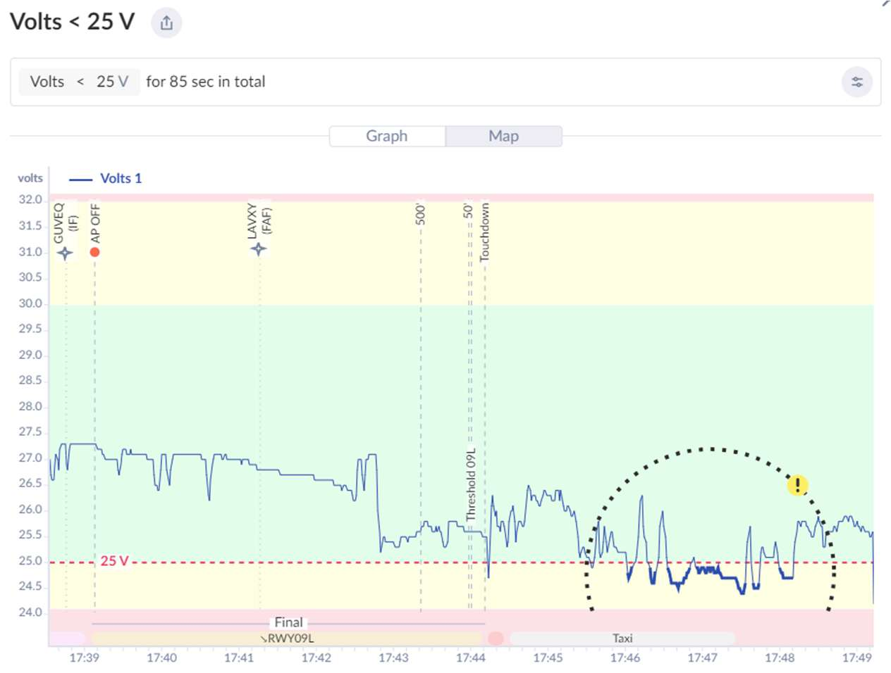
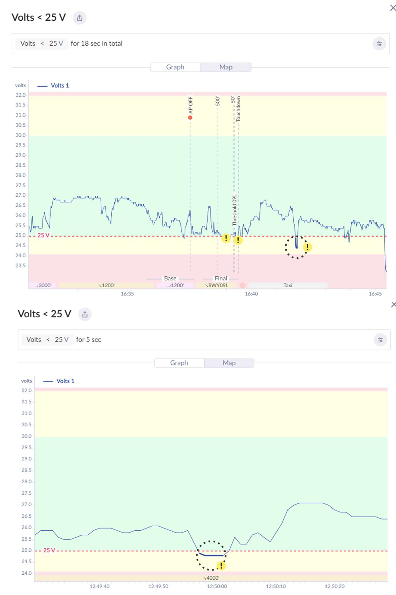
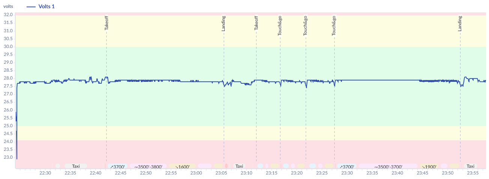
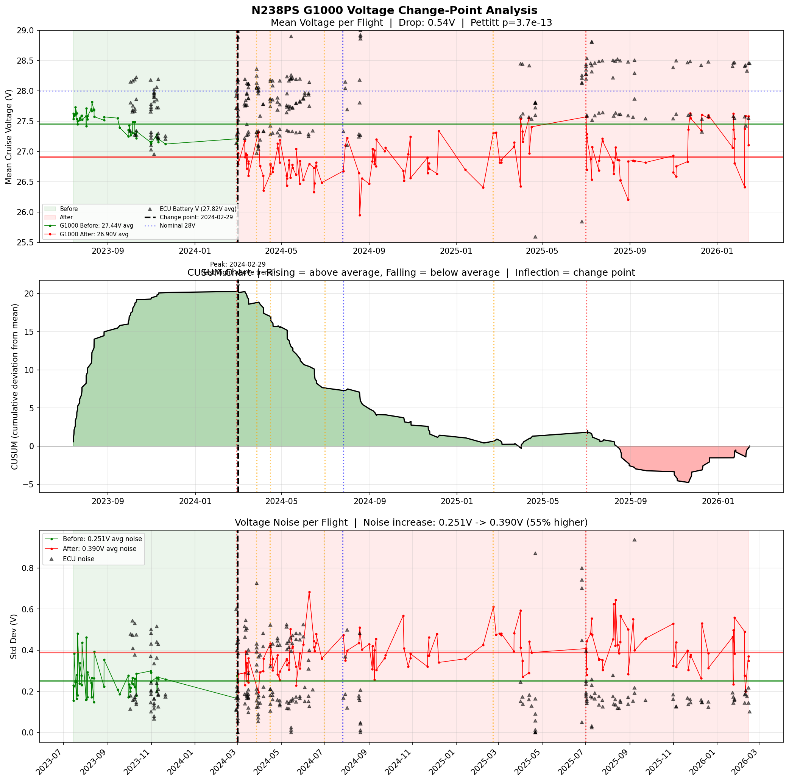
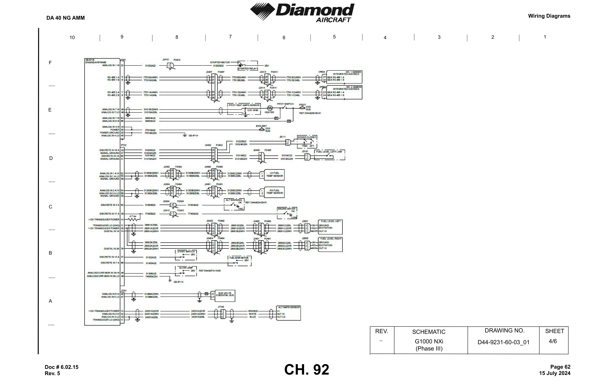

# N238PS — G1000 LOW VOLTS Troubleshooting Guide

**Aircraft:** N238PS (Diamond DA40NG, MAM40-858)
**Problem:** G1000 NXi displays lower voltage than actual bus voltage, causing intermittent LOW VOLTS annunciations
**Date:** February 2026
**Prepared by:** Aircraft Owner (Ingram Leedy)

---

## Table of Contents

1. [The Problem](#the-problem)
2. [How We Know It's Real](#how-we-know-its-real)
3. [When It Started and How It's Getting Worse](#when-it-started-and-how-its-getting-worse)
4. [What Has Already Been Tried](#what-has-already-been-tried-and-didnt-fix-it)
5. [What's Causing It](#whats-causing-it)
6. [Where to Look](#where-to-look)
7. [How to Test](#how-to-test)
8. [How to Verify the Fix](#how-to-verify-the-fix)
9. [AMM References](#amm-references)
10. [Summary](#summary)
11. [Appendix A — DA40 NG Electrical System (AFM)](#appendix-a--da40-ng-electrical-system-afm)
12. [Appendix B — Instrument Panel Circuit Breaker Layout (AFM)](#appendix-b--instrument-panel-circuit-breaker-layout-afm)

---

## The Problem

The G1000 consistently reads **1–2 volts lower** than actual bus voltage, with transient dips up to **5.6 volts low** during high-current events. This causes false LOW VOLTS annunciations in flight even though the electrical system is charging normally.

### FlySto LOW VOLTS Events (In-Flight)

These FlySto screenshots show actual LOW VOLTS events captured from G1000 flight logs. The voltage drops below the 25V threshold repeatedly during normal flight operations:

**85 seconds below 25V** — approach and taxi at KBOW, voltage swinging wildly between 24–27V:



**18 seconds below 25V** — during landing, and **5 seconds below 25V** — at altitude during cruise:



These dips are **not real** — the independent VDL48 logger shows the bus voltage is steady at ~28V during these same periods. The G1000 is the only instrument seeing these drops.

### Garmin's Prescribed Troubleshooting for LOW VOLTS

The Garmin G1000 System Maintenance Manual (190-00545-01) CAUTION Alerts table specifies what to do when LOW VOLTS appears:


> **LOW VOLTS** — On-board voltage is below 24 volts.
> **Solution:** Inspect GEA 71 connector & wiring. Troubleshoot aircraft electrical system according to DA 40 Airplane Maintenance Manual instructions.

Garmin's own manual names the **GEA 71 connector & wiring** as the first thing to inspect — which is exactly what this guide recommends. The analysis in this document identifies *which specific* GEA 71 connector pins and wires are the most likely problem.

## How We Know It's Real

Three independent measurements were taken on the same aircraft, on the same flights. Two agree. One doesn't.

| Source | Where It Measures | Average Reading | Verdict |
|--------|------------------|-----------------|---------|
| **VDL48 data logger** (plugged into AUX POWER) | Direct battery voltage | **28.3V** | Correct |
| **ECU battery voltage** (engine computer) | Separate bus and ground path | **27.8V** | Correct |
| **G1000 volt1** | Through instrument panel ground studs | **26.9V** | **Reads low** |

The VDL48 and ECU agree — the bus voltage is normal (~28V with alternator). The G1000 is the only instrument reading low.

### How the Data Was Collected

| Data Source | Collection Method | Sample Rate | Coverage |
|-------------|------------------|-------------|----------|
| **G1000 NXi flight logs** | Automatically collected every flight by the **Flight Stream 510 (AirSync)** and uploaded to [FlySto.net](https://flysto.net). CSV source files downloaded from FlySto. | 1 second | **184 flights**, Jul 2023 – Feb 2026 (entire aircraft history since delivery) |
| **AE300 ECU data logs** | Extracted from the ECU's built-in data logger via USB using **AE300-Wizard** software (Austro Engine's download tool). The encrypted `.ae3` binary log files were then decrypted and parsed into readable CSV using **AustroViewer** ([github.com/ingramleedy/AustroViewer](https://github.com/ingramleedy/AustroViewer), private repo). The ECU records 16 channels including battery voltage (channel 808) every engine run automatically. | 1 second | **265 sessions**, Oct 2023 – Feb 2026 |
| **VDL48 voltage logger** | Triplett VDL48 standalone data logger plugged into AUX POWER plug (HOT BUS, direct battery) | 2 seconds | **2 flights** on Feb 8, 2026 (3.5 hours flight time + 1.4 hours ground idle) |

- The **G1000 logs** `volt1` — the bus voltage displayed on the PFD/MFD, measured by the GEA 71S via its voltage sense input (Pin 46 (ANALOG IN 5 HI) / Pin 47 (ANALOG IN 5 LO)) from the Essential Bus
- The **ECU logs** `Battery Voltage` (channel 808) — the AE300 engine computer's own battery voltage reading, measured through a separate bus (ECU BUS) but sharing the **same instrument panel ground path** (GS-IP-3 and GS-IP-4 studs, per AMM p1936-1937, Drawing D44-9274-10-00)
- The **VDL48** measures voltage at the AUX POWER plug on the HOT BUS — a direct connection to the battery through only a 5A fuse, no relays or breakers. This gives the cleanest reference of actual bus voltage.

All three sources were time-aligned and compared using paired statistical analysis. The full analysis scripts and raw data are available in the project repository at [github.com/ingramleedy/volts](https://github.com/ingramleedy/volts).

### Ground Test (Aug 18, 2025 — battery only, no engine)

| Condition | Meter at AUX POWER | G1000 Display | Difference |
|-----------|-------------------|---------------|------------|
| Master ON, G1000 on, no other loads | **25.2V** | **23.7V** | **-1.5V** |

The offset exists on the ground with battery only. This rules out the alternator, voltage regulator, and charging system entirely.

### Ground Tests (Feb 20, 2026 — battery vs GPU, same session)

Two tests performed back-to-back on the same day, same conditions:

| Condition | Meter at AUX POWER | G1000 Display | Difference |
|-----------|-------------------|---------------|------------|
| Battery only, G1000 on, no engine | **25.3V** | **24.0V** | **-1.3V** |
| GPU (Ground Power Unit) connected, G1000 on | **28.79V** | **28.6V** | **-0.19V** |

**Same aircraft, same day, same ground conditions** — the only variable is battery vs GPU power source. The 1.3V offset is present on battery and gone on GPU in the same session. This eliminates any argument about intermittency or contact resistance changing over time.

The **24.0V G1000 reading on battery** is right at the LOW VOLTS annunciation threshold (24V per the Garmin G1000 System Maintenance Manual). Any additional electrical load would push it below threshold and trigger the annunciation — which is exactly what happens in flight.

**Why the GPU test reads nearly correctly — and why it does NOT point to the battery negative terminal:**

The GEA 71S measures bus voltage using two sense wires on its P701 connector: **Pin 46 (ANALOG IN 5 HI)** reads the Essential Bus positive rail, and **Pin 47 (ANALOG IN 5 LO)** reads the Essential Bus ground. The displayed voltage is the difference: Pin 46 minus Pin 47. If Pin 47's ground connection has resistance, it "floats" above true ground, and the reading drops by that amount.

**The GPU may actually bypass the fault — specifically at Pin 47's ground.** The EPU (External Power Unit) negative connects to **GS-RP (Ground Stud - Relay Panel)** via wire 24405A6N (6 AWG), providing a second current sink in the aft fuselage. If Pin 47's Essential Bus ground (wire 31299A22BL) terminates at a structural/airframe ground point (consistent with the generic ground symbol on the schematic), that point may have a **lower-impedance path to GS-RP** than to battery negative through the degraded connection. The GPU at GS-RP effectively "pulls down" Pin 47's ground to the correct potential — explaining the near-zero offset.

This means the GPU test is **diagnostic**: it specifically supports Pin 47's ground as the fault location. The Aug 2025 battery test showed 1.5V offset on the ground (fault present without vibration), while the GPU test showed 0.19V (fault bypassed). The ECU is unaffected because it uses a wired ground path (GS-IP-3/4 → GS-IP bus bar → 24008A4N) that is intact and doesn't depend on the same structural ground as Pin 47.

**The ECU proves the shared GS-IP ground infrastructure is healthy:** Per AMM p1936-1937 (Drawing D44-9274-10-00, EECU Wiring), the AE300 ECU (under the pilot's seat) grounds to **GS-IP-3 and GS-IP-4** — the same instrument panel ground bus as the G1000. The ECU reads ~27.8V, correct. Since the ECU shares the GS-IP bus bar, wire 24008A4N, and aft ground termination with the G1000, all of that is proven healthy.

**Two primary suspects — both unique to the GEA 71S:**

1. **Pin 47 (ANALOG IN 5 LO) Essential Bus ground** — wire 31299A22BL (shielded) connects to the low side of the Essential Bus per the G1000 wiring diagram (D44-9231-60-03). The Electrical System schematic shows only a generic ground symbol — **the physical termination point is unknown and must be traced**. Since the GEA reads Pin 46 minus Pin 47 (differential), Pin 47 is the voltage measurement reference. Any resistance at this ground directly causes a low reading.

   **Why this is hard to find:** Other Diamond variant AMM wiring diagrams explicitly call out a specific ground stud (e.g. GS-IP-X) for the GEA voltage sense LO pin. On those aircraft, a mechanic can look up the stud number and go straight to it. **The DA40 NG schematic does not** — it shows only a generic ground symbol. This means Pin 47's ground on N238PS cannot be found from the schematic alone; the wire must be physically traced from P701 Pin 47 to wherever it terminates.

2. **GS-IP-14 / Pin 20 (POWER GROUND)** — wire 77016A22N. The GEA's power ground. May affect the reading through ADC common-mode issues if it floats far from Pin 47.

**The key unknown is where wire 31299A22BL (Pin 47) physically terminates. The shop must trace this wire.**

The near-zero offset with GPU (0.19V) vs the 1.5V offset on battery is explained by the **different test conditions**, not by time passing — the GPU provides an alternate ground return path that bypasses Pin 47's degraded ground. The fault is also **vibration/thermal-sensitive** — it worsens in flight (Feb 8 data: -1.4V average, -5.6V worst) but may test better on the ground without vibration. This matches the shop's Feb 15 finding that they "could not reproduce voltage drop on ground run."

### Why the Battery Matters (but isn't the cause)

The ground path drops ~1.4V regardless of battery condition. But the higher the starting bus voltage, the more headroom the G1000 has before hitting the 25V LOW VOLTS threshold. A fully charged battery with alternator running keeps the bus at ~28V, so the G1000 reads ~26.6V — above the threshold most of the time. If the battery is weak or undercharged, the bus sits lower and the G1000 dips below 25V more easily.

A **BatteryMinder** trickle charger was installed and keeps the battery fully maintained between flights when returned to the home hangar. However, when away from the home hangar this isn't used. When maintained, this maximizes voltage headroom and keeps the G1000 reading within operational margins most of the time — but it's a workaround, not a fix. High-current transient loads (radio TX, autopilot servos, flaps) still cause dips that break through even that margin, which is what triggers the LOW VOLTS annunciations seen in the FlySto screenshots above.

## When It Started and How It's Getting Worse

### The Problem Existed From Day One

Comparing N238PS to another DA40NG (N541SA) shows something was never right — even from the delivery flight:



N541SA's G1000 reads rock-steady voltage at ~27.8V with barely any fluctuation. N238PS has **never** been this stable:

| Metric | N541SA | N238PS Brand New (Jul 2023) | N238PS Pre-Feb 2024 | N238PS Post-Feb 2024 |
|--------|--------|---------------------------|--------------------|--------------------|
| Mean voltage | ~27.8V | 27.55V | 27.44V | 26.86V |
| Noise | ~0.05–0.10V | 0.36V | 0.38V | 0.51V |
| Peak-to-peak range | ~0.3V | 4.4V | 4.6V | 5.2V |
| Time below 27V | ~0% | 6.2% | 6.2% | **53.5%** |

Even from delivery, N238PS was reading **0.25V low** and had **4–5x more voltage noise** than N541SA. This suggests a marginal ground connection has existed since the factory — the Feb 2024 shop visit then made it significantly worse.

### The Change-Point: February 2024

Statistical analysis of **184 flight logs** (Jul 2023 – Feb 2026) pinpoints exactly when the readings shifted. A statistically significant change-point was detected on **February 29, 2024**:

| Period | Mean G1000 Voltage | Voltage Noise |
|--------|-------------------|---------------|
| Before shop visit (53 flights) | 27.44V | 0.25V |
| After shop visit (131 flights) | 26.90V | 0.39V |
| **Change** | **-0.54V** | **+55% noisier** |

The ECU voltage did NOT change — it reads a steady 27.82V throughout the entire period. The problem is G1000-specific. The Feb 2024 shop visit made a pre-existing marginal connection worse, pushing it into LOW VOLTS territory.



**How to read this chart:**

- **Top panel** — Each dot is one flight's average voltage. Green = before Feb 2024, red = after. The ECU dots along the top stay flat at ~27.8V the entire time — the actual bus voltage never changed. Only the G1000 dropped.
- **Middle panel** — A trend line showing the problem is getting progressively worse over time, with a clear inflection at Feb 2024.
- **Bottom panel** — Voltage noise (how much the reading jumps around during each flight). After Feb 2024, noise increased 55% — consistent with a loose or corroded connection that vibration makes worse.

### What Happened During That Shop Visit (Feb 2024)

The engine R&R (oil leak) was not the only work performed. During the same visit:

1. **Engine removed and reinstalled** — oil sump gasket and cylinder head cover (firewall connectors disconnected/reconnected)
2. **Alternator #2 replaced** — the RACC (AC system) wasn't turning on and wasn't getting power to the AUX switch
3. **RACC relay troubleshooting** — relays in the **aft avionics bay** were inspected to diagnose the RACC power issue
4. **GSA 91 pitch servo replaced** — autopilot pitch servo (also in the aft area)

The scope of this visit was extensive — engine R&R, alternator swap, relay troubleshooting in the aft bay, servo replacement. Panels were opened, harnesses were moved, and connectors were handled throughout the aircraft. Something during this visit disturbed a ground connection, and nobody noticed the G1000 was now reading a volt low.

A second engine R&R in Jul 2025 (piston crack) did **not** fix the problem, ruling out the firewall pass-through connectors (which were reconnected during that work). The GSA 91 pitch servo was also replaced a second time — also with no improvement.

## What Has Already Been Tried (and didn't fix it)

| Date | Action | Result |
|------|--------|--------|
| Feb 2024 | Replaced alternator #2 (RACC) + RACC relay troubleshooting | Fixed RACC — but G1000 voltage problem started here |
| Feb 2024 | Replaced GSA 91 pitch servo | No improvement on voltage |
| Apr 2024 | Replaced voltage regulator | No improvement |
| Jun 2024 | Replaced voltage regulator again + repaired wire at P2208 | No improvement |
| Jul 2024 | Replaced P2413 connector (repinned HSDB harness) | Fixed COM/NAV/GPS cycling issue — no improvement on voltage |
| Feb 2025 | Replaced main alternator AND voltage regulator (3rd time) | No improvement |
| Jul 2025 | Engine R&R #2 + new battery + GSA 91 pitch servo replaced again | No improvement |
| Feb 2026 | Cleaned GDL 69A pins (CH.23) | No improvement — wrong unit |

None of these addressed the ground path. The alternator and regulators were never the problem — the ECU confirms the charging system works correctly.

The Feb 2026 pin cleaning targeted the **GDL 69A** (SiriusXM datalink transceiver, CH.23). The voltage measurement comes from the **GEA 71S** (Engine/Airframe unit, connector P701) — its power ground pins (Pin 20 (POWER GROUND) and Pin 45 (ANALOG IN 4 LO), wire 77016A22N to **GS-IP-14 (Ground Stud - Instrument Panel #14)**) were not inspected, nor were the voltage sense pins (Pin 46 (ANALOG IN 5 HI) and Pin 47 (ANALOG IN 5 LO), wires 31299A22WH/BL to the Essential Bus).

**Note:** This aircraft has a history of connector/pin problems. In May 2023, the G1000 experienced repeated COM/NAV/GPS/AHRS cycling and autopilot disconnects during an IFR flight — that issue was resolved by cleaning pins and reseating the P2413 HSDB harness connector (Jul 2024). Connector issues are a known problem on this airframe. The voltage problem is the same type of issue — a bad connection — just at a different connector/stud that hasn't been addressed yet.

## What's Causing It

**A high-resistance ground connection** somewhere in the GEA 71S's ground return path.

### Where the Voltage Is Actually Measured

The G1000 bus voltage ("volt1") is measured by the **GEA 71S** (Engine/Airframe unit), mounted on the **instrument panel shelf** behind the MFD (AMM 31-40-00, p.985, Figure 6). It is the bottom-left unit on the shelf, accessible by removing the lower instrument panel cover.

**AMM Schematic — G1000 NXi GEA 71S Wiring (D44-9231-60-03, G1000 NXi Phase I & II, Sheet 4/6):**



- Per the AFM (Doc 6.01.15-E, Section 7.10.1, p.7-43): *"The voltmeter shows the voltage of the essential bus. Under normal operating conditions the alternator voltage is shown, otherwise it is the voltage of the main battery."*
- The GEA 71S **senses bus voltage via a dedicated analog input** — Pin 46 (ANALOG IN 5 HI) and Pin 47 (ANALOG IN 5 LO), connected to the **Essential Bus** via shielded wires 31299A22WH/BL. A **3A fuse** protects the HI wire (31299A22WH); its physical location is not identified on the available AMM schematics. This fuse carries essentially no current (high-impedance analog input), so degraded fuse contacts would not cause the observed offset. An open fuse would produce a **0V reading**, not a low reading.
- **GEA power:** Pin 35 (AIRCRAFT POWER) and Pin 44 (ANALOG IN 4 HI) are connected to each other on wire **77015A22**, routed through the **5A ENG INST** breaker on the **Essential Bus**. Pin 44 lets the GEA self-sense its own supply voltage.
- **GEA power ground:** Pin 20 (POWER GROUND) and Pin 45 (ANALOG IN 4 LO) are connected to each other on wire **77016A22N** → ground stud **GS-IP-14**. Pin 49 (ANALOG/CURR MON LO) via wire **74005A22N** also to **GS-IP-14** (glow lamp circuit, probably unrelated)
- **The displayed voltage = Pin 46 (HI) minus Pin 47 (LO)** — a differential measurement. Pin 47 is the measurement reference. Any resistance at Pin 47's ground termination directly shifts the reading down. Pin 20 (POWER GROUND) powers the GEA unit but may not directly affect the differential reading — however, if Pin 20 floats too far from Pin 47, the ADC common-mode range can be exceeded, causing erratic readings (matching the high noise observed in the flight data).
- **Critical unknown:** Pin 47 (wire 31299A22BL) connects to the low side of the Essential Bus, but the Electrical System schematic (D44-9224-30-01X03) shows only a generic ground symbol at its termination. **The physical ground point where wire 31299A22BL terminates is unknown and must be traced by the shop.**

No software calibration or correction is applied — the G1000 displays exactly what the GEA 71S hardware measures. The offset is a **hardware voltage drop**, not a calibration or firmware problem. Adjusting the software offset would only mask the symptom — the underlying problem would remain and continue to degrade.

### How a Bad Ground Creates a False Low Reading

If there's extra resistance in the ground path, current flowing through that resistance creates a voltage drop that only the GEA sees:

```
V_displayed = V_actual - (I_load × R_bad_ground)
```

At 20 amps of avionics load, just **0.05 ohms** of extra ground resistance = **1.0 volt** of under-reading. That's all it takes.

### The Voltage Measurement Path


*Solid lines = documented on AMM CH.92 schematics. The complete ground return path from GS-IP (Ground Stud - Instrument Panel) bus bar to battery B1 negative is now confirmed as wire 24008A4N (4 AWG) per D44-9224-30-01X03.*

**Connector identification:** The GEA 71S has two receptacles — **J701** and **J702**. The harness plugs that mate to them are **P701** and **P702**. All voltage-related pins (Pin 20 (POWER GROUND), Pin 35 (AIRCRAFT POWER), Pin 44 (ANALOG IN 4 HI), Pin 45 (ANALOG IN 4 LO), Pin 46 (ANALOG IN 5 HI), Pin 47 (ANALOG IN 5 LO)) are on the **P701 / J701** connector. When testing, look for the harness plug labeled **P701** on the instrument panel shelf behind the GEA unit. The AMM schematic splits P701 across multiple drawing sections for clarity, but physically it is one connector.

Both voltage channels share the same ground reference (Pin 20 (POWER GROUND) / Pin 45 (ANALOG IN 4 LO) → wire 77016A22N → **GS-IP-14**). A high-resistance ground shifts **both** readings down equally.

### DA40 NG Electrical System Schematic (D44-9224-30-01X03, Sheet 1/1)

This is the master electrical system schematic for the MAM40-858 conversion (N238PS configuration). It shows all buses, relays, battery, alternator, ground stud groups, and the critical **wire 24008A4N (4 AWG)** — the dedicated ground return from the GS-IP bus bar to battery B1 negative:


### Why Only the G1000 Reads Low

The GEA 71S measures voltage as a **differential reading: Pin 46 (ANALOG IN 5 HI) minus Pin 47 (ANALOG IN 5 LO)**. Pin 47 is the measurement reference — it connects to the low side of the Essential Bus via wire 31299A22BL (shielded). The Electrical System schematic (D44-9224-30-01X03) shows only a generic ground symbol at Pin 47's termination — **the physical ground point is unknown and must be traced**.

The GEA also has a power ground at **GS-IP-14** (Pin 20 (POWER GROUND) and Pin 45 (ANALOG IN 4 LO), wire 77016A22N), which returns to battery negative through the GS-IP bus bar and wire 24008A4N (4 AWG).

The ECU (located under the pilot's seat) grounds through **GS-IP-3 and GS-IP-4** (per AMM p1936-1937, Drawing D44-9274-10-00) — the same instrument panel ground bus as the G1000. The ECU reads correctly (~27.8V), proving the shared GS-IP bus bar, wire 24008A4N, and aft ground termination are all healthy. The fault is isolated to connections unique to the GEA 71S.

```
VOLTAGE MEASUREMENT PATH (differential — this is what determines the reading):
Pin 46 (HI) ← wire 31299A22WH ← Essential Bus positive (via fuse)
Pin 47 (LO) ← wire 31299A22BL ← Essential Bus ground (UNKNOWN termination)
                                  ^^^^^^^^^^^^^^^^^^^^^^^^^^^^^^^^^^^^^^^^
                                  SUSPECT #1 — trace this wire to find
                                  where it grounds. Generic ground symbol
                                  on schematic D44-9224-30-01X03.

GEA POWER GROUND PATH:
GEA 71S → GS-IP-14 → GS-IP bus bar → wire 24008A4N (4 AWG) → Battery B1 neg
          ^^^^^^^^
          SUSPECT #2 — Pin 20/45, wire 77016A22N

PROVEN HEALTHY (ECU uses these and reads correctly):
ECU     → GS-IP-3/4 → GS-IP bus bar → wire 24008A4N (4 AWG) → Battery B1 neg
          ^^^^^^^^^    ^^^^^^^^^^^^^^   ^^^^^^^^^^^^^^^^^^^^^^^^^^^^^^^^^^^^^
          D44-9274-10-00 (p1936-1937)   D44-9224-30-01X03
```

### How the Voltage Data Flows to the G1000 Displays

The GEA 71S and ECU are completely independent measurement systems that communicate with the G1000 displays through separate digital data buses (per AMM CH.92 D44-9231-60-03 (G1000 NXi Phase I & II) and Garmin 190-00303-40):

```
GEA 71S ──RS-485──→ GIA 63W ──HSDB──→ GDU displays   (bus voltage, amps, temps)
ECU     ──RS-232──→ GIA 63W ──HSDB──→ GDU displays   (engine: RPM, fuel, oil, EGT/CHT)
```

- The **GEA 71S** sends airframe measurements (including the voltage reading) to both GIA computers via **RS-485** (P701 pins 5–8, differential pairs)
- The **ECU (AE300)** sends engine parameters to a GIA via **RS-232** (serial, separate connection)
- The GEA does not interface with the ECU — they are independent paths into the GIA
- The voltage displayed on the MFD comes **only** from the GEA, not from the ECU. The ECU's own battery voltage reading (channel 808) is stored in the ECU's internal data log but is never shown on the G1000 displays

This means the G1000 has no way to cross-check the GEA's voltage reading against the ECU's — it simply displays what the GEA reports. The only way to see the ECU's battery voltage is by downloading the ECU data log separately (via AE300-Wizard), which is how we discovered the discrepancy.

## Where to Look

### Instrument Panel

The **GEA 71S** — the unit that actually measures the voltage — is on the **instrument panel shelf** (AMM 31-40-00, p.985). Its harness connector **P701** (mates to receptacle **J701** on the unit) and ground stud **GS-IP-14** are in this area. The GEA also has a second connector pair (**P702 / J702**) but the voltage-related pins are all on P701.

**Inspect:**
- **TRACE wire 31299A22BL (Pin 47, ANALOG IN 5 LO)** — this is the voltage sense reference wire. Per the G1000 wiring diagram (D44-9231-60-03), it connects to the low side of the Essential Bus. The Electrical System schematic (D44-9224-30-01X03) shows only a generic ground symbol. **Find where this wire physically terminates** — that ground connection is the #1 suspect. Check for loose connection, corrosion, or paint under the ring terminal at the termination point. Note: other Diamond variants explicitly document a ground stud number (GS-IP-X) for this pin — the DA40 NG schematic does not, so the wire must be physically traced.
- **GEA 71S harness plug P701** — is it fully seated with lock engaged on the J701 receptacle? Check Pin 47 (ANALOG IN 5 LO), Pin 46 (ANALOG IN 5 HI), Pin 20 (POWER GROUND), Pin 45 (ANALOG IN 4 LO), and Pin 35 (AIRCRAFT POWER) specifically.
- **Ground stud GS-IP-14** — this is where the GEA 71S power ground wires (Pin 20 (POWER GROUND) and Pin 45 (ANALOG IN 4 LO), wire 77016A22N) terminate. Check for loose nut, corrosion, or paint under the ring terminals.
- Look for anything that appears disturbed, loose, or not fully reconnected

**Note:** The ECU (under the pilot's seat) grounds through GS-IP-3 and GS-IP-4 and reads correctly, so the shared GS-IP bus bar, wire 24008A4N, and other GS-IP studs are proven healthy. Focus on the GEA-specific connections above.

### Ground Stud Locations (GS-IP Series)

All G1000 components ground to the **GS-IP** group. These are the specific studs and what's connected to each:

| Ground Stud | What's Connected | Priority |
|-------------|-----------------|----------|
| **Pin 47 ground** | **GEA Pin 47 (ANALOG IN 5 LO)** — wire 31299A22BL → Essential Bus ground (unknown physical termination) | **TRACE AND CHECK FIRST** — this is the voltage measurement reference (GEA reads Pin 46 minus Pin 47). Where this wire terminates is the #1 suspect. |
| **GS-IP-14** | **GEA 71S Pin 20 (POWER GROUND) + Pin 45 (ANALOG IN 4 LO)** (both wire 77016A22N) + Pin 49 (ANALOG/CURR MON LO) glow lamp (wire 74005A22N) | **CHECK SECOND** — the voltage sensor's power ground (all GEA power ground pins terminate here) |
| **GS IP-6 (Ground Stud - Instrument Panel #6)** | GIA 63W #1 (wire 23011A20N, 20 AWG) + GIA 63W #2 (wire 23001A20N, 20 AWG) | **CHECK SECOND** — both avionics computers share this one stud |
| **GS IP-4 (Ground Stud - Instrument Panel #4)** | GDU 1050 PFD + GDU 1060 MFD + GMA 1360 Audio + COM 1 | Check third — most heavily loaded stud (4 LRUs) but not the voltage sensor ground |
| **GS IP-5 (Ground Stud - Instrument Panel #5)** | GRS 79 AHRS #1 + AHRS #2 (via GS AVB bus bar) | Check fourth |
| **GS IP-3 (Ground Stud - Instrument Panel #3)** | GPS/NAV 1 + Wx 500 Stormscope (not installed on N238PS) | Check fifth |
| **GS IP-10 (Ground Stud - Instrument Panel #10)** | GPS/NAV 2 | Lower priority |

### What to Look For at Each Ground Stud

- Loose nut (vibration loosens over time)
- Corrosion under the ring terminal (green/white buildup)
- Paint, primer, or anodize between the ring terminal and the stud surface
- Cracked or deformed ring terminal
- Multiple ring terminals stacked on one stud not all making good contact
- Lock washer missing or flattened

### LRU Connectors to Inspect

The voltage reading comes from the GEA 71S — its ground pin is the most critical. The displays (GDU) are on the instrument panel and share the same GS-IP bus bar:

| Unit | Harness Plug → Unit Receptacle | Ground Pin | Wire | Ground Stud | What It Does |
|------|-------------------------------|-----------|------|-------------|-------------|
| **GEA 71S** | **P701 → J701** | **Pin 20 (POWER GROUND)** | **77016A22N (22 AWG)** | **GS-IP-14** | **THIS IS THE VOLTAGE SENSOR** — power ground reference for all measurements |
| **GEA 71S** | **P701 → J701** | **Pin 45 (ANALOG IN 4 LO)** | **77016A22N (22 AWG)** (tied to Pin 20 (POWER GROUND)) | **GS-IP-14** | **Additional ground pin** — ground return for analog channel 4, same wire as Pin 20 (POWER GROUND) |
| **GDU 1050 PFD** | 1P1600 | Pin 27 (POWER GROUND) | 31106A22N (22 AWG) | GS IP-4 | Primary flight display |
| **GDU 1060 MFD** | 2P1601 | Pin 27 (POWER GROUND) | 31158A22N (22 AWG) | GS IP-4 | Multi-function display |

### GEA 71S P701 / J701 Pin Reference (Garmin 190-00303-40)

**P701 harness plug — view looking at rear of connector:**


Full pin listing: [GEA 71 Installation Manual (190-00303-40)](docs/GEA71_InstallationManual.pdf) — pages 23–26

When you have the GEA 71S connector P701 in hand, these are the pins relevant to the voltage problem:

**Voltage measurement circuit (inspect all of these):**

| Pin | Function | Wire (from AMM CH.92) | Where It Goes | Why It Matters |
|-----|----------|-----------------------|---------------|----------------|
| **46** | **ANALOG IN 5 HI** | **31299A22WH** (shielded) | **Essential Bus via 3A fuse (HI)** | **Voltage sense high — what's being measured.** A 3A fuse protects this wire. If the fuse were open, the reading would be **0 volts** (no signal), not a low reading — so the fuse is not the cause of our ~1.4V offset. The fuse location is not shown on the AMM schematic. |
| **47** | **ANALOG IN 5 LO** | **31299A22BL** (shielded) | **Essential Bus ground (LO)** | **PRIMARY SUSPECT — Voltage sense low / measurement reference. The GEA reads Pin 46 minus Pin 47, so this pin's ground connection directly determines the reading. Per G1000 wiring diagram (D44-9231-60-03), connects to the low side of the Essential Bus. The Electrical System schematic (D44-9224-30-01X03) shows a generic ground symbol — the physical termination point is unknown. TRACE THIS WIRE to find where it grounds.** |
| **44** | **ANALOG IN 4 HI** | **77015A22** (tied to Pin 35 (AIRCRAFT POWER)) | **GEA power supply** (same wire as AIRCRAFT POWER) | **Measures GEA's own supply voltage (Essential Bus)** |
| **45** | **ANALOG IN 4 LO** | **77016A22N** (tied to Pin 20 (POWER GROUND)) | **GS-IP-14** (ground) | **GEA ground pin — same wire as Pin 20 (POWER GROUND), shares ground path** |
| **35** | **AIRCRAFT POWER 1** | **77015A22** | **Essential Bus via ENG INST 5A** | **GEA power supply — affects internal voltage reference** |
| **20** | **POWER GROUND** | **77016A22N** | **GS-IP-14** | **GEA ground reference — if high-R, ALL readings shift** |
| 37 | AIRCRAFT POWER 2 | — | Second power input | Redundant power |

**Other GEA pins (for reference):**

| Pin | Function | Wire | Where It Goes |
|-----|----------|------|---------------|
| 48 | ANALOG/CURR MON IN 3A HI | 31006A22 | Glow lamp current monitor |
| 49 | ANALOG/CURR MON IN 3A LO | 74005A22N | **GS-IP-14** (glow lamp ground — probably unrelated to voltage) |
| 42 | ANALOG IN 3 HI | 24331A22WH | Alt amps sensor OUT HI |
| 43 | ANALOG IN 3 LO | 24331A22BL | Alt amps sensor OUT LO |
| 14 | +10V TRANSDUCER POWER | 24331A22OR | Powers alt amps sensor |
| 11 | TRANSDUCER GROUND | — | Ground return for current sensor |
| 5–8 | RS 485 1A/1B, 2A/2B | 77010/77011 | Digital data bus to GIA computers |

**GEA ground pins summary:** The GEA 71S has two ground connections on the AMM schematic: **Pin 20 (POWER GROUND)** and **Pin 45 (ANALOG IN 4 LO)** — ground return for analog channel 4. Both are tied to the same wire **77016A22N** and terminate at **GS-IP-14**. Pin 49 (ANALOG/CURR MON LO) (glow lamp current monitor LO, wire 74005A22N) also goes to GS-IP-14 but is a separate circuit, probably unrelated to voltage. Pin 36 and Pin 78 (POWER GROUND in Garmin generic manual) are not shown on the DA40NG AMM schematic and are not wired. The amps reading uses a separate **Hall-effect current transducer** (J7700) with its own power (Pin 14 (+10V TRANSDUCER POWER)) and differential output (Pin 42 (ANALOG IN 3 HI) / Pin 43 (ANALOG IN 3 LO)).

**At each connector, check for:**
- Backed-out pins (look from the rear of the connector)
- Corrosion on pin or socket contacts
- Connector not fully seated or lock not engaged
- Damaged strain relief (wires pulling on connector)

### Ground Bus Bar and Wire 24008A4N

The GS-IP studs connect to a ground bus bar mounted on the instrument panel frame. The bus bar returns to battery B1 negative via a dedicated **wire 24008A4N (4 AWG)** that runs through the firewall to the engine compartment (per D44-9224-30-01X03 Sheet 1/1). This wire has negligible resistance — the problem will be at a **terminal connection**.

**Check at the GS-IP bus bar (instrument panel end):**
- Wire 24008A4N ring terminal tight and clean at bus bar
- Bus bar mounting bolts tight
- Clean metal-to-metal contact between bus bar and IP frame
- No cracks in the bus bar

**Check at the battery negative terminal (engine compartment end):**
- Wire 24008A4N ring terminal tight, clean, not corroded
- Terminal not buried under other ring terminals (proper stacking order)
- Battery post clean, all terminals properly torqued
- Star/lock washers present

**Check at the firewall pass-through:**
- Wire 24008A4N not chafed or damaged at firewall penetration
- Seal/grommet intact

### Documentation Status

The ground return path described in this guide is **fully documented** across two AMM CH.92 schematic drawings:

| Path Segment | Source | Status |
|---|---|---|
| GEA 71S pins → wire 77016A22N → **GS-IP-14** | AMM CH.92, D44-9231-60-03 (pages 1908-1912) | **Documented on schematic** |
| All G1000 LRU ground pins → GS-IP studs | AMM CH.92, D44-9231-60-03 (pages 1908-1912) | **Documented on schematic** |
| GS-IP vs GS-RP ground stud groups (separate paths) | AMM CH.92, D44-9224-30-01X03 | **Documented on schematic** |
| GS-IP studs → GS-IP ground bus bar | Standard construction (studs mount on bus bar) | **Physical construction** |
| **GS-IP bus bar → wire 24008A4N (4 AWG) → Battery B1 negative** | **AMM CH.92, D44-9224-30-01X03 Sheet 1/1 (p1859)** | **Documented on schematic** |

The complete ground return path from any G1000 LRU to battery negative is now traceable through documented wiring: LRU ground pin → harness wire (20-22 AWG) → GS-IP stud → GS-IP bus bar → **wire 24008A4N (4 AWG)** → through firewall → Battery B1 negative terminal. This is a dedicated copper wire path, **not** structural ground through the fuselage.

## How to Test

### ESS BUS Switch Test (Quick Isolation — Multimeter Required)

This test isolates the **power path** from the **ground path** using a cockpit switch and a multimeter on the ground.

> **Why a multimeter is needed:** When the ESS BUS switch is activated, the Avionic Bus loses power and the **MFD turns off**. The PFD enters reversionary mode and displays essential engine parameters, but the **voltage reading is only shown on the MFD** — the PFD does not display it. The GEA 71S stays powered (it's on the Essential Bus), but with the MFD dark you cannot see the G1000 voltage. A multimeter on the Essential Bus provides the reference reading. Verified on N238PS, Feb 20, 2026.

**Background:** The GEA 71S senses voltage from the **Essential Bus** (via Pin 46 (ANALOG IN 5 HI) / Pin 47 (ANALOG IN 5 LO)). In normal operation, the Essential Bus is fed from the Main Bus:

```
Battery → BATT BUS → Power Relay → MAIN BUS → Main Tie → Ess Tie Relay → ESSENTIAL BUS → GEA Pin 46 (ANALOG IN 5 HI)
```

When the **ESS BUS switch** is activated (ON position), the Essential Bus is fed directly from Battery Bus 2, bypassing the Main Bus, Power Relay, Main Tie breaker, and Essential Tie Relay entirely.

Per the AMM (24-60-00):
> In the **OFF** position (normal), the ESS BUS switch gives a ground to the power relay coil. The relay closes and connects the battery bus to the main bus.
>
> In the **ON** position (emergency), the ESS BUS switch disconnects the ground from the power relay coil. The power relay opens and disconnects the main bus from the power supply. It also gives a ground to the coil of the essential tie relay. The relay energizes to break the connection between the main bus and the essential bus. At the same time, it connects the battery bus to the essential bus.

```
Battery → BATT BUS 2 → (direct) → ESSENTIAL BUS → GEA Pin 46 (ANALOG IN 5 HI)
```

**Critically, the ground path does not change either way** — the GEA 71S power ground pins (Pin 20 (POWER GROUND), Pin 45 (ANALOG IN 4 LO)) still return through GS-IP-14, and the voltage sense reference (Pin 47, ANALOG IN 5 LO) still connects to the same Essential Bus ground point. The ESS BUS switch changes only the power source, not the ground return.

**Procedure:**
1. Connect a multimeter (DC volts) to the Essential Bus (e.g., at the ENG INST breaker output or any accessible Essential Bus point)
2. Avionics powered and G1000 running. Engine running is preferred (alternator charging ~28V, higher current loads make the offset more pronounced) but not required — the offset is visible on battery alone (~25V range, lighter loads). Either way answers the question.
3. Note the G1000 voltage reading on the MFD **and** the multimeter reading. The difference between these two is the baseline offset.
4. Flip the **ESS BUS switch** ON — the MFD will turn off and the PFD will enter reversionary mode (engine parameters move to PFD, but no voltage display)
5. Read the **multimeter** voltage for 30–60 seconds. Compare to the multimeter reading from step 3.
6. Return the ESS BUS switch to normal. Confirm the MFD powers back on and the G1000 voltage reading returns.

**Interpreting results:** Compare the multimeter reading from step 5 (ESS switch ON) to step 3 (normal operation).

| Result | What It Means | Where to Look |
|--------|---------------|---------------|
| **Multimeter reading stays the same** | **The Essential Bus voltage is the same regardless of power source.** The power path (Main Bus → Essential Bus) is fine. Combined with the known G1000 offset from step 3, this **confirms the ground/sense path** as the problem. | Trace **Pin 47 (wire 31299A22BL)** to find its ground termination. Also check **GS-IP-14** ground stud and GEA P701 connector pins. Proceed to resistance measurements below. |
| Multimeter reading changes noticeably | **Power path resistance** — the normal Main Bus → Essential Bus path has degraded contacts. The ESS switch bypasses those components, and the bus voltage changes as a result. | **Essential Tie Relay contacts**, **Main Tie 30A breaker contacts**, **Power Relay contacts**, Main Bus bar connections. Inspect relay contact surfaces for pitting/corrosion. Check breaker resistance (should be < 0.005 Ω across contacts). |

Note: If the multimeter reads the same in both modes but the G1000 was reading low in step 3, that directly proves the G1000's own sensing/ground path is the issue — the bus itself is healthy.

Both the ECU and VDL48 bypass the Main Bus → Essential Bus path entirely (ECU is on ECU BUS from Battery Bus 2; VDL48 is on HOT BUS direct from battery), which is why both read higher regardless of whether the problem is power-side or ground-side.

Based on all prior analysis (variable offset with load, elevated noise, worse under vibration), we expect the multimeter reading to **stay the same** — confirming the ground path is the problem. But this test removes the guesswork.

### Resistance Measurements

**Setup:** Battery master OFF, **battery negative cable physically disconnected from the battery post**.

**Why disconnect the battery?** The meter needs to be the only source of current in the circuit. If the battery is still connected, its 28V overwhelms the meter's tiny test signal and readings will be wrong. Battery master OFF alone is not enough — the HOT BUS and BATT BUS remain live. Physically disconnecting the negative cable is the only way to fully isolate the circuit.

**Recommended meter:** Fluke 289 or similar DMM with 0.01Ω resolution and **REL (relative) mode** for auto-zeroing lead resistance. Set the meter to the lowest ohm range (600Ω range on the Fluke 289 gives 0.01Ω resolution).

**Practical setup for long-distance measurements:** The GEA 71S is on the instrument panel shelf (front) while the battery is in the aft bay — too far apart for standard 1-meter test leads. To reach both points:

1. Get a length of **heavy gauge wire** (12–14 AWG, 4–5 meters) with alligator clips on each end
2. Clip one end to the **black DMM lead**
3. Clip the other end to the **red DMM lead**
4. **Zero the leads:** Press **REL** on the Fluke 289 — this zeros out the red lead + extension wire + black lead. The display should read 0.00Ω. The aircraft is not in the circuit during zeroing.
5. Unclip the extension wire from the **red DMM lead**. Lay the extension wire through the cabin from instrument panel to aft bay. Clip the free end to the **disconnected battery negative cable lug** — this is the cable end you just pulled off the battery post. It's still connected to the aircraft's ground network. Do NOT clip to the battery post itself (it's isolated once the cable is removed).
6. Place the red probe on the test point (e.g., P701 Pin 20 (POWER GROUND)) — the meter current flows from the red probe through the aircraft's ground wiring to the cable lug. The reading is the true ground path resistance with lead resistance already zeroed out.

| Test | From | To | Expected | If High |
|------|------|----|----------|---------|
| **1. End-to-end** | GEA 71S ground pin (P701 Pin 20 (POWER GROUND)) | Battery negative cable lug | **< 0.050 Ω** | Confirms ground path problem — continue testing |
| **2. Wire 24008A4N** | GS-IP bus bar | Battery negative cable lug | < 0.010 Ω | Check 24008A4N ring terminals at both ends, battery post stacking |
| **3. Each GS-IP stud** | Each GS-IP stud terminal | GS-IP bus bar | < 0.005 Ω | Clean and retorque that stud |
| **4. Each LRU ground** | LRU ground pin (at connector) | Its GS-IP stud | < 0.010 Ω | Check connector pin, harness wire, crimp |
| **5. Battery terminal** | Wire 24008A4N ring terminal | Battery negative post | < 0.005 Ω | Clean, retorque, check stacking order |

### Where to Put the Probes (Step by Step)

**Test 1 — End-to-End (most important, do this first):**
- **Black probe:** Connected via extension wire to the **disconnected battery negative cable lug** in the aft bay (see setup above). REL should already be set from the zeroing step.
- **Red probe:** Touch the back of **Pin 20 (POWER GROUND)** on harness plug **P701** (the aircraft-side plug that mates to J701 on the GEA 71S, located on the instrument panel shelf). This is the power ground pin — the ground reference for all voltage measurements. If P701 is mated to the unit, you'll need to back-probe or disconnect it from J701 to access the pin.
- This measures the entire ground path at once. If it reads good (< 0.050 Ω), the ground path is fine and the problem is elsewhere. If high, continue with Tests 2–5 to find which segment has the resistance.

**Test 2 — Wire 24008A4N (Main Ground Return):**
- **Black probe:** Still connected via extension wire to **disconnected battery negative cable lug** (REL still active).
- **Red probe:** The **GS-IP bus bar** in the instrument panel — where wire 24008A4N (4 AWG) connects. Find the ring terminal of this heavy wire on the bus bar.
- This tests the 4 AWG dedicated ground return wire and its terminal connections at both ends (per D44-9224-30-01X03). The wire itself has negligible resistance — if this reads high, the problem is at one of the terminal connections.

**Tests 3–5** are all at the instrument panel — no extension wire needed. Disconnect the extension, touch the standard leads together, and press REL again to re-zero with just the standard leads.

**Test 3 — Each GS-IP Ground Stud:**
- **Red probe:** The **nut/terminal surface** of each GS-IP stud — where the ring terminals are stacked.
- **Black probe:** The **GS-IP bus bar** surface — bare metal on the bus bar itself.
- Test each stud individually: **GS IP-14** (GEA voltage sensor ground — most critical), GS IP-6, GS IP-4, GS IP-5, GS IP-3, GS IP-10. If one reads high while others read near-zero, that's your culprit — clean all surfaces and retorque.

**Test 4 — Each LRU Ground Wire:**
- **Red probe:** The **ground pin** at the aircraft-side harness plug — start with **P701 Pin 20 (POWER GROUND)** (the harness plug for the GEA 71S — mates to J701 on the unit).
- **Black probe:** The **GS-IP stud** that wire runs to — **GS-IP-14** for the GEA 71S.
- Tests the wire, crimp, and connector pin between the LRU and its ground stud. Repeat for each connector on the instrument panel.

**Test 5 — Battery Negative Terminal:**
- **Red probe:** The **wire 24008A4N ring terminal** at the battery negative post.
- **Black probe:** The **battery negative post** itself.
- Tests just the terminal-to-post contact. If high, clean the post and terminal, check stacking order (24008A4N should not be buried under other terminals), and retorque.

### Isolation Strategy

Start with **Test 1**. If high, the bad segment will stand out — everything else reads near-zero while the problem connection shows the bulk of the resistance. Work through Tests 2–5 in order to narrow down which segment carries the extra resistance.

**Important: Don't stop after finding one bad connection.** The data shows the ground path was never as clean as other DA40NGs — even from the factory. There may be more than one marginal connection. Clean and retorque **all** GS-IP ground studs and reseat **all** G1000 LRU connectors while the panels are open.

### What the Numbers Mean

| End-to-End Resistance | Voltage Drop at 20A | What It Means |
|----------------------|---------------------|---------------|
| < 0.010 Ω | < 0.2V | Normal — clean ground path |
| 0.010 – 0.025 Ω | 0.2 – 0.5V | Marginal — may worsen with vibration |
| 0.025 – 0.050 Ω | 0.5 – 1.0V | Degraded — consistent with the ~1.4V average offset we measured |
| 0.050 – 0.100 Ω | 1.0 – 2.0V | Failed — consistent with the -5.6V worst-case dips |
| > 0.100 Ω | > 2.0V | Severe |

**We estimate the total ground path resistance is approximately 0.05–0.09 ohms** based on the observed voltage offsets and typical avionics current draw.

## How to Verify the Fix

A ground test alone cannot reproduce the problem reliably. The offset is worse in flight due to vibration and thermal effects on the bad connection.

**After repair:**
1. Repeat the end-to-end resistance measurement — should be < 0.010 Ω
2. Power on avionics and check G1000 voltage reads within 0.3V of a meter at the AUX POWER plug
3. **Flight test** — fly at least 30 minutes with varied loads (radio TX, autopilot, flaps), then compare:
   - **Option A — ECU data (easiest):** The AE300 ECU logs battery voltage every flight automatically. Download the ECU session log and compare against the G1000 log. No extra equipment needed.
   - **Option B — VDL48 (independent reference):** Install VDL48 on AUX POWER plug, same setup as the Feb 8 analysis.
   - **Pass criteria:** G1000 vs reference mean offset < 0.3V, no dips > 1.0V, noise < 0.30V
   - The analysis scripts in this repository can process either data source automatically

## AMM References

| Reference | Content |
|-----------|---------|
| AFM Doc 6.01.15-E, Section 7.10.1 | Electrical system description, bus architecture, voltmeter/ammeter (pp. 7-39 to 7-43) |
| AMM 24-60-00 | Bus structure, power distribution, troubleshooting table |
| AMM 31-40-00, p.985-986 | GEA 71S location (instrument panel shelf), Figure 6 |
| AMM CH.92, D44-9224-30-01X03 | Electrical system wiring diagram — **N238PS configuration**: [p1859](docs/AMM_p1859_D44-9224-30-01X03_Electrical_System_Conversion.png). Shows **wire 24008A4N (4 AWG)** — dedicated ground return from GS-IP bus bar to Battery B1 negative. Other variants: [p1857](docs/AMM_p1857_D44-9224-30-01_Electrical_System.png) · [p1858](docs/AMM_p1858_D44-9224-30-01_02_Electrical_System_Wiring.png) · [p1861](docs/AMM_p1861_D44-9224-30-05_Second_Alternator.png) |
| AMM CH.92, D44-9231-60-03 | G1000 NXi wiring diagrams (Phase I & II, Sheets 2-6): [p1908](docs/AMM_p1908_G1000_wiring.png) · [p1909](docs/AMM_p1909_G1000_wiring.png) · [p1910](docs/AMM_p1910_G1000_wiring.png) · [p1911](docs/AMM_p1911_G1000_wiring.png) · [p1912](docs/AMM_p1912_G1000_wiring.png) |
| AMM CH.31 | GDU 1050/1060 connector pinouts |
| AMM CH.34 | GIA 63W connector pinouts |
| AMM CH.23 | GMA, GTX, GDL connector pinouts |
| [Garmin 190-00303-40](docs/GEA71_InstallationManual.pdf) | GEA 71 Installation Manual — P701/P702 connector pin function lists (pages 23-26) |
| [Garmin 190-00545-01](docs/G100%20System%20Maintenance%20Manaual%20DA40%20-%20CAUTION%20ALERTS.png) | G1000 System Maintenance Manual — CAUTION Alerts table. LOW VOLTS (below 24V): "Inspect GEA 71 connector & wiring" |
| [Concorde 5-0324 Rev G](docs/5-0324-rg-manual.pdf) | RG-series battery manual — State of Charge vs Open Circuit Voltage table (p.13): 24V battery at 25.8V+ = 100% SOC, 25.2V = 75%, 24.6V = 50%, 24.0V = 25%, 23.4V = 0% |

## Summary

The G1000 reads low because of a high-resistance ground connection — not a calibration issue, not a charging system issue, not a firmware issue. The voltage was never as stable as other DA40NGs (even from delivery), and it got significantly worse after the Feb 2024 shop visit. Three voltage regulators, two alternators, and two pitch servos have been replaced — none fixed it because the ground path was never addressed.

The complete ground return path is now documented: GEA 71S Pin 20 → wire 77016A22N (22 AWG) → **GS-IP-14** → GS-IP bus bar → **wire 24008A4N (4 AWG)** → through firewall → Battery B1 negative terminal (per D44-9224-30-01X03 and D44-9231-60-03). The 4 AWG wire itself has negligible resistance — the problem is at a **terminal connection**.

Start at the **instrument panel shelf** with GEA 71S connector P701 (Pin 20 (POWER GROUND) and Pin 45 (ANALOG IN 4 LO), wire 77016A22N) and ground stud **GS-IP-14** (where both GEA power ground pins terminate). Check the **wire 24008A4N terminal** at the GS-IP bus bar and at the battery negative post. Clean and retorque **all** GS-IP ground studs and reseat **all** G1000 connectors on the instrument panel. Don't stop after finding one bad connection — the data shows there may be more than one marginal joint.

---

## Appendix A — DA40 NG Electrical System (AFM)

*Source: DA40 NG AFM, Doc 6.01.15-E, Rev. 3, Section 7.10.1 — Electrical System (pp. 7-39 to 7-43)*

### Power Generation

The DA 40 NG has a 28 Volt DC system. Power generation is provided by a 70 Ampere alternator (generator) which is mounted on the bottom left side of the engine. The alternator is driven by a flat belt.

The power output line of the alternator is connected to the ENG ECU bus via a 100 A fuse, which is installed in the instrument panel. The power output line also runs through the current sensor, which provides an indication of the power being supplied to the electrical system by the alternator including the current for battery charging.

In the event of a main battery failure the field of the alternator is energized by two 12 V, 7.2 Ah sealed-lead-acid batteries (ECU backup batteries) which are installed behind the first ring frame. The ENGINE MASTER switch connects the ECU backup battery to the alternator voltage regulator via a 10 A fuse.

### Storage

Main battery power is stored in a 24 V, 13.6 Ah lead acid battery mounted behind the baggage compartment frame. The main battery is connected to the battery bus via the battery-relay which is installed in the relay junction box behind the baggage compartment frame.

The battery relay is controlled with the ELECTRIC MASTER key switch which is located in the center of the instrument panel.

In addition, two 12 V, 7.2 Ah sealed lead-acid batteries (ECU backup-batteries) are installed behind the first ring frame as a further source of electrical power for the Engine Control Unit (ECU B only).

Under normal operating conditions the ECU backup batteries are charged by the ECU bus. In the event of an alternator failure and a depleted main battery the ECU backup batteries automatically supply electrical power to ECU B via a 32 A fuse. This prevents the engine from stopping in the unlikely event of an alternator failure and a totally discharged main battery.

### Distribution

Electrical power is distributed via the hot battery bus, the battery bus 1, the battery bus 2, the ECU bus, the main bus, the essential bus and the avionic bus.

**Hot Battery Bus:**
The hot battery bus is directly connected to the main battery, installed in the relay junction box and cannot be disconnected from the main battery. The hot battery bus provides power to the accessory power plug and ELT which are protected by their own fuses.

**Battery Bus 1:**
The battery bus 1 is connected to the main battery via the battery-relay which can be controlled by the ELECTRIC MASTER key switch. The battery bus 1 provides power to the battery bus 2 and heavy duty power to the starter. The battery bus 1 is also connected to the power input line of the external power plug.

**External Power Unit (EPU) Plug — AN2551:**
The GPU connects through an AN2551 plug in the engine compartment. Per D44-9224-30-01X03:

| EPU Pin | Wire | Gauge | Connects To |
|---------|------|-------|-------------|
| Jumper/Sense | 24401B22 → J2421 pin 4 → 24401A22 | 22 AWG | EPU RELAY coil |
| **Positive** | **24403A6** | **6 AWG** | **BATT BUS** (through EPU RELAY + 100A fuse) |
| **Negative** | **24405A6N** | **6 AWG** | **GS-RP** (relay panel ground, aft fuselage — adjacent to battery) |

**Physical layout:** Per AMM installation drawings (24-31, 24-40, 24-60), the relay panel, battery, EPU plug, and battery relay are all **co-located in the aft fuselage**. GS-RP ground studs and the battery B1 negative terminal are adjacent, connected by short straps. The GPU ground at GS-RP does not provide a significantly shorter alternate path — the near-zero offset with GPU (0.19V) is primarily because the intermittent fault is in good contact on the ground (no vibration). See the GPU ground test results in the Evidence Summary section above.

**Battery Bus 2:**
The battery bus 2 is connected to the battery bus 1 via a 100 A fuse and provides power to the ECU bus via a 80 A fuse. It also provides power to the main bus via the power-relay which can be controlled by the ELECTRIC MASTER key switch and the ESSENTIAL BUS switch. The ELECTRIC MASTER key switch must be set to ON and the ESSENTIAL BUS switch must be set to OFF to connect the battery bus to the main bus.

**ECU Bus:**
The ECU bus is connected to the battery bus 2 via a 80 A fuse and provides power for the ECU A and ECU B and their fuel pumps. It is also connected to the power output line of the alternator via a 100 A fuse. It also provides power for charging the ECU backup battery. The ENGINE MASTER switch must be set to ON to activate the ECU A and ECU B via the ECU bus.

**Main Bus:**
The main bus is connected to the battery bus via the power-relay. It provides power to the consumers directly connected to the main bus and the avionic bus via the avionic master-relay. The AVIONIC MASTER switch must be set to ON to connect the main bus to the avionic bus. Under normal operating conditions the main bus is also connected to the essential bus via the essential tie-relay. In the event of an alternator failure the pilot must switch ON the ESSENTIAL BUS switch (refer to Section 3.4 - FAILURES IN THE ELECTRICAL SYSTEM). This separates the main bus from the battery bus and the essential bus and the equipment connected to the main bus no longer has power.

**Essential Bus:**
Under normal operating conditions the essential bus is connected to the main bus via the essential tie-relay. The essential bus provides power to the consumers connected to the essential bus. The AVIONIC MASTER switch must be set to ON to connect the essential bus to the avionic bus. In the event of an alternator failure the pilot must switch ON the ESSENTIAL BUS switch (refer to Section 3.4 - FAILURES IN THE ELECTRICAL SYSTEM). This separates the essential bus from the main bus. The essential bus is then connected to the battery bus 2 which provides battery power for a limited time to the equipment essential for safe flight and landing.

### Consumers

The individual consumers (e.g. radio, electrical fuel transfer pump, position lights, etc.) are connected to the appropriate bus via automatic circuit breakers.

### Voltmeter

The voltmeter shows the voltage of the essential bus. Under normal operating conditions the alternator voltage is shown, otherwise it is the voltage of the main battery.

### Ammeter

The ammeter displays the intensity of current which is supplied to the electrical system by the alternator, including the current for battery charging.

---

## Appendix B — Instrument Panel Circuit Breaker Layout (AFM)

*Source: DA40 NG AFM, Doc 6.01.15-E, Rev. 3, Section 7.10, p.361 — Instrument Panel*


The circuit breakers are physically grouped by bus on the instrument panel. This layout shows which bus each breaker belongs to:

### EECU BUS (Top Row)

| Breaker | Rating | Circuit |
|---------|--------|---------|
| EECU A | — | Engine Control Unit A |
| EECU B | — | Engine Control Unit B |
| EECU A | — | Engine Control Unit A (backup) |
| EECU B | — | Engine Control Unit B (backup) |
| FUEL PUMP A | — | Fuel Pump A |
| FUEL PUMP B | — | Fuel Pump B |

### ESSENTIAL BUS (Second Group)

| Breaker | Rating | Circuit | Relevance |
|---------|--------|---------|-----------|
| HORIZON | — | Standby horizon | |
| AHRS | — | Attitude/Heading Reference | |
| ADC | — | Air Data Computer | |
| COM 1 | 5A | COM 1 transceiver | GPS/NAV 1 power ground → GS IP-3 |
| GPS/NAV 1 | 5A | GPS/NAV 1 | Power ground → GS IP-3 |
| **ENG INST** | **5A** | **GEA 71S — airframe sensors (bus voltage, alt amps, pitot heat, fuel level/temp, doors, fuel lever, start switch, fuel xfer, glow lamp, engine water, alt warning)** | **Powers the GEA 71S, which is the unit that measures bus voltage** |
| XPDR | — | Transponder (GTX 33) | |
| FLAPS | — | Flap motor | |
| PITOT | — | Pitot heat | |
| FLOOD | — | Flood lights | |

### MAIN BUS (Lower Group)

| Breaker | Rating | Circuit |
|---------|--------|---------|
| PWR | 60A | Power Relay (Main Bus power) |
| MFD | — | GDU 1060 Multi-Function Display |
| STROBE | — | Strobe lights |
| POSITION | — | Position lights |
| AV BUS | 25A | Avionic Bus (through Avionic Relay) |
| AV/CDU FAN | — | Avionics cooling fan |
| START | — | Starter |
| TAXI/MAP | — | Taxi/map lights |
| INST. LT | — | Instrument lights |
| XFER PUMP | — | Fuel transfer pump |
| AUTO PILOT | — | Autopilot servos |
| ADF | — | ADF (if installed) |
| WX500 | — | Stormscope |
| TAS | — | Traffic Advisory System |

### AVIONICS BUS (Right Group)

| Breaker | Rating | Circuit | Relevance |
|---------|--------|---------|-----------|
| COM 2 | 5A | COM 2 transceiver | |
| GPS/NAV 2 | 5A | GPS/NAV 2 | Power ground → GS IP-10 |
| AUDIO | — | GMA 1360 Audio Panel | |
| DME | — | DME (if installed) | |

### Center Controls

| Control | Type | Function |
|---------|------|----------|
| MASTER CONTROL | Key switch | Electric Master — controls battery relay + power relay |
| ESS BUS | Toggle switch | Emergency — connects Essential Bus directly to Battery Bus 2 |
| MAIN TIE | Breaker (30A) | Connects Main Bus to Essential Bus via Essential Tie Relay |
| LANDING | — | Landing light |
| PFD | — | GDU 1050 Primary Flight Display |

### Key Observation

The **ENG INST** breaker (which powers the GEA 71S voltage sensor) is physically located in the **Essential Bus** group on the instrument panel, confirming the GEA 71S is powered from the Essential Bus — not the Avionic Bus. This means:

1. The GEA 71S stays powered even when the Avionic Master is OFF
2. When the ESS BUS switch is activated (emergency mode), the GEA 71S switches to direct Battery Bus 2 power along with all other Essential Bus loads
3. The GEA 71S power path is: Main Bus → Main Tie 30A → Ess Tie Relay → ESS TIE 30A → Essential Bus → ENG INST 5A → GEA 71S
