# G1000 NXi Voltage Measurement Correlation Analysis

**Aircraft:** N238PS (Diamond DA40NG)
**Date:** February 8, 2026
**Avionics:** Garmin G1000 NXi
**Reference Logger:** Triplett VDL48 (S/N: 171VD_2506100052)

## Background

The G1000 NXi in N238PS has been intermittently triggering **LOW VOLTS** annunciations during normal flight operations. The aircraft electrical system appeared to be functioning normally — alternator output was healthy and no other electrical anomalies were observed. This raised the question: is the G1000 accurately reporting bus voltage, or is there a measurement error causing false alarms?

To investigate, a Triplett VDL48 voltage data logger was connected directly to the aircraft electrical bus as an independent reference. Two flights were conducted with both the G1000 data logging and the VDL48 recording simultaneously:

| | Flight 1 | Flight 2 |
|---|---|---|
| **Route** | KBOW to KSPG | KSPG to KBOW |
| **Time (UTC)** | 15:51 – 16:47 | 18:10 – 19:25 |
| **Duration** | ~56 min | ~75 min |

The VDL48 recorded continuously across both flights and the ~85-minute ground stop between them, capturing three distinct phases: Flight 1, engine-off idle, and Flight 2.

## Key Finding

**The G1000 NXi systematically under-reports bus voltage compared to the independent VDL48 reference.**

| Metric | Flight 1 | Flight 2 | Combined |
|---|---|---|---|
| G1000 volt1 mean | 26.40 V | 27.32 V | 26.93 V |
| VDL48 reference mean | 28.26 V | 28.31 V | 28.29 V |
| **Mean difference** | **-1.87 V** | **-0.99 V** | **-1.36 V** |
| 95% range | -2.68 to -0.42 V | -1.78 to -0.15 V | -2.67 to -0.18 V |
| Paired t-test | p < 0.001 | p < 0.001 | p < 0.001 |

The difference is highly statistically significant (p < 0.001) with worst-case transient dips reaching -5.6 V below the reference reading. This under-reading is more than sufficient to trigger LOW VOLTS annunciations even when actual bus voltage is normal.

## Visualizations

### VDL48 Full Recording Overview

The VDL48 captured three distinct phases: Flight 1 at ~28.3 V (alternator charging), idle period decaying from ~26.3 V to ~25.5 V (battery only), and Flight 2 at ~28.3 V.

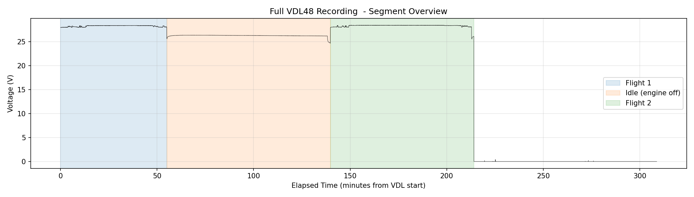

### G1000 vs VDL48 Voltage Comparison

The green trace (VDL48) remains steady at ~28.3 V during both flights while the blue trace (G1000 volt1) consistently reads lower with substantially more fluctuation. The red trace shows the instantaneous difference.

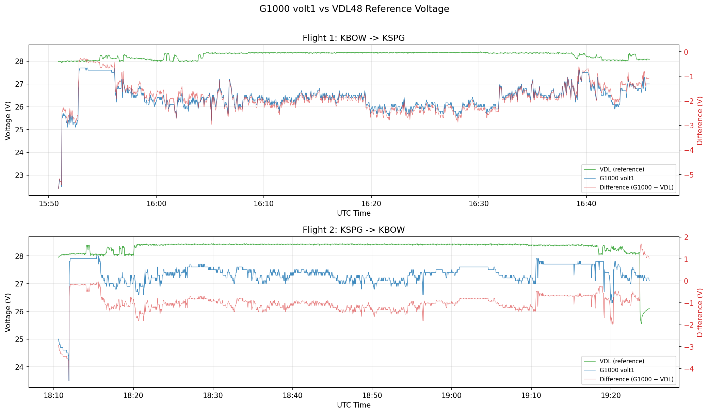

### Distribution of Voltage Differences

Both flights show the G1000 reading shifted well below the VDL reference. Flight 1 had a larger offset (-1.87 V) than Flight 2 (-0.99 V).

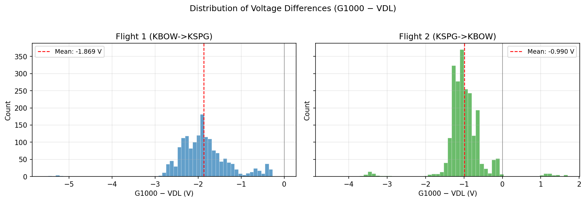

### Correlation Scatter Plot

Nearly all data points fall below the 1:1 line. The low r-squared value indicates the G1000 fluctuations are largely independent of actual bus voltage changes, pointing to an issue in the G1000's sensing path rather than a simple calibration offset.


## Three-Source Correlation: Adding ECU Battery Voltage

A third independent voltage measurement was added from the Austro Engine AE300 ECU's own ADC (channel 808, "Battery Voltage"). The ECU data was extracted from encrypted `.ae3` hex dump files using the [AustroView](../AustroView/) project. The same two flights exist in the ECU data logger (sessions 80 and 81).

### Three-Way Results

| Pair | Flight 1 | Flight 2 | Combined |
|------|----------|----------|----------|
| **G1000 - VDL48** | **-1.94 V** | **-0.98 V** | **-1.38 V** |
| **G1000 - ECU** | **-2.05 V** | **-0.21 V** | **-0.99 V** |
| **ECU - VDL48** | **+0.11 V** | **-0.77 V** | **-0.40 V** |

**Key findings:**
- **Flight 1**: The ECU closely agrees with the VDL48 (mean offset only +0.11 V). Both read ~28.3 V while the G1000 reads ~26.4 V. This confirms the G1000 is the outlier.
- **Flight 2**: The ECU reads slightly lower than the VDL48 (-0.77 V), but still significantly higher than the G1000. The G1000 remains the lowest of the three.
- **The G1000 is consistently the lowest reading** across both flights and all pairwise comparisons, strongly supporting the high-resistance ground hypothesis.

### Three-Way Time Series

Each flight shows VDL48 (green) and ECU (orange) tracking together while G1000 (blue) reads consistently lower:

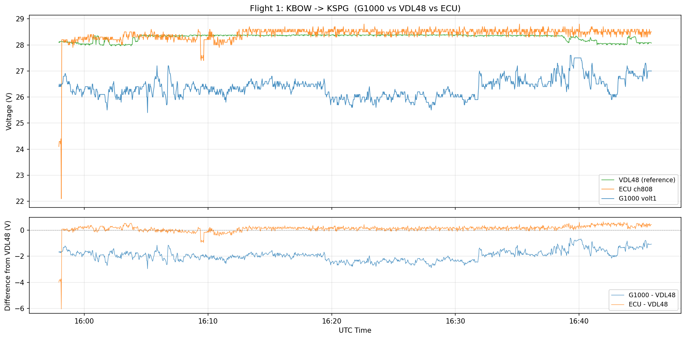
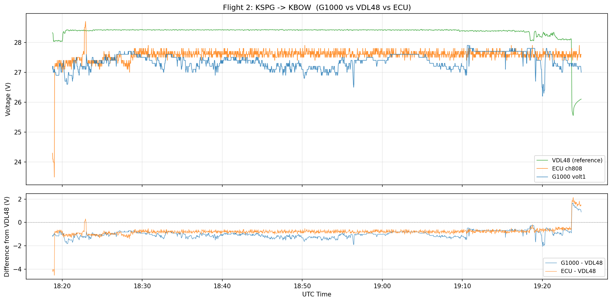

### ECU vs VDL48 Scatter

The ECU mostly clusters near the 1:1 line with the VDL48, confirming both independent instruments agree on the actual bus voltage:

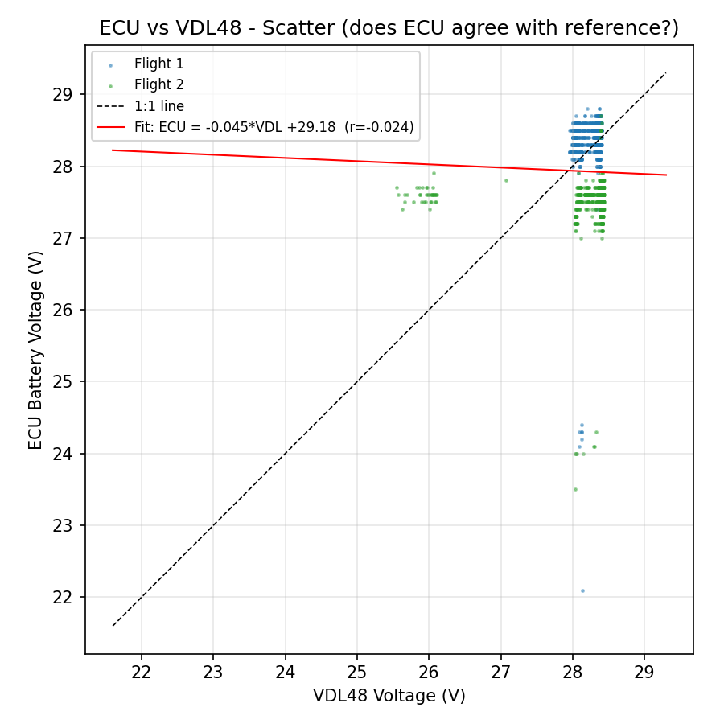

### Three-Way Difference Distributions

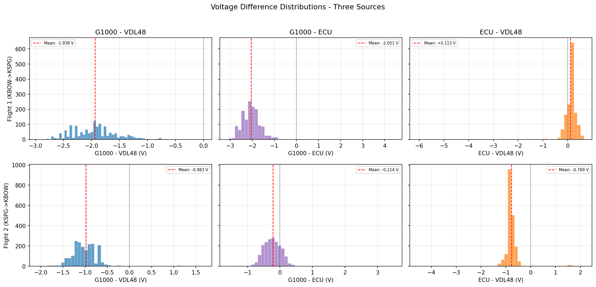

## Electrical System Architecture

N238PS is a MAM40-858 configuration. Wiring schematics were extracted from the DA40 NG Airplane Maintenance Manual (Doc 6.02.15, CH.92, Drawing Nos. D44-9224-30-01 through D44-9224-30-05). The bus structure diagram is from AMM Section 24-60-00.

### Bus Structure Diagram (AMM 24-60-00, Figure 1)

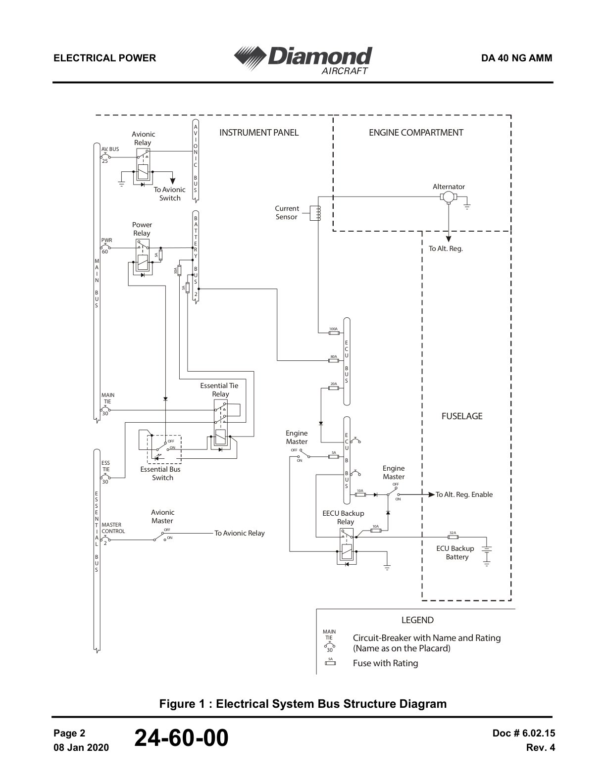

### DA40 NG Electrical System Schematic (MAM40-858 Conversion, p1859)

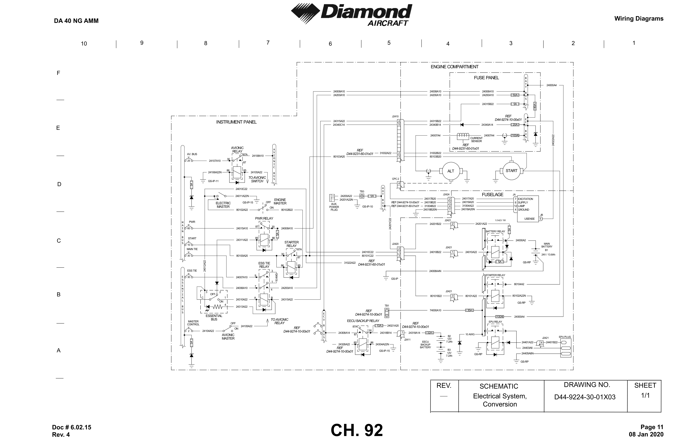

### Bus Structure & Power Distribution

The DA40 NG has seven electrical buses. The VDL48 reference logger was connected to the **AUX POWER PLUG** on the HOT BUS (direct battery, 5A fuse).

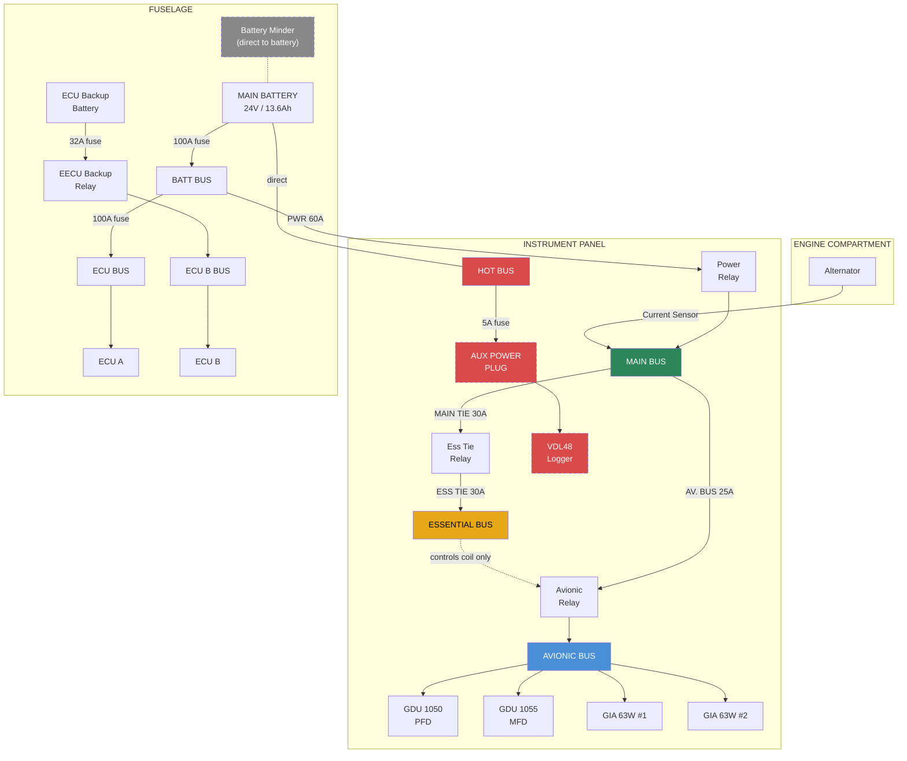

**Note:** The G1000 is on the **AVIONIC BUS**, which is fed from the **MAIN BUS** (not the Essential Bus). The Avionic Master switch lives on the Essential Bus but only controls the Avionic Relay coil -- it does not carry power. The AMM trouble-shooting table (24-60-00, p627) confirms: "There is 28 VDC on the main bus (if G1000 is installed)... but not on the avionic bus" as the first fault condition, indicating the G1000's power originates from the MAIN BUS.

### Ground Return Paths

The G1000 measures bus voltage at its power input pins **relative to its own ground pins**. Any resistance in the ground return path causes the G1000 to read lower than actual bus voltage: `V_measured = V_bus - (I_load x R_ground)`.

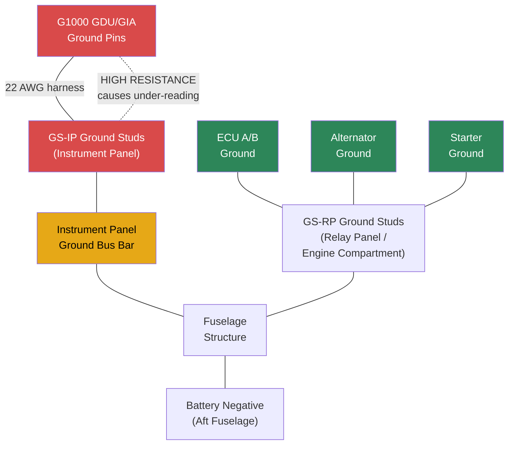

The relay panel and engine compartment components (battery, alternator, starter, ECU) use separate **GS-RP ground studs** that return directly to battery negative, bypassing the instrument panel ground bus entirely. This is why only the G1000 reads low.

### Why Three Instruments Disagree

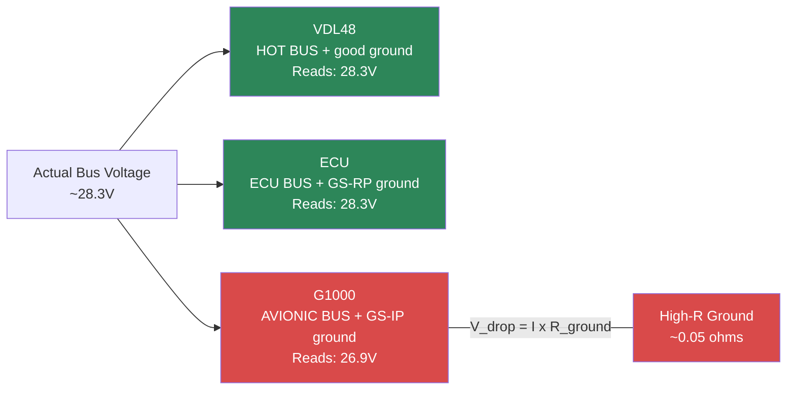

The alternator voltage regulator (J2424) has its own **dedicated USENSE wire** (24022A22, 22 AWG, pin 5) that senses bus voltage independently, so the alternator regulates correctly regardless of the G1000's ground path issue.

## Probable Cause: High-Resistance Ground Connection

The data patterns are consistent with a high-resistance connection in the G1000's voltage measurement or ground return path:

1. **Variable offset, not constant** — A calibration error would produce a fixed offset. The observed difference varies from -5.6 V to +1.7 V with a standard deviation of 0.71 V. This is consistent with current-dependent voltage drops across a resistive connection.

2. **G1000 shows excess noise** — The VDL sees a stable bus (0.27 V std dev) while the G1000 fluctuates much more (0.69 V std dev) on the same bus. The extra variance comes from varying current through a resistive path.

3. **Near-zero correlation (r = 0.09)** — The two instruments measure the same bus yet their readings are essentially uncorrelated. The G1000's voltage fluctuations are driven by its own ground/sensing path impedance, not actual bus voltage changes.

4. **Transient deep dips** — Momentary dips to -5.6 V below reference are consistent with high-current events (radio transmit, servo actuation) pulling current through a resistive ground.

5. **Different magnitude between flights** — Flight 1 offset was -1.87 V vs Flight 2 at -0.99 V. Thermal expansion, vibration, or connector seating can alter contact resistance between flights.

Using Ohm's law, even **0.05 ohms** of ground resistance at 20 A load produces a 1.0 V drop that only the G1000 sees through its ground path.

## Recommended Actions

Based on the wiring schematics, in priority order:

1. **G1000 GDU/GIA ground pins at harness connectors** — Check for corrosion, backed-out pins, or loose contact in the GDU 1050/1060 and GIA 63W connectors (ground pins specifically)
2. **Instrument panel ground studs (GS-IP series)** — Inspect for loose nut, corrosion, paint under ring terminals, or cracked ring terminals. These are where the G1000 harness grounds attach to the airframe
3. **Ground bus bar to fuselage bond** — Check the structural attachment point where the instrument panel ground bus bar connects to the airframe
4. **Firewall ground feedthrough** — Where instrument panel grounds transition to the engine compartment/battery ground
5. **Measure resistance** from the G1000 ground pin (at the connector) to battery negative terminal — values above ~0.02-0.05 ohms would explain the observed offset
6. **After repair**, repeat this test with the VDL48 to verify the offset is eliminated

## Repository Structure

```
volt/
├── README.md                  # This file
├── voltage_analysis.py        # Two-source analysis (G1000 vs VDL48)
├── correlate_ecu.py           # Three-source analysis (+ AE300 ECU)
├── generate_report.py         # Generates self-contained HTML report
├── data/
│   ├── N238PS_KBOW-KSPG_20260208-1551UTC.csv   # G1000 log, Flight 1
│   ├── N238PS_KSPG-KBOW_20260208-1812UTC.csv   # G1000 log, Flight 2
│   └── LOG_VD.CSV                               # VDL48 voltage logger data
├── docs/
│   ├── G1000 DataLog Fields.pdf                 # G1000 data log field reference
│   ├── AMM_p622_*_Bus_Structure_G1000.png       # Bus structure diagram (24-60-00 Fig.1)
│   ├── AMM_p1857_*_Electrical_System.png        # Main electrical system schematic
│   ├── AMM_p1858_*_Electrical_System_Wiring.png # Electrical system wiring detail
│   ├── AMM_p1859_*_Electrical_System_Conversion.png  # Electrical system (MAM40-858)
│   ├── AMM_p1860_*_Electrical_System_Club.png   # Electrical system (Club variant)
│   └── AMM_p1861_*_Second_Alternator.png        # Second alternator system
└── output/
    ├── Voltage_Analysis_Report_N238PS_20260208.html  # Full shareable HTML report
    ├── voltage_report.txt              # Two-source statistical summary
    ├── three_way_voltage_report.txt    # Three-source statistical summary
    ├── vdl_overview.png                # VDL full recording plot
    ├── flight_comparison.png           # G1000 vs VDL time series
    ├── difference_histograms.png       # Two-source voltage difference distributions
    ├── scatter.png                     # G1000 vs VDL scatter with regression
    ├── three_way_flight1.png           # Three-source Flight 1 overlay
    ├── three_way_flight2.png           # Three-source Flight 2 overlay
    ├── ecu_vs_vdl_scatter.png          # ECU vs VDL scatter
    └── three_way_histograms.png        # Three-source difference distributions
```

## Running the Analysis

Requires Python 3.10+ with numpy, matplotlib, and scipy:

```bash
pip install numpy matplotlib scipy
```

Run the two-source analysis (G1000 vs VDL48):

```bash
python voltage_analysis.py
```

Run the three-source analysis (adds ECU data from AustroView):

```bash
python correlate_ecu.py
```

Generate the self-contained HTML report:

```bash
python generate_report.py
```

The HTML report embeds all images as base64 and can be shared as a single file. Open in any browser and use File > Print > Save as PDF to create a PDF version.

## Data Sources

- **G1000 NXi data logs**: Exported from the G1000 NXi SD card. CSV format with 1-second sampling, 58 columns including `volt1` (main bus voltage). See `Docs/G1000 DataLog Fields.pdf` for field definitions.
- **VDL48 log**: Triplett VDL48 data logger with 2-second sampling, connected to the **AUX POWER PLUG** in the cockpit. Per AMM 24-00-00 Figure 1, the Aux Power Plug is on the **HOT BUS** (direct battery connection via 5A fuse), giving the VDL48 a clean reference measurement of battery/alternator voltage without relay or breaker drops. The logger's date/time stamp is incorrect (shows 2019-03-01), but the sampling period is accurate. The analysis aligns the VDL segments to G1000 flight times based on voltage pattern segmentation.
- **AE300 ECU data log**: Battery voltage (channel 808) from the Austro Engine AE300 ECU's flash data logger, 1-second sampling. Parsed from encrypted `.ae3` hex dump files using the [AustroView](../AustroView/) project. Sessions 80 and 81 correspond to the same Feb 8 flights.

## Statistical Methods

- Both signals are interpolated onto a common 2-second grid for paired comparison
- VDL data is segmented into flight/idle/flight phases using a 27 V threshold with a 60-second sustained-detection window
- Paired t-tests assess whether the mean difference is significantly different from zero
- Pearson correlation measures how well the two signals track each other
- 95% range is computed as the 2.5th to 97.5th percentile of the difference distribution
