# N238PS — G1000 LOW VOLTS Investigation

**Aircraft:** N238PS (Diamond DA40NG, MAM40-858)
**Problem:** G1000 NXi displays lower voltage than actual bus voltage, causing intermittent LOW VOLTS annunciations
**Date:** February 2026
**Prepared by:** Aircraft Owner (Ingram Leedy)

---

## Table of Contents

**[Part 1 — The Problem](#part-1--the-problem)**
- [1.1 FlySto LOW VOLTS Events](#11-flysto-low-volts-events-in-flight)
- [1.2 Key Finding](#12-key-finding)
- [1.3 Garmin's Prescribed Troubleshooting](#13-garmins-prescribed-troubleshooting-for-low-volts)

**[Part 2 — Evidence](#part-2--evidence)**
- [2.1 Three Independent Measurements](#21-three-independent-measurements)
- [2.2 Flight Data Visualizations](#22-flight-data-visualizations)
- [2.3 Three-Source Correlation](#23-three-source-correlation-adding-ecu-battery-voltage)
- [2.4 Ground Tests](#24-ground-tests)
- [2.5 Load-Dependent Offset and Vibration Sensitivity](#25-load-dependent-offset-and-vibration-sensitivity--p701-pin-contact)
- [2.6 Why the Battery Matters](#26-why-the-battery-matters-but-isnt-the-cause)
- [2.7 External Comparison (N541SA)](#27-external-comparison-da40ng-voltage-stability-n541sa)
- [2.8 ECU Differential Analysis](#28-ecu-differential-analysis-gea-specific-isolation)

**[Part 3 — Root Cause Analysis](#part-3--root-cause-analysis)**
- [3.1 Where the Voltage Is Measured](#31-where-the-voltage-is-actually-measured)
- [3.2 How a Bad Ground Creates a False Low Reading](#32-how-a-bad-ground-creates-a-false-low-reading)
- [3.3 Voltage Measurement Path](#33-the-voltage-measurement-path)
- [3.4 Electrical System Schematic](#34-da40-ng-electrical-system-schematic-d44-9224-30-01x03-sheet-11)
- [3.5 Why Only the G1000 Reads Low](#35-why-only-the-g1000-reads-low)
- [3.6 Data Flow to Displays](#36-how-the-voltage-data-flows-to-the-g1000-displays)
- [3.7 Probable Cause Summary](#37-probable-cause-summary)

**[Part 4 — Maintenance History](#part-4--maintenance-history)**
- [4.1 Historical Voltage Analysis (184 Flights)](#41-historical-voltage-analysis-184-flights)
- [4.2 The Change-Point: February 2024](#42-the-change-point-february-2024)
- [4.3 What Has Already Been Tried](#43-what-has-already-been-tried-and-didnt-fix-it)
- [4.4 Second Engine R&R](#44-second-engine-rr--differential-diagnosis)
- [4.5 Maintenance Timeline](#45-maintenance-timeline)

**[Part 5 — Troubleshooting & Repair Guide](#part-5--troubleshooting--repair-guide)** — **For Mechanics: Start Here**
- [5.1 Where to Look (Four Areas)](#51-where-to-look-four-areas)
- [5.2 Ground Stud Locations](#52-ground-stud-locations-gs-ip-series)
- [5.3 GEA 71S P701 Pin Reference](#53-gea-71s-p701--j701-pin-reference-garmin-190-00303-40)
- [5.4 How to Test](#54-how-to-test)
- [5.5 How to Verify the Fix](#55-how-to-verify-the-fix)

**[Part 6 — Technical Reference](#part-6--technical-reference)**
- [6.1 Electrical System Architecture](#61-electrical-system-architecture)
- [6.2 Ground Path — Wire-Level Detail](#62-ground-path--wire-level-detail)
- [6.3 AMM References](#63-amm-references)
- [6.4 Appendix A — Electrical System (AFM)](#64-appendix-a--da40-ng-electrical-system-afm)
- [6.5 Appendix B — Circuit Breaker Layout](#65-appendix-b--instrument-panel-circuit-breaker-layout-afm)
- [6.6 Reference Images](#66-reference-images)

**[Part 7 — Analysis Tools & Repository](#part-7--analysis-tools--repository)**
- [7.1 Repository Structure](#71-repository-structure)
- [7.2 Running the Analysis](#72-running-the-analysis)
- [7.3 Data Sources](#73-data-sources)
- [7.4 Statistical Methods](#74-statistical-methods)

---

## Part 1 — The Problem

The G1000 consistently reads **1–2 volts lower** than actual bus voltage, with transient dips up to **5.6 volts low** during high-current events. This causes false LOW VOLTS annunciations in flight even though the electrical system is charging normally.

### 1.1 FlySto LOW VOLTS Events (In-Flight)

These FlySto screenshots show actual LOW VOLTS events captured from G1000 flight logs. The voltage drops below the 25V threshold repeatedly during normal flight operations:

**85 seconds below 25V** — approach and taxi at KBOW, voltage swinging wildly between 24–27V:

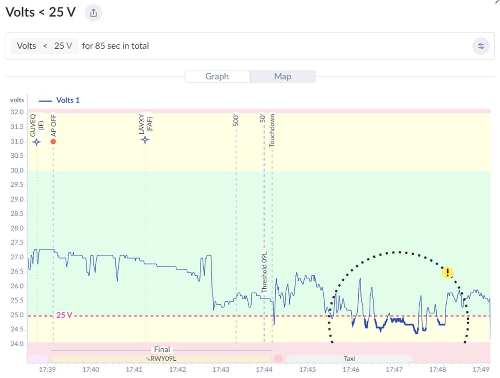

**18 seconds below 25V** — during landing, and **5 seconds below 25V** — at altitude during cruise:

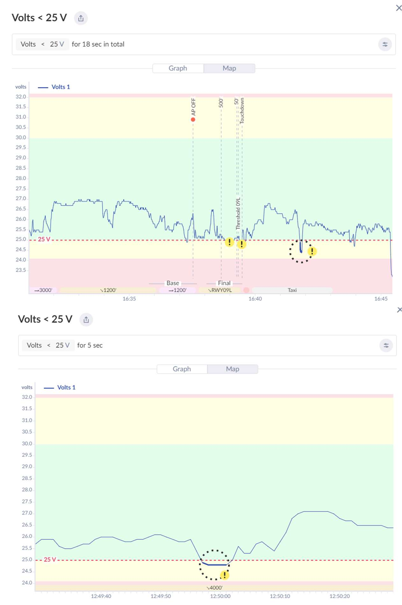

**In-flight cockpit photo** — G1000 MFD showing 25.0V (at the LOW VOLTS threshold) with +13A alternator output during normal flight:

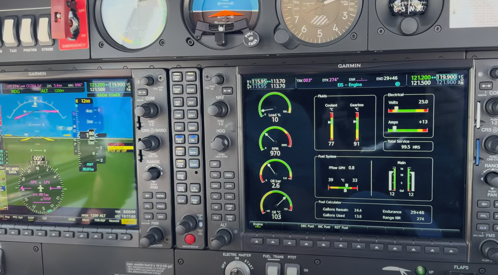

These dips are **not real** — the independent VDL48 logger shows the bus voltage is steady at ~28V during these same periods. The G1000 is the only instrument seeing these drops.

### 1.2 Key Finding

**The G1000 NXi systematically under-reports bus voltage compared to the independent VDL48 reference.**

| Metric | Flight 1 | Flight 2 | Combined |
|---|---|---|---|
| G1000 volt1 mean | 26.40 V | 27.32 V | 26.93 V |
| VDL48 reference mean | 28.26 V | 28.31 V | 28.29 V |
| **Mean difference** | **-1.87 V** | **-0.99 V** | **-1.36 V** |
| 95% range | -2.68 to -0.42 V | -1.78 to -0.15 V | -2.67 to -0.18 V |
| Paired t-test | p < 0.001 | p < 0.001 | p < 0.001 |

The difference is highly statistically significant (p < 0.001) with worst-case transient dips reaching -5.6 V below the reference reading. This under-reading is more than sufficient to trigger LOW VOLTS annunciations even when actual bus voltage is normal.

### 1.3 Garmin's Prescribed Troubleshooting for LOW VOLTS

The Garmin G1000 System Maintenance Manual (190-00545-01) CAUTION Alerts table specifies what to do when LOW VOLTS appears:

> **LOW VOLTS** — On-board voltage is below 24 volts.
> **Solution:** Inspect GEA 71 connector & wiring. Troubleshoot aircraft electrical system according to DA 40 Airplane Maintenance Manual instructions.

Garmin's own manual names the **GEA 71 connector & wiring** as the first thing to inspect — which is exactly what this guide recommends. The analysis in this document identifies *which specific* GEA 71 connector pins and wires are the most likely problem. See [G1000 System Maintenance Manual CAUTION Alerts image](#g1000-system-maintenance-manual--caution-alerts) in the Reference Images section.

<br>

---

<br>

## Part 2 — Evidence

### 2.1 Three Independent Measurements

Three independent measurements were taken on the same aircraft, on the same flights. Two agree. One doesn't.

| Source | Where It Measures | Average Reading | Verdict |
|--------|------------------|-----------------|---------|
| **VDL48 data logger** (plugged into AUX POWER) | Direct battery voltage | **28.3V** | Correct |
| **ECU battery voltage** (engine computer) | Separate bus and ground path | **27.8V** | Correct |
| **G1000 volt1** | Through instrument panel ground studs | **26.9V** | **Reads low** |

The VDL48 and ECU agree — the bus voltage is normal (~28V with alternator). The G1000 is the only instrument reading low.

#### 2.1.1 How the Data Was Collected

| Data Source | Collection Method | Sample Rate | Coverage |
|-------------|------------------|-------------|----------|
| **G1000 NXi flight logs** | Automatically collected every flight by the **Flight Stream 510 (AirSync)** and uploaded to [FlySto.net](https://flysto.net). CSV source files downloaded from FlySto. | 1 second | **184 flights**, Jul 2023 – Feb 2026 (entire aircraft history since delivery) |
| **AE300 ECU data logs** | Extracted from the ECU's built-in data logger via USB using **AE300-Wizard** software (Austro Engine's download tool). The encrypted `.ae3` binary log files were then decrypted and parsed into readable CSV using **AustroViewer** ([github.com/ingramleedy/AustroViewer](https://github.com/ingramleedy/AustroViewer), private repo). The ECU records 16 channels including battery voltage (channel 808) every engine run automatically. | 1 second | **265 sessions**, Oct 2023 – Feb 2026 |
| **VDL48 voltage logger** | Triplett VDL48 standalone data logger plugged into AUX POWER plug (HOT BUS, direct battery) | 2 seconds | **2 flights** on Feb 8, 2026 (3.5 hours flight time + 1.4 hours ground idle) |

- The **G1000 logs** `volt1` — the bus voltage displayed on the PFD/MFD, measured by the GEA 71S via its voltage sense input (Pin 46 (ANALOG IN 5 HI) / Pin 47 (ANALOG IN 5 LO)) from the Essential Bus
- The **ECU logs** `Battery Voltage` (channel 808) — the AE300 engine computer's own battery voltage reading, measured through a separate bus (ECU BUS) but sharing the **same instrument panel ground path** (GS-IP-3 and GS-IP-4 studs, per AMM p1936-1937, Drawing D44-9274-10-00)
- The **VDL48** measures voltage at the AUX POWER plug on the HOT BUS — a direct connection to the battery through only a 5A fuse, no relays or breakers. This gives the cleanest reference of actual bus voltage.

All three sources were time-aligned and compared using paired statistical analysis. The full analysis scripts and raw data are available in the project repository at [github.com/ingramleedy/volts](https://github.com/ingramleedy/volts).

### 2.2 Flight Data Visualizations

#### 2.2.1 VDL48 Full Recording Overview

The VDL48 captured three distinct phases: Flight 1 at ~28.3 V (alternator charging), idle period decaying from ~26.3 V to ~25.5 V (battery only), and Flight 2 at ~28.3 V.

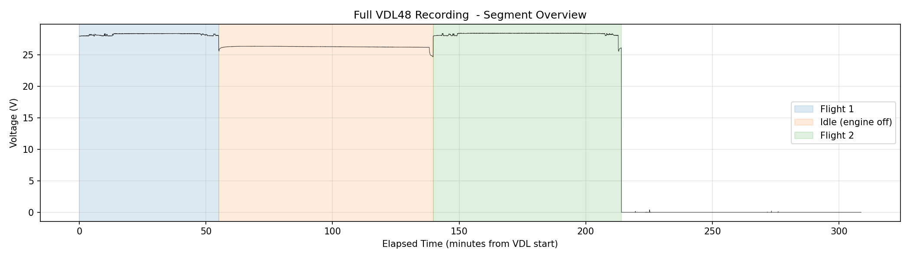

#### 2.2.2 G1000 vs VDL48 Voltage Comparison

The green trace (VDL48) remains steady at ~28.3 V during both flights while the blue trace (G1000 volt1) consistently reads lower with substantially more fluctuation. The red trace shows the instantaneous difference.

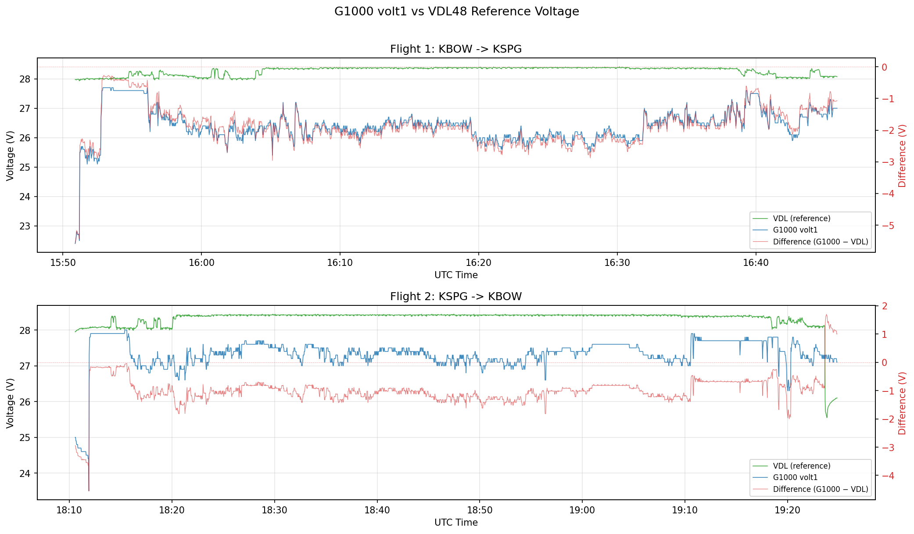

#### 2.2.3 Distribution of Voltage Differences

Both flights show the G1000 reading shifted well below the VDL reference. Flight 1 had a larger offset (-1.87 V) than Flight 2 (-0.99 V).

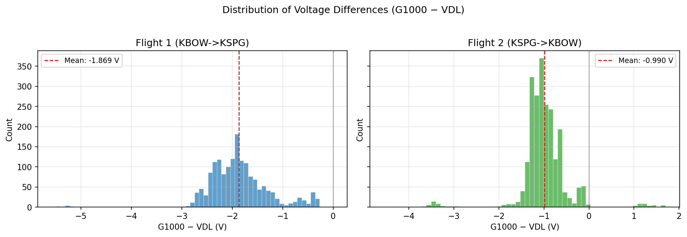

#### 2.2.4 Correlation Scatter Plot

Nearly all data points fall below the 1:1 line. The low r-squared value indicates the G1000 fluctuations are largely independent of actual bus voltage changes, pointing to an issue in the G1000's sensing path rather than a simple calibration offset.

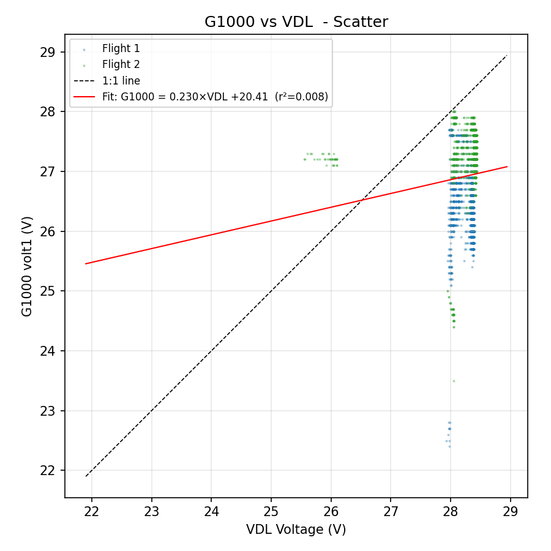

### 2.3 Three-Source Correlation: Adding ECU Battery Voltage

A third independent voltage measurement was added from the Austro Engine AE300 ECU's own ADC (channel 808, "Battery Voltage"). The ECU data was extracted from encrypted `.ae3` hex dump files using the [AustroView](../AustroView/) project. The same two flights exist in the ECU data logger (sessions 80 and 81).

#### 2.3.1 Three-Way Results

| Pair | Flight 1 | Flight 2 | Combined |
|------|----------|----------|----------|
| **G1000 - VDL48** | **-1.94 V** | **-0.98 V** | **-1.38 V** |
| **G1000 - ECU** | **-2.05 V** | **-0.21 V** | **-0.99 V** |
| **ECU - VDL48** | **+0.11 V** | **-0.77 V** | **-0.40 V** |

**Key findings:**
- **Flight 1**: The ECU closely agrees with the VDL48 (mean offset only +0.11 V). Both read ~28.3 V while the G1000 reads ~26.4 V. This confirms the G1000 is the outlier.
- **Flight 2**: The ECU reads slightly lower than the VDL48 (-0.77 V), but still significantly higher than the G1000. The G1000 remains the lowest of the three.
- **The G1000 is consistently the lowest reading** across both flights and all pairwise comparisons, strongly supporting the high-resistance ground hypothesis.

#### 2.3.2 Three-Way Time Series

Each flight shows VDL48 (green) and ECU (orange) tracking together while G1000 (blue) reads consistently lower:

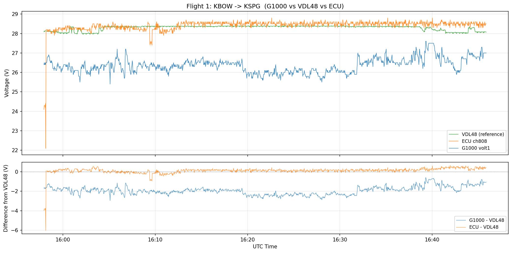
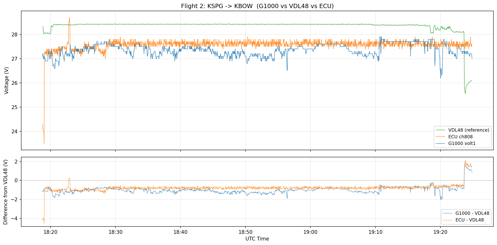

#### 2.3.3 ECU vs VDL48 Scatter

The ECU mostly clusters near the 1:1 line with the VDL48, confirming both independent instruments agree on the actual bus voltage:

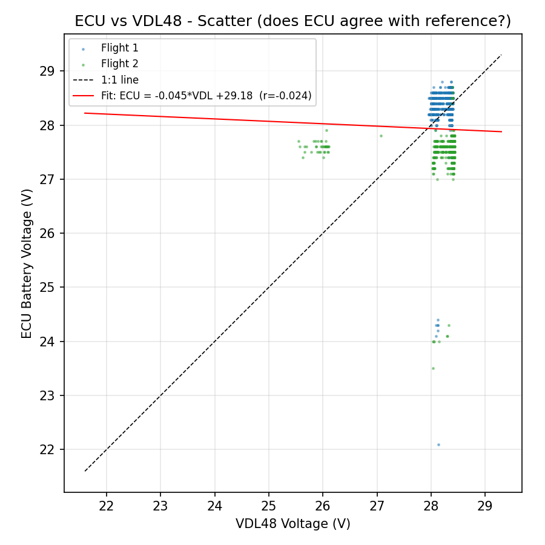

#### 2.3.4 Three-Way Difference Distributions

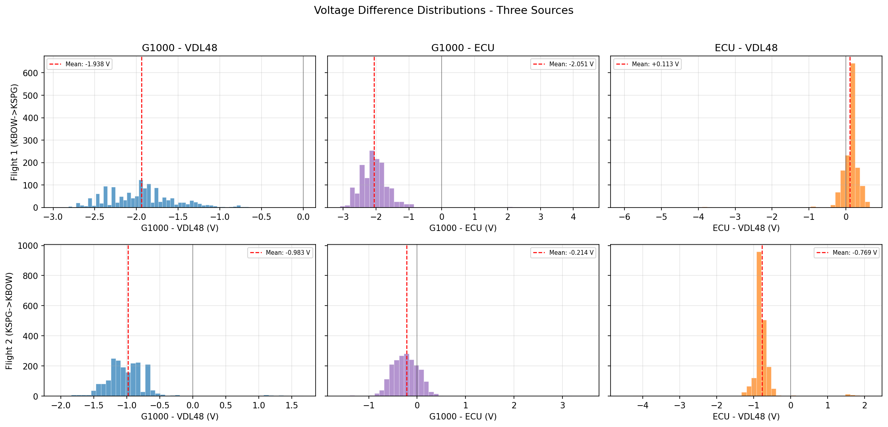

### 2.4 Ground Tests

#### 2.4.1 Aug 18, 2025 — Battery Only, No Engine

| Condition | Meter at AUX POWER | G1000 Display | Difference |
|-----------|-------------------|---------------|------------|
| Master ON, G1000 on, no other loads | **25.2V** | **23.7V** | **-1.5V** |

The offset exists on the ground with battery only. This rules out the alternator, voltage regulator, and charging system entirely.

#### 2.4.2 Feb 20, 2026 — Battery vs GPU, Same Session

Two tests performed back-to-back on the same day, same conditions. **Both tests were Master ON only (no Avionics Bus)** — low electrical load (~1-2A):

| Condition | Meter at AUX POWER | G1000 Display | Difference |
|-----------|-------------------|---------------|------------|
| Battery only, Master ON (no Avionics) | **25.3V** | **24.0V** | **-1.3V** |
| GPU connected, Master ON (no Avionics) | **28.79V** | **28.6V** | **-0.19V** |

The **24.0V G1000 reading on battery** is right at the LOW VOLTS annunciation threshold (24V per the Garmin G1000 System Maintenance Manual). Any additional electrical load would push it below threshold and trigger the annunciation — which is exactly what happens in flight.

> **Important context (discovered Feb 25):** These GPU tests were conducted at low load (Master ON only, Avionics Bus off). When tested at full avionics load on GPU (test D, Feb 25), the offset was **-1.155V** — not the near-zero result seen here. The -0.19V result reflects low current through the bad connection, not the GPU fixing the problem. See [Section 2.4.3](#243-feb-25-2026--battery-terminal-cleaning-structural-ground-test-and-flight-test).

#### 2.4.3 Feb 25, 2026 — Battery Terminal Cleaning, Structural Ground Test, and Flight Test

**Battery terminal cleaned, structural grounds verified < 6 mV, problem persists in flight.**

**A. Before cleaning — Battery only vs GPU, Master ON only (no Avionics Bus — low load):**

| Condition | AUX POWER | G1000 GEA | Offset |
|-----------|-----------|-----------|--------|
| Battery only, Master ON (no Avionics) | 26.2V | 24.7V | **-1.5V** |
| GPU, Master ON (no Avionics) | 28.8V | 28.6V | **-0.2V** |

> **Note:** The -0.2V GPU offset at low load appeared to show the GPU "fixing" the problem. This was misleading — test D below (GPU at full avionics load) shows **-1.155V** offset, proving the fault is load-dependent and present regardless of power source.

**B. Battery negative terminal inspection** — found three cables (bottom to top):

| Position | Wire | Destination | Notes |
|----------|------|-------------|-------|
| Bottom (closest to post) | 24008A4N | GS-IP (Instrument Panel) | 4 AWG, as documented |
| Middle | **24008B4N** | **GS-RP (Relay Panel)** | **NOT IN AMM SCHEMATICS — new discovery** |
| Top | 24405A6N | GPU/EPU | Black sheath cable, as documented |

**Cable 24008B4N** is a companion ground wire to 24008A4N — both are heavy-gauge dedicated wires from battery negative to their respective ground stud groups. "Cable 200" is a **generic IPC item number** (IPC P/N D44-2403-160-00, "Cable, Battery GND") — it is simply the IPC catalog's sequential item designation for this cable, not a wire number or engineering identifier. The actual wire is **24008B4N**, as labeled on the cable itself. The wire number 24008B4N does not appear in AMM schematics, but the IPC lists it as item "Cable 200".

**C. After cleaning — terminal cleaned, reordered, retorqued.** New order (bottom to top): 24008B4N (GS-RP), 24008A4N (GS-IP), 24405A6N (EPU).

**D. Structural ground voltage drop test** — on GPU, Master ON, G1000 + Avionics Bus on (full load):

| From B1(-) to | Voltage Drop | Verdict |
|----------------|-------------|---------|
| Canopy ground strap (near instrument panel) | **5.6 mV** | Excellent |
| Pilot step ground (forward fuselage) | **5.7 mV** | Excellent |
| Wire loom ground (near battery, aft) | **2.3 mV** | Excellent |
| Relay chassis (GS-RP) | **0 mV** | Perfect |

**All tested structural ground points are within 6 mV of battery negative** — aft fuselage and cabin structural grounds are healthy. **Not yet tested:** instrument panel ground studs (GS-IP series, including GS-IP-14 where the GEA terminates) and engine compartment grounds. These require studying the instrument panel diagrams to identify access points.

**G1000 system power draw** (measured with Fluke i410 AC/DC Current Clamp, 1 mV/A, on GPU plug cable):

| Metric | Value |
|--------|-------|
| Average current | **6.1A** |
| Peak current | **7.2A** |
| Voltage at battery terminal | 28.355V (GPU) |
| Average power | **~173W** |
| Peak power | **~204W** |
| Load config | Master ON, G1000 on, Avionics Bus on, engine off |

*Note: In flight with engine running, the G1000 MFD alternator amp reading shows 13-15A (bouncing), which includes the G1000/avionics load plus battery charging and other aircraft systems.*

**Yet in the same test:** multimeter at battery terminal reads **28.355V**, G1000 GEA reads **27.2V** — an offset of **-1.155V** with every structural ground confirmed good. **The fault is not in any ground path downstream of the battery terminal.**

**E. Flight test (after cleaning):**

| Phase | G1000 GEA | AUX POWER | Offset |
|-------|-----------|-----------|--------|
| Taxi out | 27.8V | 28.3V | **-0.5V** |
| Flight | 26.5V | 28.1V | **-1.6V** |
| Flight | 26.7V | 28.1V | **-1.4V** |
| Flight | 26.0V | 28.1V | **-2.1V** |
| Taxi in | 25.0V | 26.2V | **-1.2V** |

**The in-flight offset is unchanged after cleaning** (-1.4V to -2.1V, vs -1.4V average from Feb 8 VDL48 data). The battery terminal was not the fault.

**What this eliminates:**
- Battery negative terminal contact resistance (just cleaned and torqued)
- Cable 24008A4N and 24008B4N / IPC "Cable 200" (structural ground tests prove continuity)
- Structural ground joints (all < 6 mV from battery negative)
- The entire structural ground network

**What remains:** The GEA P701 connector, Pin 47's wire (31299A22BL) and its unknown termination, GS-IP-14 stud (Pin 20), the Essential Bus positive path relay/breaker contacts, and/or the Pin 46 3A fuse.

### 2.5 Load-Dependent Offset and Vibration Sensitivity — P701 Pin Contact

The voltage offset is **proportional to electrical load** and **dramatically worsened by vibration**. This pattern points to a resistive connection at one or more GEA P701 connector pins.

#### 2.5.1 The Offset Scales with Load

GPU ground tests on Feb 25 — with structural grounds verified healthy (< 6 mV) and battery terminal cleaned — isolate the GEA's own circuit:

| Test | Power Source | Avionics Load | Current | Offset | Implied R |
|------|-------------|---------------|---------|--------|-----------|
| Feb 25-A | GPU | Master ON only (low) | ~1-2A | **-0.2V** | ~0.1-0.2Ω |
| Feb 25-D | GPU | Master ON + Avionics ON (full) | ~6.1A | **-1.155V** | **~0.19Ω** |

At low load on GPU, the offset is small (-0.2V). At full avionics load on GPU, the offset is **-1.155V**. This is **V = I × R** behavior, implying **~0.19Ω** of resistance in a current-carrying path unique to the GEA.

> **Earlier GPU tests (Feb 20 and Feb 25-A) appeared to show the GEA reading correctly on GPU.** This was misleading — those tests were conducted at low load (Master ON only, no Avionics Bus). The low current produced only a small drop across the bad connection, masking the fault. **The GPU does not fix the problem.**

Because the offset scales with avionics load current, the faulty resistance must be in a **current-carrying pin** — most likely **Pin 20 (POWER GROUND)** or **Pin 35 (AIRCRAFT POWER 1)** rather than Pin 47 (voltage sensing input, near-zero current). However, Pin 47 could contribute if its contact resistance is high enough to interact with the ADC's input bias current.

#### 2.5.2 Vibration Makes It Dramatically Worse

| Condition | Vibration | Offset |
|-----------|-----------|--------|
| Ground, GPU, full avionics | None | **-1.155V** (stable) |
| Taxi | Low | **-0.5V to -1.2V** |
| Flight | Full engine + airframe | **-1.4V to -2.1V**, worst dip **-5.6V** |

A solid resistive connection would produce a stable, predictable offset proportional to load. The erratic, vibration-dependent swings — especially the deep transient dips to -5.6V — are characteristic of a **loose or corroded pin contact** that bounces between partial contact states under vibration. This also explains the excess noise in the G1000 data: VDL48 sees 0.27V std dev while the G1000 sees 0.69V on the same bus. A healthy DA40 NG (N541SA, [see comparison](#27-external-comparison-da40ng-voltage-stability-n541sa)) shows stable voltage — the instability is specific to N238PS.

#### 2.5.3 Battery vs GPU at Low Load — Unexplained Difference

The battery-only offset at low load (-1.5V) is much larger than the GPU offset at the same low load (-0.2V). This cannot be explained by the P701 pin resistance alone (which depends on current, not power source). The difference may reflect:

- An additional resistive element in the battery return path that the GPU bypasses
- A difference in how the GEA's ADC responds to different source impedances
- A voltage drop in the Essential Bus positive feed path (Power Relay + MAIN TIE + Ess Tie Relay + ESS TIE) that is partially compensated when the GPU raises the overall bus voltage

The structural ground network has been tested healthy (< 6 mV) and the battery terminal was cleaned, so neither of those explain it. **The exact mechanism is not fully resolved**, but the dominant fault — the load-dependent, vibration-sensitive resistance at the P701 connector — is clear from the GPU full-load test.

#### 2.5.4 Why the ECU Is Unaffected

The ECU grounds through **GS-IP-3 and GS-IP-4** → GS-IP bus bar → wire 24008A4N (4 AWG) → battery negative. This is a dedicated wire path with **no shared connector pins** with the GEA. The ECU reads a stable 27.8V throughout, proving the shared ground infrastructure is healthy and the fault is specific to the GEA P701 connector and its wiring.

#### 2.5.5 What's Ruled Out

- Battery negative terminal — cleaned and retorqued, no improvement
- Structural ground network (aft fuselage and cabin) — all tested points < 6 mV from battery negative under full load. GS-IP studs and engine compartment grounds not yet tested.
- Wire 24008A4N and 24008B4N (IPC "Cable 200") — verified healthy
- GS-IP bus bar — ECU uses it and reads correctly
- Alternator, voltage regulator, charging system — ECU and VDL48 confirm correct bus voltage

### 2.6 Why the Battery Matters (but isn't the cause)

The ground path drops ~1.4V regardless of battery condition. But the higher the starting bus voltage, the more headroom the G1000 has before hitting the 25V LOW VOLTS threshold. A fully charged battery with alternator running keeps the bus at ~28V, so the G1000 reads ~26.6V — above the threshold most of the time. If the battery is weak or undercharged, the bus sits lower and the G1000 dips below 25V more easily.

A **BatteryMinder** trickle charger keeps the battery maintained between flights at the home hangar, maximizing voltage headroom — but it's a workaround, not a fix. High-current transient loads (radio TX, autopilot servos, flaps) still cause dips that trigger LOW VOLTS.

### 2.7 External Comparison: DA40NG Voltage Stability (N541SA)

A comparison data point was provided by another DA40NG owner (geekmug / Scott, aircraft N541SA) on the [Diamond Aviators forum](https://www.diamondaviators.net/forum/viewtopic.php?p=108026#p108026) (Feb 16, 2026):

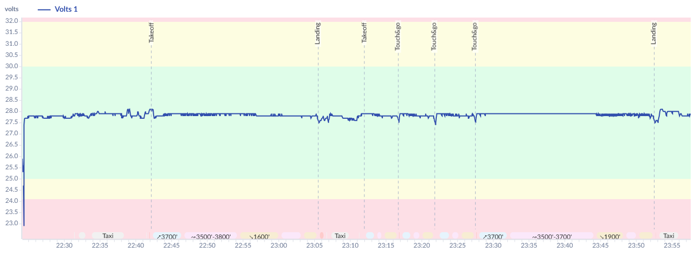

| Metric | N541SA | N238PS Brand New (Jul 2023) | N238PS Pre-Feb 2024 | N238PS Post-Feb 2024 |
|--------|--------|---------------------------|--------------------|--------------------|
| Mean voltage | ~27.8V | 27.55V | 27.44V | 26.86V |
| Noise | ~0.05–0.10V | 0.36V | 0.38V | 0.51V |
| Peak-to-peak range | ~0.3V | 4.4V | 4.6V | 5.2V |
| Time below 27V | ~0% | 6.2% | 6.2% | **53.5%** |

Even from delivery, N238PS was reading **0.25V low** and had **4–5x more voltage noise** than N541SA. This suggests a marginal ground connection has existed since the factory — the Feb 2024 shop visit then made it significantly worse.

The G1000 is **capable of reading steady, accurate voltage** when ground paths are healthy. The issue is aircraft-specific, not a G1000 platform issue.

### 2.8 ECU Differential Analysis (GEA-Specific Isolation)

By subtracting the ECU voltage from the G1000 voltage for each matched flight (114 same-day pairs), all shared factors are eliminated — bus voltage, battery condition, wire 24008A4N, GS-IP bus bar. What remains is purely the GEA 71S-specific degradation.

#### 2.8.1 Three-Period Differential Results

| Period | Pairs | G1000 Mean | ECU Mean | G1000 − ECU | G1000 Noise Excess |
|--------|-------|-----------|---------|-------------|-------------------|
| Before R&R #1 (pre Feb 2024) | 25 | 27.29V | 27.61V | **−0.31V** | −0.108V (quieter) |
| Between R&Rs (Feb 2024 – Apr 2025) | 58 | 26.90V | 27.77V | **−0.88V** | +0.115V |
| After R&R #2 (Jul 2025+) | 31 | 26.90V | 28.09V | **−1.19V** | +0.248V |

#### 2.8.2 Step Changes at Each R&R (GEA-Specific Only)

| Event | G1000−ECU Step | Welch t | p-value |
|-------|---------------|---------|---------|
| R&R #1 (Feb 2024) | **−0.56V worse** | −5.98 | 2.2e-08 |
| R&R #2 (Jul 2025) | **−0.31V worse** | −2.82 | 6.9e-03 |
| **Total degradation** | **−0.88V** | −7.36 | **5.4e-12** |

Both R&Rs worsened the GEA-specific path. Before R&R #1, the G1000 was actually **quieter** than the ECU. After R&R #2, the G1000 has +0.248V more noise. The progressive worsening is consistent with a connection that gets disturbed during each maintenance visit but never properly repaired.

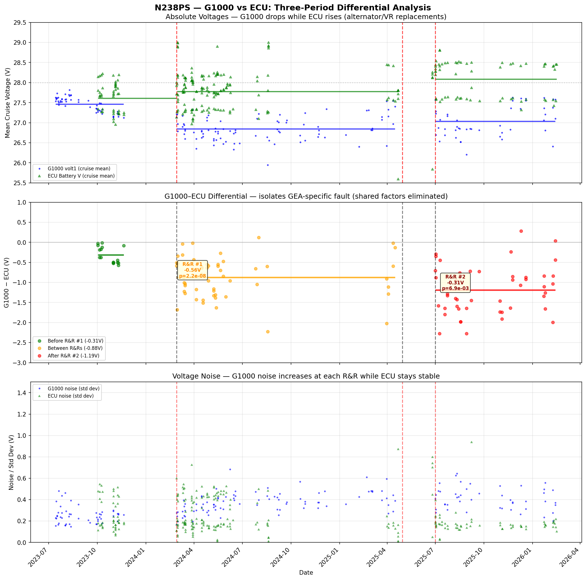

**How to read this chart:** Top panel shows absolute voltages — ECU rises while G1000 falls. Middle panel shows the G1000−ECU differential colored by period, with step annotations at each R&R. Bottom panel shows G1000 noise increasing at each R&R while ECU noise stays flat.

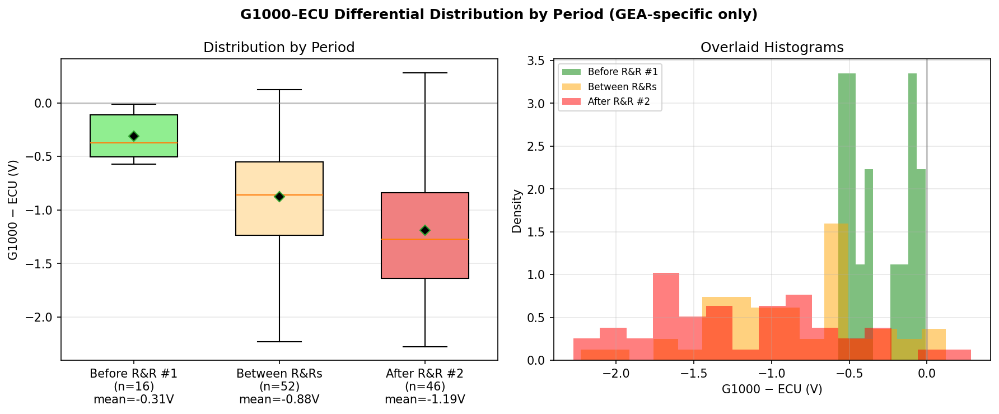

<br>

---

<br>

## Part 3 — Root Cause Analysis

**A high-resistance ground connection** somewhere in the GEA 71S's ground return path.

### 3.1 Where the Voltage Is Actually Measured

The G1000 bus voltage ("volt1") is measured by the **GEA 71S** (Engine/Airframe unit), mounted on the **instrument panel shelf** behind the MFD (AMM 31-40-00, p.985, Figure 6). It is the bottom-left unit on the shelf, accessible by removing the lower instrument panel cover.

**AMM Schematic — G1000 NXi GEA 71S Wiring (D44-9231-60-03, Sheet 4/6):**

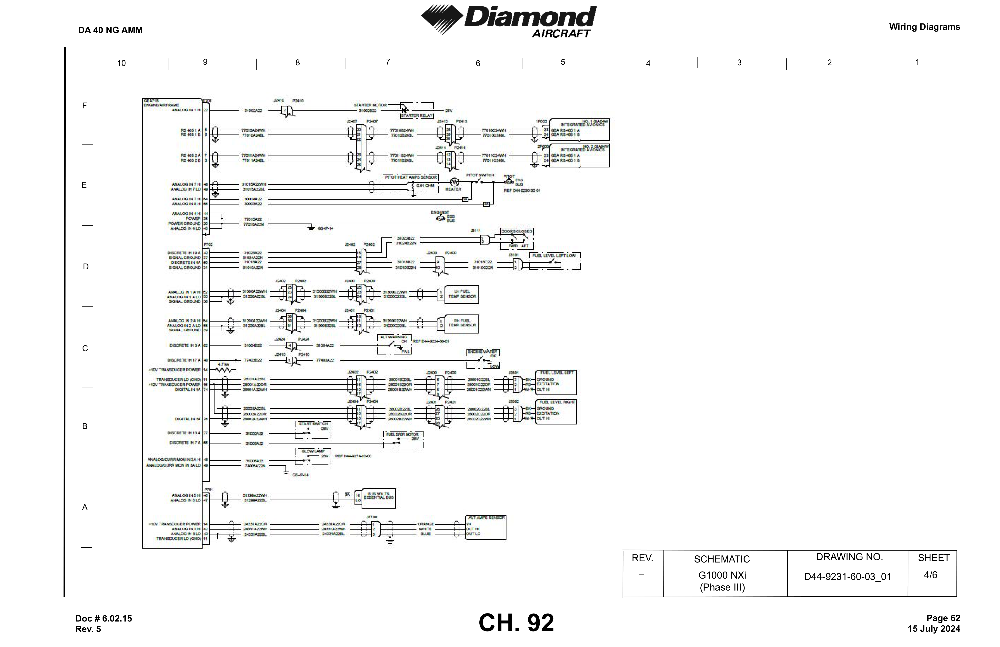

- Per the AFM (Doc 6.01.15-E, Section 7.10.1, p.7-43): *"The voltmeter shows the voltage of the essential bus. Under normal operating conditions the alternator voltage is shown, otherwise it is the voltage of the main battery."*
- The GEA 71S **senses bus voltage via a dedicated analog input** — Pin 46 (ANALOG IN 5 HI) and Pin 47 (ANALOG IN 5 LO), connected to the **Essential Bus** via shielded wires 31299A22WH/BL. A **3A fuse** protects the HI wire; an open fuse would produce a **0V reading**, not a low reading.
- **The displayed voltage = Pin 46 (HI) minus Pin 47 (LO)** — a differential measurement. Pin 47 is the measurement reference. Any resistance at Pin 47's ground termination directly shifts the reading down.
- **Critical unknown:** Pin 47 (wire 31299A22BL) connects to the low side of the Essential Bus. The Electrical System schematic (D44-9224-30-01X03) shows it connected to the ECU BUS — but the ECU BUS is a positive bus, so this cannot be a literal connection. We infer Pin 47 connects to airplane ground, but **the physical ground point where wire 31299A22BL terminates is unknown and must be traced by the shop.**

No software calibration or correction is applied — with m=1.0 and b=0.0, the G1000 displays exactly what the GEA 71S hardware measures. The offset is a **hardware voltage drop**, not a calibration or firmware problem.

### 3.2 How a Bad Ground Creates a False Low Reading

If there's extra resistance in the ground path, current flowing through that resistance creates a voltage drop that only the GEA sees:

```
V_displayed = V_actual - (I_load × R_bad_ground)
```

**Estimating the resistance from our data:**

The Feb 25 ground test (test D) provides the cleanest measurement — GPU power, structural grounds verified healthy, battery terminal cleaned:
- At 6.1A avionics load: **-1.155V** offset → **R ≈ 1.155V / 6.1A = 0.189Ω** (189 milliohms)

This is consistent with the in-flight G1000-to-ECU offset (avg 1.19V) at ~13A alternator output, which gives R ≈ 0.092Ω — lower because the 13A total alternator current includes loads that don't flow through the GEA's specific bad connection. The ~0.19Ω estimate from the isolated ground test is more accurate.

**How this triggers LOW VOLTS at normal load levels (13-20A):**

The G1000 LOW VOLTS annunciation triggers at **24V** (per Garmin G1000 System Maintenance Manual). During cruise the alternator holds the bus at ~28V, so even with a 1.2V drop the G1000 reads ~26.8V — above threshold. But during **landing and taxi** (when the FlySto LOW VOLTS events occurred), the engine is at idle RPM, alternator output drops, and the bus voltage sags toward battery voltage:

| Actual bus voltage | At 6A (0.19Ω) | G1000 reads | At 13A (0.19Ω) | G1000 reads |
|---|---|---|---|---|
| 28.0V (cruise) | -1.14V | 26.9V | -2.47V | 25.5V |
| 27.0V (low alt output) | -1.14V | 25.9V | -2.47V | 24.5V |
| **26.5V** (idle/taxi) | -1.14V | **25.4V** | -2.47V | **24.0V** |
| **26.0V** (battery sag) | -1.14V | **24.9V** | -2.47V | **23.5V** |
| **25.5V** (weak battery) | -1.14V | **24.4V** | -2.47V | **23.0V** |

At 26.5V actual bus (idle/taxi) with 13A through the bad connection → G1000 reads **24.0V** — right at the LOW VOLTS threshold. Any momentary load spike (radio TX, flap retraction, autopilot servo) or vibration-induced resistance increase pushes it below 24V and triggers the annunciation.

**This compounds in both directions:** higher resistance increases the drop at any given current, AND higher current increases the drop at any given resistance. A connection that degrades over time (corrosion, thermal cycling, vibration) faces both — worsening resistance while the same loads keep flowing. The battery that failed capacity testing at 68% (Jul 2025) makes it worse still, as a degraded battery sags more under load, lowering the starting bus voltage during idle/taxi phases.

### 3.3 The Voltage Measurement Path

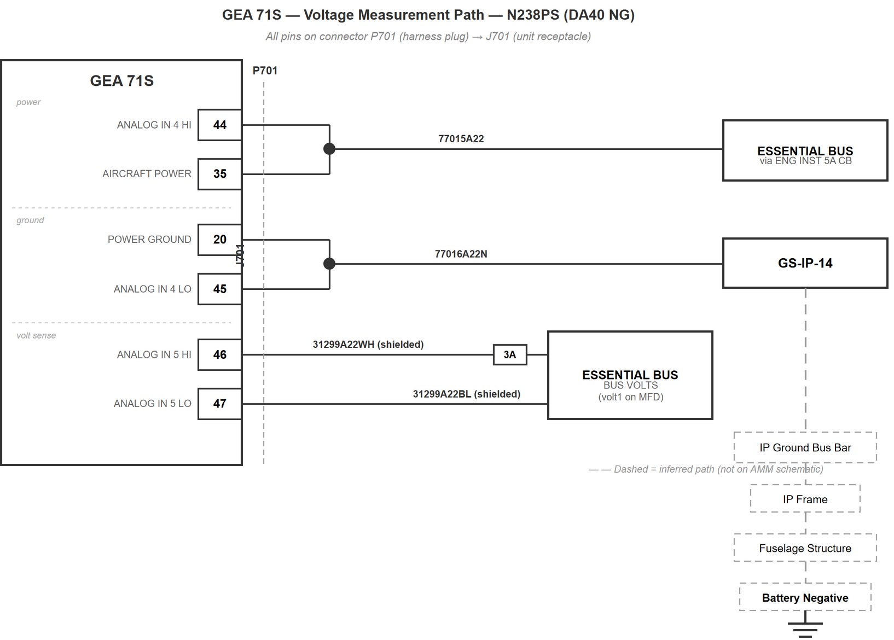

*Solid lines = documented on AMM CH.92 schematics. The complete ground return path from GS-IP bus bar to battery B1 negative is confirmed as wire 24008A4N (4 AWG) per D44-9224-30-01X03.*

### 3.4 DA40 NG Electrical System Schematic (D44-9224-30-01X03, Sheet 1/1)

This is the master electrical system schematic for the MAM40-858 conversion (N238PS configuration). It shows all buses, relays, battery, alternator, and the critical **wire 24008A4N (4 AWG)**:

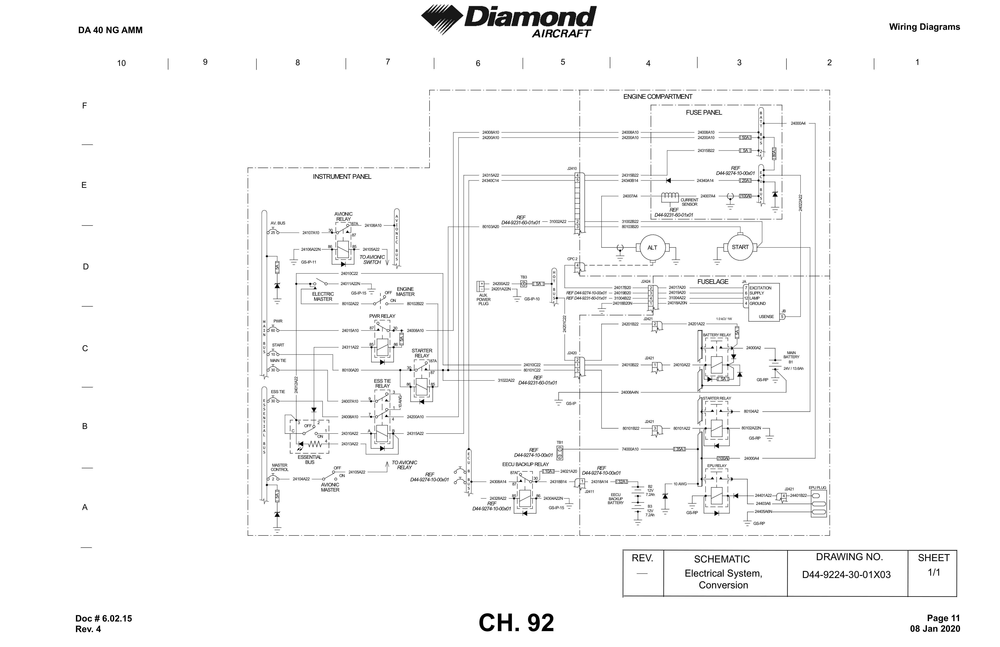

### 3.5 Why Only the G1000 Reads Low

The GEA 71S measures voltage as a **differential reading: Pin 46 (HI) minus Pin 47 (LO)**. Pin 47 connects to the low side of the Essential Bus via wire 31299A22BL. The schematic shows this wire connected to the ECU BUS (a positive bus), which makes no sense for a ground reference — we infer it connects to airplane ground, but the physical termination is unknown.

The ECU (under the pilot's seat) grounds through **GS-IP-3 and GS-IP-4** (per AMM p1936-1937, Drawing D44-9274-10-00) — the same instrument panel ground bus. The ECU reads correctly (~27.8V), proving the shared GS-IP bus bar, wire 24008A4N, and aft ground termination are all healthy. The fault is isolated to connections unique to the GEA 71S.

```
VOLTAGE MEASUREMENT PATH (differential — determines the reading):
Pin 46 (HI) ← wire 31299A22WH ← Essential Bus positive (via fuse)
Pin 47 (LO) ← wire 31299A22BL ← shown as ECU BUS on schematic (UNKNOWN actual termination)
                                  ^^^^^^^^^^^^^^^^^^^^^^^^^^^^^^^^^^^^^^^^
                                  SUSPECT #1 — trace this wire

GEA POWER GROUND PATH:
GEA 71S → GS-IP-14 → GS-IP bus bar → wire 24008A4N (4 AWG) → Battery B1 neg
          ^^^^^^^^
          SUSPECT #2 — Pin 20/45, wire 77016A22N

PROVEN HEALTHY (ECU uses these and reads correctly):
ECU     → GS-IP-3/4 → GS-IP bus bar → wire 24008A4N (4 AWG) → Battery B1 neg
```

### 3.6 How the Voltage Data Flows to the G1000 Displays

The GEA 71S and ECU are completely independent measurement systems:

```
GEA 71S ──RS-485──→ GIA 63W ──HSDB──→ GDU displays   (bus voltage, amps, temps)
ECU     ──RS-232──→ GIA 63W ──HSDB──→ GDU displays   (engine: RPM, fuel, oil, EGT/CHT)
```

The G1000 has no way to cross-check the GEA's voltage reading against the ECU's — it simply displays what the GEA reports. The only way to see the ECU's battery voltage is by downloading the ECU data log separately.

### 3.7 Why the G1000 Amps Reading Is Accurate (Despite the Voltage Error)

The alternator current displayed on the MFD ("AMPS") is measured by a **Hall-effect current transducer** (J7700, the ALT AMPS SENSOR) using a **differential** input on GEA P701 Pins 42/43 (ANALOG IN 3 HI/LO). The transducer has its own isolated power supply (+10V from Pin 14) and ground return (Pin 11), completely separate from the POWER GROUND path at Pin 20.

```
GEA 71S P701                    ALT AMPS SENSOR (J7700)
─────────────                   ───────────────────────
Pin 14 (+10V TRANSDUCER PWR) ──→  V+    (wire 24331A22OR)
Pin 42 (ANALOG IN 3 HI)     ←──  OUT HI (wire 24331A22WH)
Pin 43 (ANALOG IN 3 LO)     ←──  OUT LO (wire 24331A22BL)
Pin 11 (TRANSDUCER LO/GND)  ──→  GND
```

Because the amps measurement is differential and isolated from the power ground, **the bad ground path does NOT affect the amps reading**. The MFD amps display is accurate.

**Observed amps behavior:** The MFD alternator amps reading bounces between **13-15A** both on the ground at idle and during cruise flight. This is **normal voltage regulator hunting** — the regulator constantly adjusts alternator field current to maintain target bus voltage, and the amps display reflects those adjustments. At idle RPM the alternator is near the bottom of its output range, so the regulator hunts more aggressively (wider swing). In cruise at higher RPM the alternator has more headroom and the hunting range narrows. This behavior is not related to the voltage measurement fault — the amps circuit is fully isolated from the bad pin contact.

**G1000 system power draw** (measured Feb 25, 2026 on the ground with Fluke i410 AC/DC Current Clamp, 1 mV/A, clamped on GPU plug cable):

| Metric | Value |
|--------|-------|
| Average current draw | **6.1A** |
| Peak current draw | **7.2A** |
| Voltage at battery terminal | 28.355V (GPU) |
| Average power | **~173W** |
| Peak power | **~204W** |
| Load config | Master ON, G1000 on, Avionics Bus on, engine off |

The 6.1A G1000/avionics load is a subset of the 13-15A total alternator output — the remainder goes to battery charging, lighting, pitot heat, and other aircraft systems.

**Note:** G1000 CSV data logs do not record amps (only `volt1` and `volt2`). The ECU data logs do not record aircraft electrical current (only fuel system solenoid currents). The MFD amps display is the only source for alternator current data, and it is not logged.

### 3.8 Probable Cause Summary

1. **Variable offset, not constant** — varies from -5.6 V to +1.7 V (σ = 0.71 V). Consistent with current-dependent voltage drops across a resistive connection.
2. **G1000 shows excess noise** — VDL sees 0.27 V std dev while G1000 sees 0.69 V on the same bus.
3. **Near-zero correlation (r = 0.09)** — G1000 fluctuations are driven by its own ground/sensing path, not actual bus voltage changes.
4. **Transient deep dips** — -5.6 V worst case, consistent with high-current events pulling current through a resistive ground.
5. **Different magnitude between flights** — thermal expansion, vibration, or connector seating alter contact resistance.

Using Ohm's law, even **0.05 ohms** of ground resistance at 20 A = 1.0 V drop that only the G1000 sees.

<br>

---

<br>

## Part 4 — Maintenance History

### 4.1 Historical Voltage Analysis (184 Flights)

The single-flight analysis was confirmed across **all 184 G1000 NXi flight logs** (Jul 2023 – Feb 2026).

#### 4.1.1 Voltage History with ECU Reference

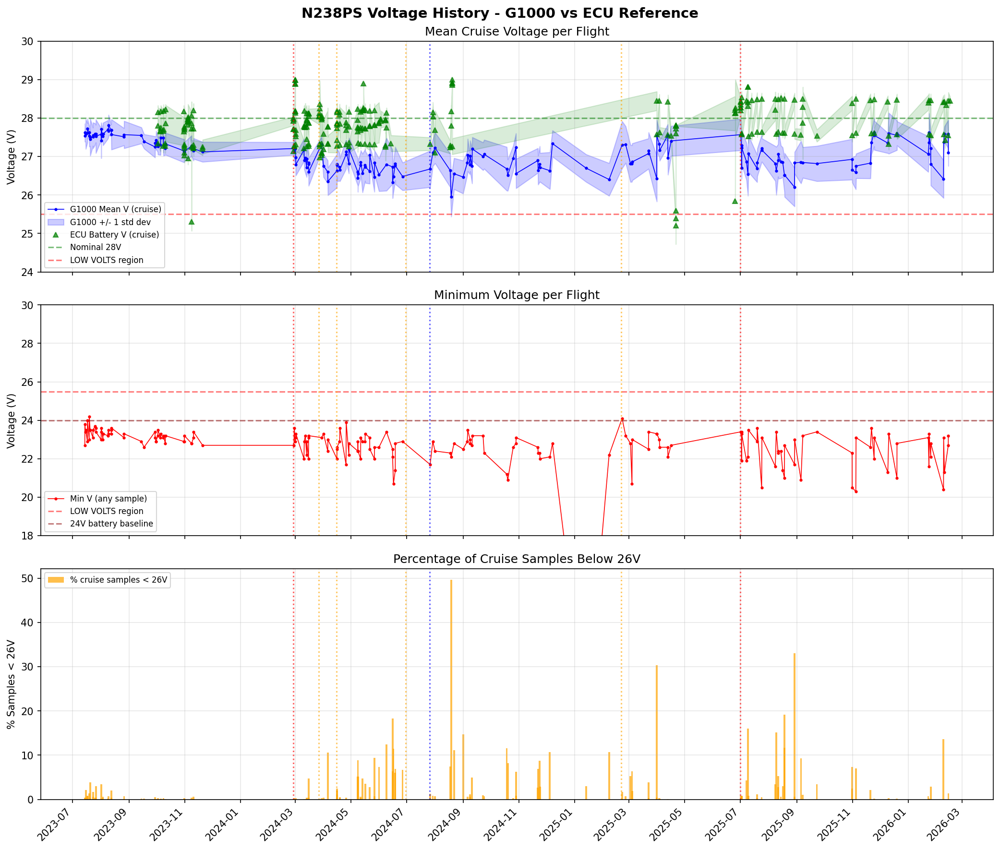

#### 4.1.2 Change-Point Detection (Pettitt's Test)

A nonparametric Pettitt's test detected a statistically significant change-point at **February 29, 2024** (p = 3.75e-13):

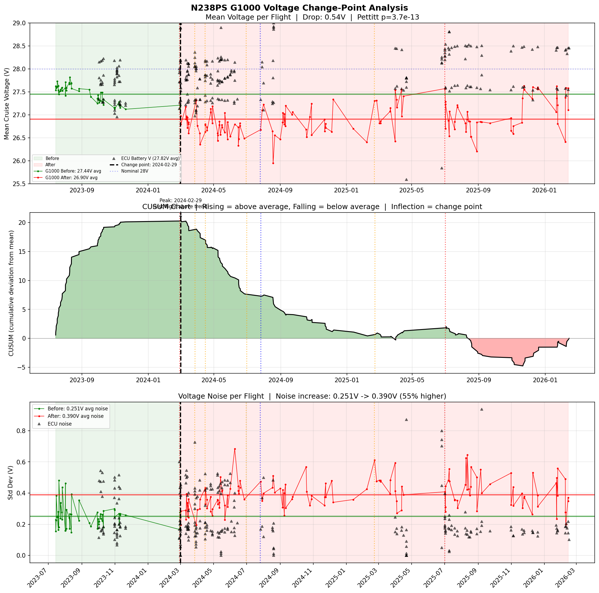

| Metric | Before (53 flights) | After (131 flights) |
|---|---|---|
| Mean cruise voltage | 27.44 V | 26.90 V |
| Mean noise (std dev) | 0.251 V | 0.390 V |
| **Voltage drop** | | **-0.54 V** |
| **Noise increase** | | **+55%** |

The ECU reads a stable **27.82 V** throughout — no change-point. The drop is G1000-specific.

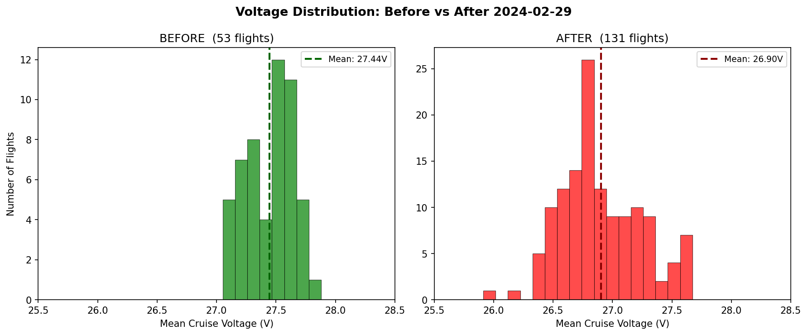

### 4.2 The Change-Point: February 2024

The engine R&R on **February 28, 2024** (oil leak repair) aligns precisely with the detected change-point. Work during that visit:

1. **Engine removed and reinstalled** — oil sump gasket and cylinder head cover
2. **Alternator #2 replaced** — RACC power issue
3. **RACC relay troubleshooting** — relays in the aft avionics bay inspected
4. **GSA 91 pitch servo replaced**

Panels were opened, harnesses were moved, and connectors were handled throughout the aircraft. Something disturbed a ground connection, and nobody noticed the G1000 was now reading a volt low.

**~~Probable mechanism — battery terminal corrosion:~~** ~~During the R&R, the battery was disconnected and ring terminals left exposed in a humid Florida hangar.~~ **ELIMINATED (Feb 25, 2026):** Battery terminal was cleaned, retorqued, and structural grounds verified at < 6 mV — problem persists unchanged. **Revised mechanism:** Something during the Feb 2024 shop visit disturbed the GEA P701 connector, Pin 47's wire termination, or GS-IP-14 stud — these components are unique to the GEA sensing path and were not disturbed during R&R #2.

### 4.3 What Has Already Been Tried (and didn't fix it)

| Date | Action | Result |
|------|--------|--------|
| Feb 2024 | Replaced alternator #2 (RACC) + relay troubleshooting | Fixed RACC — but voltage problem started here |
| Feb 2024 | Replaced GSA 91 pitch servo | No improvement on voltage |
| Apr 2024 | Replaced voltage regulator | No improvement |
| Jun 2024 | Replaced voltage regulator again + repaired wire at P2208 | No improvement |
| Jul 2024 | Replaced P2413 connector (repinned HSDB harness) | Fixed COM/NAV/GPS cycling — no improvement on voltage |
| Feb 2025 | Replaced main alternator AND voltage regulator (3rd time) | No improvement |
| Jul 2025 | Engine R&R #2 + new battery + pitch servo replaced again | No improvement |
| Feb 2026 | Cleaned GDL 69A pins (CH.23) | No improvement — wrong unit |
| **Feb 25, 2026** | **Cleaned battery negative terminal + retorqued** | **No improvement — structural grounds all < 6 mV, flight offset unchanged (-1.4 to -2.1V)** |

None addressed the GEA-specific sensing path. The alternator, regulators, and battery terminal were never the problem.

### 4.4 Second Engine R&R — Differential Diagnosis

The engine was removed again in Apr–Jul 2025 (piston crack). Same firewall connectors reconnected:

| Period | Flights | Mean Voltage | Mean Noise (σ) |
|---|---|---|---|
| Before R&R #1 (pre Feb 2024) | 50 | 27.46 V | 0.253 V |
| Between R&Rs (Mar 2024 – Apr 2025) | 88 | 26.84 V | 0.374 V |
| After R&R #2 (Jul 2025+) | 46 | 27.03 V | 0.410 V |

The problem **did not resolve** after R&R #2. This **rules out firewall pass-through connectors**. The ECU proves the shared GS-IP infrastructure is healthy.

### 4.5 Maintenance Timeline

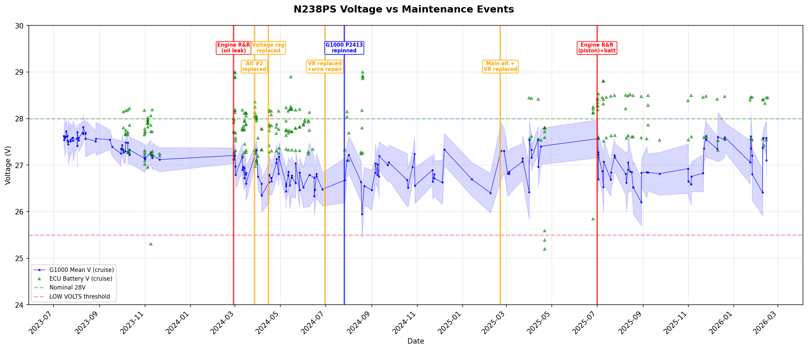

| Date | TT (hrs) | Event |
|---|---|---|
| **Feb 28, 2024** | **54.5** | **Engine R&R for oil leak** — change-point |
| Mar 27, 2024 | 57.7 | Replaced alternator #2 |
| Apr 15, 2024 | 61.4 | Replaced voltage regulator |
| Jun 30, 2024 | 100.7 | Replaced VR again + repaired wire at P2208 |
| Jul 26, 2024 | 95.6 | Replaced P2413 connector; replaced alt #2 belt |
| Feb 21, 2025 | 136.9 | Replaced main alternator AND VR (3rd time) |
| Jul 1, 2025 | 147.5 | Engine R&R #2; battery failed at 68%, replaced |
| **Aug 18, 2025** | ~150 | **Owner ground test**: 25.2V actual, G1000 23.7V — **1.5V offset** |
| **Feb 8, 2026** | ~158 | **VDL48 flight test**: -1.36V mean, -5.6V worst |
| Feb 15, 2026 | ~160 | Shop cleaned GDL 69A pins (wrong unit) |
| **Feb 20, 2026** | ~160 | **GPU test**: 0.19V offset with GPU vs 1.3V battery |
| **Feb 25, 2026** | ~160 | **Battery terminal cleaned/retorqued + structural grounds all < 6 mV + flight test: -1.4 to -2.1V offset unchanged** |

<br>

---

<br>

## Part 5 — Troubleshooting & Repair Guide

> **For Mechanics:** This section contains all the actionable information — where to look, how to test, and how to verify the fix. The preceding sections provide the evidence and analysis.

### 5.1 Where to Look

> **Updated Feb 25, 2026:** Battery negative terminal, structural grounds, and shared GS-IP infrastructure are all eliminated. The fault is isolated to the GEA P701 connector and its specific wiring. The offset is **load-dependent** (~0.19Ω) and **vibration-sensitive** — characteristic of a loose or corroded pin contact.

**1. GEA P701/J701 Connector Pins — PRIMARY SUSPECT**

The GEA 71S P701 connector is the single point where all voltage sensing and power wires converge. The load-dependent offset (test D: -1.155V at 6.1A on GPU) implies ~0.19Ω of resistance in a **current-carrying pin**. The vibration sensitivity (ground: -1.155V stable → flight: -1.4V to -2.1V with dips to -5.6V) is characteristic of a loose pin bouncing between contact states.

**Priority pins to inspect (current-carrying — most likely fault):**
- **Pin 20 (POWER GROUND)** — wire 77016A22N → GS-IP-14. All GEA return current flows through this pin. A bad contact here creates a load-dependent offset AND corrupts the ADC ground reference.
- **Pin 35 (AIRCRAFT POWER 1)** — wire 77015A22 from Essential Bus via ENG INST 5A breaker. All GEA supply current flows through this pin. A bad contact on the power side has the same effect.
- **Pin 78 (POWER GROUND)** — second power ground pin, also routes to GS-IP-14.

**Also inspect (voltage sensing — secondary):**
- **Pin 47 (ANALOG IN 5 LO)** — wire 31299A22BL, voltage measurement reference. High-impedance input (near-zero current), so a bad contact would cause noise/instability rather than a clean load-dependent offset — but it could contribute to the erratic deep dips.
- **Pin 46 (ANALOG IN 5 HI)** — wire 31299A22WH, voltage measurement positive. Same reasoning.
- **Pin 45 (ANALOG IN 4 LO)** — wire 77016A22N (same wire as Pin 20), GEA self-monitoring ground.

**What to look for:**
- **Backed-out pins** — check from the rear of the connector. A pin that has partially withdrawn from its socket has intermittent contact under vibration.
- **Corrosion or discoloration** on pin contacts
- **Connector not fully seated** — partially mated connector increases contact resistance on all pins
- **Damaged strain relief** — allows the harness to flex at pin contacts during vibration
- **Chafed or damaged wires** — especially shielded wires 31299A22WH/BL (Pins 46/47)

**Why this is the top suspect:** The offset scales with avionics load current (V = I × R at ~0.19Ω), worsens dramatically with vibration (bouncing between partial contact states), and produces the excess voltage noise that distinguishes N238PS from a healthy DA40 NG. A loose pin in a connector behind the instrument panel — subject to engine vibration transmitted through the airframe — explains every observation in the data.

**2. Pin 47 (ANALOG IN 5 LO) — Trace This Wire**

Wire 31299A22BL (shielded) — the voltage measurement reference. Per the G1000 wiring diagram (D44-9231-60-03), connects to the low side of the Essential Bus. The Electrical System schematic (D44-9224-30-01X03) shows this wire connected to the ECU BUS — but the ECU BUS is a positive bus, so this cannot be a literal ground connection. We infer Pin 47 connects to airplane ground, but **the physical termination is unknown and must be traced**.

**Why this is hard to find:** Other Diamond variants explicitly specify a ground stud (e.g. GS-IP-X) for this pin. **The DA40 NG schematic does not** — it shows only an ambiguous ECU BUS connection. The wire must be physically traced from P701 Pin 47.

**3. GS-IP-14 / Pin 20 (POWER GROUND)**

Wire 77016A22N. The GEA's power ground terminates at GS-IP-14 — the only LRU on this stud. Even though the dedicated wire path downstream is healthy (ECU proves GS-IP bus bar and 24008A4N are fine), if the **GS-IP-14 stud itself** is corroded or loose, it only affects the GEA. Check: loose nut, corrosion under ring terminal, paint/primer between terminal and stud, cracked terminal.

**4. Positive path: BATT BUS → Essential Bus**

Four relay/breaker contacts between BATT BUS and Essential Bus: Power Relay (PWR 60A), MAIN TIE 30A, Ess Tie Relay, ESS TIE 30A. The ECU bypasses all of these (ECU BUS is fed directly from BATT BUS). Resistance across these contacts would be load-dependent — potentially explaining part of the offset. Measure Essential Bus voltage directly vs AUX POWER (HOT BUS) to quantify any drop in the positive path.

**~~5. Battery negative terminal, wire 24008B4N (IPC "Cable 200"), and aft/cabin structural grounds~~ — ELIMINATED**

Cleaned and retorqued Feb 25, 2026. Structural ground voltage drops measured at aft fuselage and cabin points — all < 6 mV from battery negative under full avionics load. Problem persists unchanged in flight. **Not the fault.**

**6. Areas Not Yet Tested (TODO)**

Two areas remain untested and should be checked for completeness:

**Instrument panel area** — contains the Main Bus, Avionic Bus, Essential Bus (what the GEA reads), and the GS-IP ground stud series. This is where all the bus ground references (airplane ground symbols on the schematic) physically terminate. Key tests:
- Voltage drop from battery negative to each GS-IP stud (especially GS-IP-14)
- Voltage drop from battery negative to the Essential Bus ground reference
- Direct voltage measurement on the Essential Bus vs AUX POWER (quantifies positive path drops)
- **Trace Pin 47 wire (31299A22BL)** — it must terminate somewhere in this area

**Engine compartment** — contains the fuse panel (100A ECU BUS fuse, other high-current fuses), ALT AMPS current sensor (J7700), ECU BUS, and Battery Bus. The schematic shows Pin 47 connected to the ECU BUS, which has a physical presence here. Key tests:
- Voltage drop from battery negative to engine compartment ground points (alternator ground strap, engine-to-mount bonding, firewall ground)
- Inspect the fuse panel and its ground connections
- Check whether the ECU BUS connection shown for Pin 47 has any physical wiring in the engine area

Testing both areas completes the ground survey from battery negative → aft fuselage (done) → cabin (done) → instrument panel (TODO) → engine compartment (TODO). If all test clean, the fault is definitively at the P701 connector contacts or GS-IP-14 stud.

### 5.2 Ground Stud Locations (GS-IP Series)

| Ground Stud | What's Connected | Priority |
|-------------|-----------------|----------|
| **P701 connector** | **All GEA pins — inspect connector first** | **CHECK FIRST** |
| **Pin 47 ground** | **GEA Pin 47 (ANALOG IN 5 LO)** — wire 31299A22BL (unknown termination) | **TRACE THIS WIRE** |
| **GS-IP-14** | **GEA 71S Pin 20 + Pin 45** (wire 77016A22N) + Pin 49 glow lamp | **CHECK SECOND** |
| **GS IP-6** | GIA 63W #1 + GIA 63W #2 | Check third |
| **GS IP-4** | GDU 1050 PFD + GDU 1060 MFD + GMA 1360 + COM 1 | Check third — most loaded (4 LRUs) |
| **GS IP-5** | GRS 79 AHRS #1 + AHRS #2 (via GS AVB) | Check fourth |
| **GS IP-3** | GPS/NAV 1 + Wx 500 Stormscope | Check fifth |
| **GS IP-10** | GPS/NAV 2 | Lower priority |

**What to look for:** Loose nut, corrosion under ring terminal, paint/primer between terminal and stud, cracked terminal, flattened lock washer.

### 5.3 GEA 71S P701 / J701 Pin Reference (Garmin 190-00303-40)


Full pin listing: [GEA 71 Installation Manual (190-00303-40)](docs/GEA71_InstallationManual.pdf) — pages 23–26

**Voltage measurement circuit (inspect all):**

| Pin | Function | Wire | Where It Goes | Why It Matters |
|-----|----------|------|---------------|----------------|
| **46** | **ANALOG IN 5 HI** | **31299A22WH** (shielded) | **Essential Bus via 3A fuse** | **Voltage sense high. Open fuse = 0V, not low.** |
| **47** | **ANALOG IN 5 LO** | **31299A22BL** (shielded) | **Essential Bus ground** | **PRIMARY SUSPECT — measurement reference. TRACE THIS WIRE.** |
| **44** | **ANALOG IN 4 HI** | **77015A22** (= Pin 35) | **GEA power supply** | Measures GEA's own supply |
| **45** | **ANALOG IN 4 LO** | **77016A22N** (= Pin 20) | **GS-IP-14** | GEA ground — same wire as Pin 20 |
| **35** | **AIRCRAFT POWER 1** | **77015A22** | **Essential Bus via ENG INST 5A** | GEA power supply |
| **20** | **POWER GROUND** | **77016A22N** | **GS-IP-14** | GEA ground reference |

**Check for:** Backed-out pins (rear of connector), corrosion, connector not fully seated, damaged strain relief.

### 5.4 How to Test

#### 5.4.1 Quick Voltage Drop Test (Owner Can Perform)

With Master ON, G1000 running, battery only (no engine, no GPU):

**Test A (direct):** Meter on DC volts. Red probe on **BatteryMinder ring terminal** (top of stack on B1(-) bolt), black probe on **battery post metal** (below the stack). Good: < 0.05V. Bad: 0.5V to 1.5V+.

**Test B (if post inaccessible):** Measure B1(+) to BatteryMinder terminal on B1(-). Compare to G1000 display. If both ~24V → stack elevated, hypothesis confirmed. If meter much higher → problem upstream in GEA-specific path.

#### 5.4.2 ESS BUS Switch Test (Quick Isolation — Multimeter Required)

> **Why a multimeter is needed:** When ESS BUS switch activates, MFD turns off. PFD enters reversionary mode but **does not display voltage**. Verified on N238PS, Feb 20, 2026.

**Procedure:**
1. Connect multimeter (DC volts) to Essential Bus (e.g., ENG INST breaker output)
2. Avionics powered, G1000 running
3. Note G1000 voltage on MFD **and** multimeter — the difference is baseline offset
4. Flip ESS BUS switch ON — MFD turns off
5. Read multimeter for 30–60 seconds
6. Return ESS BUS switch to normal

| Result | Meaning | Next Step |
|--------|---------|-----------|
| **Multimeter stays the same** | **Confirms ground/sense path** problem | Trace Pin 47, check GS-IP-14, resistance measurements |
| Multimeter changes | **Power path** problem | Check Essential Tie Relay, Main Tie breaker, Power Relay |

#### 5.4.3 Resistance Measurements

**Setup:** Battery master OFF, **battery negative cable physically disconnected**. Meter needs to be the only current source.

**Recommended meter:** Fluke 289 or similar DMM with 0.01Ω resolution and **REL mode**.

**Long-distance setup:** Use heavy gauge wire (12–14 AWG, 4–5 m) with clips. Zero leads (press REL), clip one end to disconnected battery negative cable lug, probe test point with the other.

| Test | From | To | Expected | If High |
|------|------|----|----------|---------|
| **1. End-to-end** | GEA P701 Pin 20 | Battery neg cable lug | **< 0.050 Ω** | Confirms problem — continue |
| **2. Wire 24008A4N** | GS-IP bus bar | Battery neg cable lug | < 0.010 Ω | Check terminals both ends |
| **3. Each GS-IP stud** | Stud terminal | GS-IP bus bar | < 0.005 Ω | Clean and retorque |
| **4. Each LRU ground** | LRU ground pin | Its GS-IP stud | < 0.010 Ω | Check connector, wire, crimp |
| **5. Battery terminal** | 24008A4N ring terminal | Battery post | < 0.005 Ω | Clean, retorque, check stacking |

#### 5.4.4 What the Numbers Mean

| Resistance | Voltage Drop at 20A | Interpretation |
|-----------|---------------------|---------------|
| < 0.010 Ω | < 0.2V | Normal |
| 0.010 – 0.025 Ω | 0.2 – 0.5V | Marginal — may worsen with vibration |
| 0.025 – 0.050 Ω | 0.5 – 1.0V | Degraded — consistent with ~1.4V offset |
| 0.050 – 0.100 Ω | 1.0 – 2.0V | Failed — consistent with -5.6V dips |
| > 0.100 Ω | > 2.0V | Severe |

**Estimated total ground path resistance: 0.05–0.09 ohms.**

**Important:** Don't stop after finding one bad connection. The data shows the ground path was never as clean as other DA40NGs — even from the factory. Clean and retorque **all** GS-IP ground studs and reseat **all** G1000 LRU connectors while the panels are open.

### 5.5 How to Verify the Fix

A ground test alone cannot reproduce the problem reliably. The offset is worse in flight (vibration, thermal).

**After repair:**
1. AMM 20-30-00 Section C post-repair checks on all disturbed connections
2. Repeat end-to-end resistance — should be < 0.010 Ω
3. G1000 voltage should read within 0.3V of meter at AUX POWER
4. **Flight test** — at least 30 minutes with varied loads:
   - **Option A — ECU data (easiest):** Compare ECU session log vs G1000 log
   - **Option B — VDL48:** Same setup as Feb 8 analysis
   - **Pass:** Mean offset < 0.3V, no dips > 1.0V, noise < 0.30V
   - Analysis scripts in this repo process either source automatically

<br>

---

<br>

## Part 6 — Technical Reference

### 6.1 Electrical System Architecture

N238PS is a MAM40-858 configuration. Wiring schematics from DA40 NG AMM (Doc 6.02.15, CH.92).

#### 6.1.1 Bus Structure Diagram (AMM 24-60-00, Figure 1)

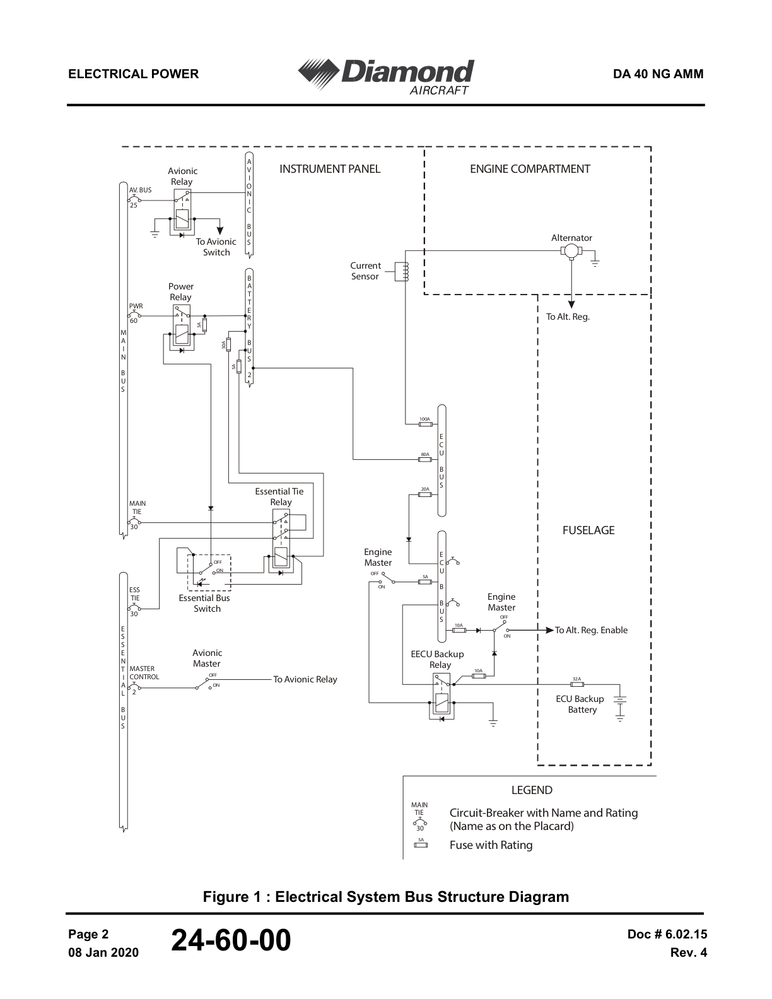

**Note:** The **GEA 71S** (voltage sensor) is on the **Essential Bus** via the 5A ENG INST breaker. Most G1000 LRUs (displays, computers) are on the **AVIONIC BUS**.

The alternator voltage regulator (J2424) has its own **dedicated USENSE wire** (24022A22) that senses bus voltage independently, so the alternator regulates correctly regardless of the G1000's ground path issue.

#### 6.1.2 External Power Unit (EPU) Plug — AN2551

| EPU Pin | Wire | Gauge | Connects To |
|---------|------|-------|-------------|
| Jumper/Sense | 24401B22 → J2421 → 24401A22 | 22 AWG | EPU RELAY coil |
| **Positive** | **24403A6** | **6 AWG** | **BATT BUS** (via EPU RELAY + 100A fuse) |
| **Negative** | **24405A6N** | **6 AWG** | **GS-RP / Battery B1(-)** (aft fuselage) |

### 6.2 Ground Path — Wire-Level Detail

#### 6.2.1 Segment Detail Table

| Seg | From | To | Connection | Wire | Gauge | Failure Modes |
|---|---|---|---|---|---|---|
| **1** | GEA 71S ground pins | Harness connector | Pin-to-socket | Per AMM | 22 AWG | Backed-out pin, corrosion, loose connector |
| **2** | Harness connector | GS-IP stud | Crimped ring terminal | Harness wires | 22 AWG | Crimp failure, wire break, chafing |
| **3** | GS-IP stud | Ground bus bar | Bolted ring terminal | Stud + nut + lock washer | N/A | Loose nut, corrosion, paint under terminal |
| **4** | Ground bus bar | IP frame | Bolted/bonded joint | Mounting hardware | N/A | Loose bolt, dissimilar metal corrosion |
| **5** | IP frame | Fuselage | Structural bond | Bonding strap (if present) | Varies | Loose strap, paint between surfaces |
| **6** | Fuselage | Battery negative | Heavy cable | Wire 24008A4N | 4 AWG | Loose terminal, corrosion |

#### 6.2.2 G1000 NXi Ground Stud Inventory (D44-9231-60-03)

| LRU | Connector | Pin | Wire | Gauge | Ground Stud |
|-----|-----------|-----|------|-------|-------------|
| **GIA 63W #1** | 1P604 | 14 | 23011A20N | 20 AWG | **GS IP-6** |
| **GIA 63W #2** | 2P604 | 14 | 23001A20N | 20 AWG | **GS IP-6** |
| **GDU 1050 PFD** | 1P1600 | 27 | 31106A22N | 22 AWG | **GS IP-4** |
| **GDU 1060 MFD** | 2P1601 | 27 | 31158A22N | 22 AWG | **GS IP-4** |
| **GEA 71S** | P701 | 20 | 77016A22N | 22 AWG | **GS-IP-14** |
| **GEA 71S** | P701 | 45 | 77016A22N (= Pin 20) | 22 AWG | **GS-IP-14** |
| **GEA 71S** | P701 | 49 | 74005A22N | 22 AWG | **GS-IP-14** |
| **GRS 79 AHRS #1** | P791 | 34 | 34903A22N | 22 AWG | **GS IP-5** (via GS AVB) |
| **GRS 79 AHRS #2** | P791 | 34 | 34901A22N | 22 AWG | **GS IP-5** |
| **GMA 1360 Audio** | P3475 | -- | 23201A20N | 20 AWG | **GS IP-4** |
| **GPS/NAV 1** | -- | -- | 34001A22N | 22 AWG | **GS IP-3** |
| **GPS/NAV 2** | -- | -- | 34101A22N | 22 AWG | **GS IP-10** |

**Ground Stud Loading Summary:**

| Ground Stud | Components | Priority |
|-------------|-----------|----------|
| **GS-IP-14** | GEA 71S (3 pins) | **CRITICAL** — voltage sensor |
| **GS IP-6** | GIA 63W #1 + #2 | **HIGH** — avionics computers |
| **GS IP-4** | PFD + MFD + Audio + COM 1 | **HIGH** — most loaded (4 LRUs) |
| **GS IP-5** | AHRS #1 + #2 (via GS AVB) | MEDIUM |
| **GS IP-3** | GPS/NAV 1 + Wx 500 | MEDIUM |
| **GS IP-10** | GPS/NAV 2 | LOW |

### 6.3 AMM References

| Reference | Content |
|-----------|---------|
| AFM Doc 6.01.15-E, Section 7.10.1 | Electrical system description, bus architecture (pp. 7-39 to 7-43) |
| AMM 24-60-00 | Bus structure, power distribution, troubleshooting |
| AMM 31-40-00, p.985-986 | GEA 71S location (instrument panel shelf) |
| AMM CH.92, D44-9224-30-01X03 | Electrical system wiring — [p1859](docs/AMM_p1859_D44-9224-30-01X03_Electrical_System_Conversion.png). Other variants: [p1857](docs/AMM_p1857_D44-9224-30-01_Electrical_System.png) · [p1858](docs/AMM_p1858_D44-9224-30-01_02_Electrical_System_Wiring.png) · [p1861](docs/AMM_p1861_D44-9224-30-05_Second_Alternator.png) |
| AMM CH.92, D44-9231-60-03 | G1000 NXi wiring: [p1908](docs/AMM_p1908_G1000_wiring.png) · [p1909](docs/AMM_p1909_G1000_wiring.png) · [p1910](docs/AMM_p1910_G1000_wiring.png) · [p1911](docs/AMM_p1911_G1000_wiring.png) · [p1912](docs/AMM_p1912_G1000_wiring.png) |
| [Garmin 190-00303-40](docs/GEA71_InstallationManual.pdf) | GEA 71 Installation Manual — P701/P702 pin lists (pp. 23-26) |
| [Garmin 190-00545-01](docs/G100%20System%20Maintenance%20Manaual%20DA40%20-%20CAUTION%20ALERTS.png) | G1000 System Maintenance Manual — LOW VOLTS: "Inspect GEA 71 connector & wiring" |
| AMM 20-30-00 (pp. 361–363) | Standard Practices — Electrical: repair scope, Loctite 222, post-repair testing |
| [Concorde 5-0324 Rev G](docs/5-0324-rg-manual.pdf) | RG-series battery manual — charge table, installation/torque specs |

### 6.4 Appendix A — DA40 NG Electrical System (AFM)

*Source: DA40 NG AFM, Doc 6.01.15-E, Rev. 3, Section 7.10.1 (pp. 7-39 to 7-43)*

**Power Generation:** 28V DC system, 70A alternator on bottom left of engine, belt-driven. ECU backup batteries (2× 12V, 7.2Ah) behind first ring frame provide alternator field excitation if main battery fails.

**Storage:** Main battery (24V, 13.6Ah) behind baggage compartment frame, controlled by ELECTRIC MASTER key switch via battery relay.

**Distribution:** Seven buses — Hot Battery Bus (always on, AUX POWER + ELT), Battery Bus 1/2, ECU Bus, Main Bus, Essential Bus, Avionic Bus.

**Voltmeter:** Shows Essential Bus voltage. Under normal conditions shows alternator voltage, otherwise battery voltage.

**Ammeter:** Displays alternator output current including battery charging.

### 6.5 Appendix B — Instrument Panel Circuit Breaker Layout (AFM)

*Source: DA40 NG AFM, p.361*


Key breakers for this investigation:

| Bus | Breaker | Rating | Relevance |
|-----|---------|--------|-----------|
| **ESSENTIAL BUS** | **ENG INST** | **5A** | **Powers the GEA 71S — the voltage sensor** |
| MAIN BUS | PWR | 60A | Power Relay (Main Bus power) |
| MAIN BUS | AV BUS | 25A | Avionic Bus (through Avionic Relay) |

The ENG INST breaker is in the Essential Bus group, confirming the GEA 71S is on the Essential Bus.

### 6.6 Reference Images

#### 6.6.1 IPC 24-31 Battery Installation

Battery mounting in aft fuselage. The IPC shows three connections at battery negative: wire 24008A4N, wire 24405A6N, and "Cable 200" (item 200 in the IPC catalog — a generic sequential item number, not a wire number).

**Actual inspection (Feb 25, 2026)** found three cables at B1(-): 24008A4N (GS-IP), **24008B4N** (GS-RP), and 24405A6N (EPU). The IPC's "Cable 200" (P/N D44-2403-160-00, "Cable, Battery GND") is actually **wire 24008B4N** — "Cable 200" is just the IPC's generic item number for this cable. The wire number 24008B4N does not appear in AMM schematics but is labeled on the physical cable. Battery terminal was cleaned, retorqued; structural grounds verified < 6 mV — **problem persists unchanged in flight**.


#### 6.6.2 IPC 24-40 External Power


#### 6.6.3 IPC 24-60 Battery Relay


#### 6.6.4 IPC 24-60 Relay Panel


#### 6.6.5 G1000 System Maintenance Manual — CAUTION Alerts


<br>

---

<br>

## Part 7 — Analysis Tools & Repository

### 7.1 Repository Structure

```
volt/
├── README.md                  # This file
├── CLAUDE.md                  # Project context and session history
├── voltage_analysis.py        # Two-source analysis (G1000 vs VDL48)
├── correlate_ecu.py           # Three-source analysis (+ AE300 ECU)
├── voltage_history.py         # Historical analysis (184 flights) + change-point detection
├── ecu_changepoint.py         # ECU differential three-period analysis + Pettitt test
├── flysto_download.py         # Bulk download G1000 CSVs from FlySto.net
├── generate_report.py         # Generates self-contained HTML report
├── data/
│   ├── N238PS_KBOW-KSPG_20260208-1551UTC.csv   # G1000 Flight 1
│   ├── N238PS_KSPG-KBOW_20260208-1812UTC.csv   # G1000 Flight 2
│   ├── LOG_VD.CSV                               # VDL48 logger
│   ├── source/                                  # All 184 G1000 CSVs (not in git)
│   └── ecu/                                     # ECU .ae3 files (not in git)
├── docs/                      # AMM schematics, IPC drawings, reference images
└── output/                    # Generated plots and reports
```

### 7.2 Running the Analysis

Requires Python 3.10+ with numpy, matplotlib, scipy:

```bash
pip install numpy matplotlib scipy
```

| Script | Purpose | Command |
|--------|---------|---------|
| `voltage_analysis.py` | Two-source (G1000 vs VDL48) | `python voltage_analysis.py` |
| `correlate_ecu.py` | Three-source (+ ECU) | `python correlate_ecu.py` |
| `voltage_history.py` | 184-flight history + change-point | `python voltage_history.py` |
| `ecu_changepoint.py` | ECU differential analysis | `python ecu_changepoint.py` |
| `flysto_download.py` | Download G1000 CSVs from FlySto | `python flysto_download.py` |
| `generate_report.py` | HTML report | `python generate_report.py` |

### 7.3 Data Sources

- **G1000 NXi**: CSV, 1-second sampling, 58 columns. See `Docs/G1000 DataLog Fields.pdf`.
- **VDL48**: 2-second sampling, AUX POWER PLUG (HOT BUS, direct battery via 5A fuse). Logger date/time incorrect but period accurate.
- **AE300 ECU**: Battery voltage (channel 808), 1-second sampling. Parsed from `.ae3` files via [AustroView](../AustroView/).

### 7.4 Statistical Methods

- Signals interpolated onto common 2-second grid for paired comparison
- VDL segmented into flight/idle phases using 27V threshold + 60-second window
- Paired t-tests, Pearson correlation, Pettitt's nonparametric change-point test
- 95% range as 2.5th–97.5th percentile of difference distribution
