# G1000 NXi Voltage Measurement Correlation Analysis

**Aircraft:** N238PS (Diamond DA40NG)
**Date:** February 8, 2026
**Avionics:** Garmin G1000 NXi
**Reference Logger:** Triplett VDL48 (S/N: 171VD_2506100052)

## Background

The G1000 NXi in N238PS has been intermittently triggering **LOW VOLTS** annunciations during normal flight operations. The aircraft electrical system appeared to be functioning normally — alternator output was healthy and no other electrical anomalies were observed. This raised the question: is the G1000 accurately reporting bus voltage, or is there a measurement error causing false alarms?

To investigate, a Triplett VDL48 voltage data logger was connected directly to the aircraft electrical bus as an independent reference. Two flights were conducted with both the G1000 data logging and the VDL48 recording simultaneously:

| | Flight 1 | Flight 2 |
|---|---|---|
| **Route** | KBOW to KSPG | KSPG to KBOW |
| **Time (UTC)** | 15:51 – 16:47 | 18:10 – 19:25 |
| **Duration** | ~56 min | ~75 min |

The VDL48 recorded continuously across both flights and the ~85-minute ground stop between them, capturing three distinct phases: Flight 1, engine-off idle, and Flight 2.

## Key Finding

**The G1000 NXi systematically under-reports bus voltage compared to the independent VDL48 reference.**

| Metric | Flight 1 | Flight 2 | Combined |
|---|---|---|---|
| G1000 volt1 mean | 26.40 V | 27.32 V | 26.93 V |
| VDL48 reference mean | 28.26 V | 28.31 V | 28.29 V |
| **Mean difference** | **-1.87 V** | **-0.99 V** | **-1.36 V** |
| 95% range | -2.68 to -0.42 V | -1.78 to -0.15 V | -2.67 to -0.18 V |
| Paired t-test | p < 0.001 | p < 0.001 | p < 0.001 |

The difference is highly statistically significant (p < 0.001) with worst-case transient dips reaching -5.6 V below the reference reading. This under-reading is more than sufficient to trigger LOW VOLTS annunciations even when actual bus voltage is normal.

## Visualizations

### VDL48 Full Recording Overview

The VDL48 captured three distinct phases: Flight 1 at ~28.3 V (alternator charging), idle period decaying from ~26.3 V to ~25.5 V (battery only), and Flight 2 at ~28.3 V.


### G1000 vs VDL48 Voltage Comparison

The green trace (VDL48) remains steady at ~28.3 V during both flights while the blue trace (G1000 volt1) consistently reads lower with substantially more fluctuation. The red trace shows the instantaneous difference.


### Distribution of Voltage Differences

Both flights show the G1000 reading shifted well below the VDL reference. Flight 1 had a larger offset (-1.87 V) than Flight 2 (-0.99 V).


### Correlation Scatter Plot

Nearly all data points fall below the 1:1 line. The low r-squared value indicates the G1000 fluctuations are largely independent of actual bus voltage changes, pointing to an issue in the G1000's sensing path rather than a simple calibration offset.


## Three-Source Correlation: Adding ECU Battery Voltage

A third independent voltage measurement was added from the Austro Engine AE300 ECU's own ADC (channel 808, "Battery Voltage"). The ECU data was extracted from encrypted `.ae3` hex dump files using the [AustroView](../AustroView/) project. The same two flights exist in the ECU data logger (sessions 80 and 81).

### Three-Way Results

| Pair | Flight 1 | Flight 2 | Combined |
|------|----------|----------|----------|
| **G1000 - VDL48** | **-1.94 V** | **-0.98 V** | **-1.38 V** |
| **G1000 - ECU** | **-2.05 V** | **-0.21 V** | **-0.99 V** |
| **ECU - VDL48** | **+0.11 V** | **-0.77 V** | **-0.40 V** |

**Key findings:**
- **Flight 1**: The ECU closely agrees with the VDL48 (mean offset only +0.11 V). Both read ~28.3 V while the G1000 reads ~26.4 V. This confirms the G1000 is the outlier.
- **Flight 2**: The ECU reads slightly lower than the VDL48 (-0.77 V), but still significantly higher than the G1000. The G1000 remains the lowest of the three.
- **The G1000 is consistently the lowest reading** across both flights and all pairwise comparisons, strongly supporting the high-resistance ground hypothesis.

### Three-Way Time Series

Each flight shows VDL48 (green) and ECU (orange) tracking together while G1000 (blue) reads consistently lower:


### ECU vs VDL48 Scatter

The ECU mostly clusters near the 1:1 line with the VDL48, confirming both independent instruments agree on the actual bus voltage:


### Three-Way Difference Distributions


## Electrical System Architecture

N238PS is a MAM40-858 configuration. Wiring schematics were extracted from the DA40 NG Airplane Maintenance Manual (Doc 6.02.15, CH.92, Drawing Nos. D44-9224-30-01 through D44-9224-30-05). The bus structure diagram is from AMM Section 24-60-00.

### Bus Structure Diagram (AMM 24-60-00, Figure 1)


### DA40 NG Electrical System Schematic (MAM40-858 Conversion, p1859)


### Bus Structure & Power Distribution

The DA40 NG has seven electrical buses. The VDL48 reference logger was connected to the **AUX POWER PLUG** on the HOT BUS (direct battery, 5A fuse).


**Note:** The G1000 is on the **AVIONIC BUS**, which is fed from the **MAIN BUS** (not the Essential Bus). The Avionic Master switch lives on the Essential Bus but only controls the Avionic Relay coil -- it does not carry power. The AMM trouble-shooting table (24-60-00, p627) confirms: "There is 28 VDC on the main bus (if G1000 is installed)... but not on the avionic bus" as the first fault condition, indicating the G1000's power originates from the MAIN BUS.

### Ground Return Paths

The G1000 measures bus voltage at its power input pins **relative to its own ground pins**. Any resistance in the ground return path causes the G1000 to read lower than actual bus voltage: `V_measured = V_bus - (I_load x R_ground)`.


The relay panel and engine compartment components (battery, alternator, starter, ECU) use separate **GS-RP ground studs** that return directly to battery negative, bypassing the instrument panel ground bus entirely. This is why only the G1000 reads low.

### Why Three Instruments Disagree


The alternator voltage regulator (J2424) has its own **dedicated USENSE wire** (24022A22, 22 AWG, pin 5) that senses bus voltage independently, so the alternator regulates correctly regardless of the G1000's ground path issue.

## G1000 Ground Path — Complete Wire-Level Detail

This section documents every connection segment in the G1000 NXi ground return path, from LRU connector pins through to the battery negative terminal.

**Source documents:**
- AMM 24-60-00 Bus Structure Figure 1 (p622) — bus architecture and power paths
- AMM CH.92 wiring diagrams D44-9224-30-01 through -03 — power distribution system (alternator, relays, buses). These do NOT show G1000 LRU-level wiring.
- **G1000 LRU connector pinouts and harness wire numbers** are in AMM CH.31 (Instruments), CH.34 (Navigation), CH.23 (Communications) — not yet extracted

### Ground Path Segment Map

The G1000's ground return has **six segments** connected in series. The total resistance from LRU ground pin to battery negative is the sum of all segment resistances. Any single high-resistance segment causes the under-reading.


### Segment Detail Table

| Seg | From | To | Connection Type | Wire/Cable | Gauge | Failure Modes |
|---|---|---|---|---|---|---|
| **1** | GIA 63W / GDU ground pins | Harness connector mate | Pin-to-socket in LRU connector | Per AMM CH.31/34 | 22 AWG | Backed-out pin, corrosion on pin/socket, loose connector lock |
| **2** | Harness connector | GS-IP stud | Crimped ring terminal on wire | G1000 harness ground wires | 22 AWG | Crimp failure, wire break inside insulation, chafed wire |
| **3** | GS-IP stud | Ground bus bar | Ring terminal bolted to threaded stud | Stud with nut + lock washer | N/A (hardware) | Loose nut, corrosion under ring terminal, paint/anodize under terminal, cracked ring terminal |
| **4** | Ground bus bar | IP frame | Bolted or bonded joint | Bus bar mounting hardware | N/A (hardware) | Loose mounting bolt, corrosion at contact surface, dissimilar metal corrosion |
| **5** | IP frame | Fuselage structure | Structural bond / bonding strap | May be integral or bonding jumper | Varies | Loose bonding strap, paint between surfaces, corrosion at bond |
| **6** | Fuselage structure | Battery negative | Heavy cable + structural path | Battery negative cable | 4-6 AWG | Loose terminal, corrosion (unlikely — ECU reads correctly via same endpoint) |

### G1000 Connectors Referenced in Maintenance History

| Connector | Location | What It Connects | Maintenance Event |
|---|---|---|---|
| P2413 | Behind instrument panel | G1000 HSDB (High-Speed Data Bus) harness | Jul 26, 2024: connector replaced, harness repinned |
| GDL 69A connectors | Behind instrument panel | Datalink transceiver | Feb 15, 2026: pins cleaned (wrong unit — see CLAUDE.md) |

**Note:** The CH.92 schematics (D44-9224-30-01 through -03) cover the power distribution system (alternator, relays, buses, circuit breakers) — not the G1000 LRU wiring itself. The G1000 LRU connector pinouts, harness wire numbers, and ground pin assignments are documented in AMM CH.31 (Instruments), CH.34 (Navigation), and CH.23 (Communications). The alternator regulator (J2424), second alternator/RACC (J2432), and power relays are charging/distribution components — they are not part of the G1000's measurement or ground path.

### Ground Stud Groups

The DA40 NG uses two physically separate ground stud groups. This separation is critical to understanding why only the G1000 reads low:


### AMM Chapter Cross-Reference

The CH.92 schematics show power distribution. For complete G1000 LRU pin assignments, refer to these additional AMM chapters:

| AMM Chapter | Section | Content | Key LRUs |
|---|---|---|---|
| CH.31 | Instruments / Displays | GDU 1050/1055/1060 wiring, connector pinouts | PFD, MFD |
| CH.34 | Navigation | GIA 63W, GSU 73, GMU 44 wiring, connector pinouts | Avionics computers, AHRS, magnetometer |
| CH.23 | Communications | GMA 1347, GTX 33, GDL 69A wiring, connector pinouts | Audio panel, transponder, datalink |
| CH.24 | Electrical Power | Bus structure, circuit breaker assignments | Power distribution to all LRUs |
| CH.92 | Wiring Diagrams | System-level schematics (what we have) | All — but at system level, not LRU pin level |

## Diagnostic & Troubleshooting Procedure

### Required Equipment

| Item | Specification | Purpose |
|---|---|---|
| Digital multimeter | 4-digit, milliohm capable (e.g., Fluke 87V) | Resistance measurements |
| Milliohm meter (preferred) | Kelvin 4-wire, 0.001 Ω resolution | Precise low-resistance measurement |
| Test leads | Kelvin clips or sharp probes | Contact through corrosion/coating |
| Torque wrench | Per AMM specs for ground stud nuts | Retorquing connections |
| Isopropyl alcohol + abrasive pad | Scotch-Brite or equivalent | Cleaning contact surfaces |
| Triplett VDL48 (or equivalent) | DC voltage data logger, 2-sec sampling | Post-repair verification flight test |

### Step-by-Step Ground Path Resistance Test

**Prerequisite:** Battery master OFF, all avionics OFF. Disconnect battery negative cable for safety during resistance measurements. All resistance measurements should use the lowest ohm range available (milliohm mode if equipped). For DMMs without milliohm mode, subtract lead resistance (short leads together and note the reading).

```mermaid
flowchart TB
    START["<b>START</b><br/>Battery disconnected<br/>All power OFF"] --> STEP1

    STEP1["<b>STEP 1: End-to-End Baseline</b><br/>Measure: GIA 63W GND pin → Battery negative terminal<br/>Expected: < 0.050 Ω<br/>If > 0.050 Ω: confirms ground path problem"] --> STEP1R{"> 0.050 Ω?"}
    STEP1R -->|"YES — problem confirmed"| STEP2
    STEP1R -->|"NO — ground path OK,<br/>check power side instead"| PWRSIDE["Investigate AVIONIC BUS<br/>power path: AV.BUS 25A CB,<br/>Avionic Relay contacts,<br/>LRU power pin connections"]

    STEP2["<b>STEP 2: Segment 6 — Fuselage to Battery</b><br/>Measure: bare fuselage metal near IP → Battery negative post<br/>Expected: < 0.010 Ω<br/>This tests the fuselage structural path"] --> STEP2R{"> 0.010 Ω?"}
    STEP2R -->|"YES"| FIX6["Check:<br/>• Battery negative cable terminals<br/>• Fuselage ground point corrosion<br/>• Firewall bonding"]
    STEP2R -->|"NO"| STEP3

    STEP3["<b>STEP 3: Segment 5 — IP Frame to Fuselage</b><br/>Measure: IP frame/structure → bare fuselage metal<br/>Expected: < 0.005 Ω<br/>This tests the IP-to-fuselage bond"] --> STEP3R{"> 0.005 Ω?"}
    STEP3R -->|"YES"| FIX5["Check:<br/>• IP mounting bolts/bonding straps<br/>• Paint between IP frame and fuselage<br/>• Bonding jumper if installed"]
    STEP3R -->|"NO"| STEP4

    STEP4["<b>STEP 4: Segment 3+4 — GS-IP Stud to IP Frame</b><br/>Measure: each GS-IP stud → IP frame<br/>Expected: < 0.005 Ω per stud<br/>This tests stud connections + bus bar"] --> STEP4R{"> 0.005 Ω<br/>on any stud?"}
    STEP4R -->|"YES"| FIX34["Check that stud:<br/>• Loose nut — retorque<br/>• Corrosion under ring terminal<br/>• Paint/anodize under terminal<br/>• Cracked ring terminal<br/>• Bus bar mounting bolts"]
    STEP4R -->|"NO"| STEP5

    STEP5["<b>STEP 5: Segment 1+2 — LRU GND Pin to GS-IP Stud</b><br/>Measure: GIA 63W GND pin (at connector) → GS-IP stud<br/>Repeat for GDU 1050, GDU 1055<br/>Expected: < 0.010 Ω per LRU<br/>This tests harness wire + connector pin"] --> STEP5R{"> 0.010 Ω<br/>on any LRU?"}
    STEP5R -->|"YES"| FIX12["Check that LRU:<br/>• Connector pin corrosion<br/>• Backed-out pin in connector<br/>• Crimp integrity at ring terminal<br/>• Wire break inside insulation<br/>• Connector shell/lock engagement"]
    STEP5R -->|"NO"| ALLGOOD["All segments within limits.<br/>Consider:<br/>• Intermittent fault (vibration-dependent)<br/>• Power-side resistance (AV.BUS CB,<br/>  Avionic Relay contacts)<br/>• Re-test with controlled vibration"]

    style START fill:#333,color:#fff
    style STEP1 fill:#4a90d9,color:#fff
    style STEP2 fill:#4a90d9,color:#fff
    style STEP3 fill:#4a90d9,color:#fff
    style STEP4 fill:#4a90d9,color:#fff
    style STEP5 fill:#4a90d9,color:#fff
    style FIX6 fill:#e6a817,color:#000
    style FIX5 fill:#e6a817,color:#000
    style FIX34 fill:#d94a4a,color:#fff
    style FIX12 fill:#d94a4a,color:#fff
    style PWRSIDE fill:#2d8659,color:#fff
    style ALLGOOD fill:#2d8659,color:#fff
```



### Resistance Thresholds & What They Mean

| End-to-End Resistance | Voltage Drop at 20A | Interpretation |
|---|---|---|
| < 0.010 Ω | < 0.2 V | Normal — ground path is clean |
| 0.010 – 0.025 Ω | 0.2 – 0.5 V | Marginal — explain minor offset, may worsen with vibration |
| 0.025 – 0.050 Ω | 0.5 – 1.0 V | Degraded — consistent with observed ~1.4 V average offset |
| 0.050 – 0.100 Ω | 1.0 – 2.0 V | Failed — consistent with observed worst-case dips to -5.6 V |
| > 0.100 Ω | > 2.0 V | Severe — would cause persistent LOW VOLTS in flight |

**Note:** The observed -1.36 V average offset at typical avionic bus loads (15–25 A) implies approximately **0.05–0.09 Ω** total ground path resistance. The worst-case -5.6 V transient dips during high-current events (radio TX at ~8A, autopilot servos) would occur when instantaneous current spikes combine with this resistance.

### Visual Inspection Checklist

Inspect every connection in the ground path, looking for these specific failure modes:

**At each GS-IP ground stud:**
- [ ] Nut torqued to AMM specification (check with calibrated torque wrench)
- [ ] Lock washer present and not flattened/broken
- [ ] Ring terminal fully seated flat against stud surface
- [ ] No paint, primer, anodize, or sealant between ring terminal and stud/bus bar
- [ ] Ring terminal not cracked, bent, or deformed
- [ ] No green/white corrosion (aluminum) or green verdigris (copper)
- [ ] No evidence of arcing or heat discoloration
- [ ] Stud threads not stripped or cross-threaded
- [ ] Multiple ring terminals on same stud: all making good contact (not stacked too high)

**At each G1000 LRU connector (J5044, J5055, J63W-1, J63W-2, etc.):**
- [ ] Connector fully seated and locked (CPA clip engaged if applicable)
- [ ] No backed-out pins visible from rear of connector
- [ ] Pins not corroded, bent, or recessed
- [ ] Connector shell not cracked
- [ ] Harness strain relief intact (wires not pulling on connector)
- [ ] No moisture or contamination inside connector

**At the ground bus bar:**
- [ ] All mounting bolts tight
- [ ] Contact surfaces clean and bright metal-to-metal
- [ ] No cracks in bus bar
- [ ] All stud connections to bar verified

**At the IP frame-to-fuselage bond:**
- [ ] Bonding strap/jumper present (if required by AMM)
- [ ] Strap terminals clean and tight
- [ ] No paint or sealant between bonding surfaces
- [ ] Metal-to-metal contact confirmed

### Priority Ranking (Most Likely Failure Points)

Based on the data analysis (change-point at Feb 2024, second R&R did not resolve, G1000-specific):

| Priority | Location | Why Most Likely | Test |
|---|---|---|---|
| **1** | **GS-IP ground studs** | Most common source of intermittent ground resistance in GA aircraft. Ring terminals loosen over time from vibration. Paint under terminals during manufacture or maintenance. | Step 4: Stud-to-frame resistance |
| **2** | **Ground bus bar mounting** | Bolted joint between bus bar and IP structure can loosen. Dissimilar metal corrosion (copper bar on aluminum frame). | Step 4: Part of stud-to-frame test |
| **3** | **IP frame-to-fuselage bond** | Structural bond or bonding strap. If the IP is semi-floating (shock-mounted), the ground depends on a bonding jumper that may have been disturbed. | Step 3: IP frame to fuselage |
| **4** | **GIA 63W connector ground pins** | Connector pin corrosion or insufficient pin tension. The GIA is the primary voltage sensor — its ground pin is the most critical. | Step 5: LRU pin to stud |
| **5** | **Harness ground wire crimp** | Factory crimp on ring terminal at the GS-IP stud end. Can crack internally without visible damage. | Step 5: LRU pin to stud |

### Compartment-by-Compartment Inspection Guide

Organized by physical location for systematic troubleshooting. Work through each compartment methodically — the fault was introduced during the Feb 2024 R&R #1 maintenance window and could be anywhere along the G1000's ground return path.

#### INSTRUMENT PANEL (Highest Priority)

This is where all G1000 LRUs are mounted and where the GS-IP ground stud group connects them to the airframe ground. Most likely compartment for the fault — the shop accessed this area during R&R #1 and again during every subsequent repair attempt.

| Item | What to Check | Test Method | Pass Criteria |
|---|---|---|---|
| **GS-IP ground studs** | Torque, corrosion, paint under terminals, cracked ring terminals | Milliohm: each GS-IP stud → IP frame | < 0.005 Ω per stud |
| **Ground bus bar** | Mounting bolt torque, dissimilar metal corrosion (Cu bar on Al frame), cracks | Milliohm: bus bar → IP frame | < 0.005 Ω |
| **GIA 63W #1 connector (J63W-1)** | Pin corrosion, backed-out pins, connector lock, strain relief — THIS IS THE PRIMARY VOLTAGE SENSOR | Milliohm: GIA GND pin → GS-IP stud | < 0.010 Ω |
| **GIA 63W #2 connector (J63W-2)** | Same as above — redundant voltage sensor | Milliohm: GIA GND pin → GS-IP stud | < 0.010 Ω |
| **GDU 1050 PFD connector (J5044)** | Pin corrosion, connector lock — displays the voltage reading | Milliohm: GDU GND pin → GS-IP stud | < 0.010 Ω |
| **GDU 1055 MFD connector (J5055)** | Same as above | Milliohm: GDU GND pin → GS-IP stud | < 0.010 Ω |
| **GEA 71 connector** | Engine/airframe interface — sensor wires pass through firewall | Milliohm: GEA GND pin → GS-IP stud | < 0.010 Ω |
| **GMA 1347 / GTX 33 / GDL 69A / GSU 73** | All remaining G1000 LRU connectors | Milliohm: each GND pin → GS-IP stud | < 0.010 Ω |
| **P2413 connector** | Repinned Jul 2024 — check quality of rework | Visual: pin alignment, crimp quality, solder joints | No bent/recessed pins |
| **Harness routing behind IP** | Chafing, pinched wires, harness tie-down damage from repeated panel access | Visual + continuity test | No damaged insulation |
| **All ring terminal crimps at GS-IP studs** | Crimp integrity — can crack internally without visible damage | Milliohm: wire side of crimp → stud side | < 0.005 Ω across crimp |

**Visual inspection checklist:**
- [ ] Each GS-IP stud nut torqued to AMM spec
- [ ] Lock washers present and not flattened
- [ ] Ring terminals fully seated, no paint/anodize between terminal and stud
- [ ] No green/white corrosion or arcing evidence
- [ ] All LRU connectors fully seated and locked (CPA clips engaged)
- [ ] No backed-out pins visible from rear of any connector
- [ ] Harness strain reliefs intact on all connectors
- [ ] Bus bar mounting bolts tight, contact surfaces bright metal
- [ ] No evidence of tools dropped on or damage to ground bus bar

#### FUSELAGE (Medium Priority)

The structural ground path from the instrument panel to the battery passes through the fuselage. The pitch servo work (under seats) during R&R #1 could have involved moving or bumping harnesses/structure in this area.

| Item | What to Check | Test Method | Pass Criteria |
|---|---|---|---|
| **IP frame-to-fuselage structural bond** | Bonding strap or structural joint where IP mounts to fuselage — vibration can loosen | Milliohm: IP frame → bare fuselage metal | < 0.005 Ω |
| **IP mounting bolts/shock mounts** | If IP is shock-mounted, ground depends on bonding jumper not structure | Visual: bonding jumper present and tight | Metal-to-metal contact |
| **Fuselage structure continuity** | DA40 NG is composite with metal structural elements — ground path follows metal | Milliohm: fuselage near IP → fuselage near firewall | < 0.010 Ω |
| **Under-seat area (pitch servo)** | Harness routing disturbed during pitch servo work (R&R #1 only) | Visual: no pinched wires, correct routing | No damage |
| **Battery negative terminal** | Aft fuselage — loose/corroded terminal | Milliohm: fuselage metal near battery → battery negative post | < 0.005 Ω |
| **Battery negative cable** | Heavy gauge cable from terminal to airframe ground point | Visual + milliohm: cable end-to-end | < 0.005 Ω |

**Visual inspection checklist:**
- [ ] IP-to-fuselage bonding strap/jumper present and tight (if applicable per AMM)
- [ ] No paint or sealant between bonding surfaces
- [ ] IP shock mount bolts tight (if shock-mounted)
- [ ] Under-seat wiring harnesses properly routed and secured
- [ ] Battery negative terminal clean and tight
- [ ] Battery ground cable: no corrosion, no fraying, secure at both ends

#### ENGINE COMPARTMENT (Suspect — R&R #1 Specific Work)

The oil leak repair during R&R #1 required accessing the cylinder head cover (top of engine) and oil sump gasket (bottom of engine). Any wiring or ground connections disturbed for this access would NOT have been re-done during R&R #2's piston work. The G1000's ground path passes through the firewall area on its way to the battery.

| Item | What to Check | Test Method | Pass Criteria |
|---|---|---|---|
| **Firewall ground bonding** | Bonding strap(s) from firewall to fuselage structure — in the ground return path | Milliohm: firewall metal → fuselage metal (cockpit side) | < 0.005 Ω |
| **Firewall feedthrough grounding** | Ground continuity through firewall penetrations (connectors, grommets) | Milliohm: cockpit-side firewall → engine-side firewall | < 0.005 Ω |
| **Engine ground straps** | Engine-to-airframe bonding straps — affect overall ground reference | Visual: clean, tight, correct torque | Bright metal contact |
| **Harness routing near cylinder head** | Oil leak repair required access to top of engine — harnesses may have been moved/re-routed | Visual: harnesses in correct routing per AMM, no chafing | No damage or misrouting |
| **Harness routing near oil sump** | Oil sump gasket replacement required access to bottom of engine | Visual: same as above | No damage or misrouting |
| **P2208 connector area** | Wire terminal repaired Jun 2024 — check quality of repair | Visual + milliohm: repaired terminal resistance | < 0.010 Ω |
| **GEA 71 sensor wire pass-throughs** | Sensor wires from engine to GEA 71 behind IP pass through firewall | Visual: seals intact, no chafing at firewall | No damage |

**Why check here even though ECU reads correctly:** The ECU's GS-RP ground path is a *different* ground path than the G1000's GS-IP path. Both paths share the fuselage-to-battery-negative segment, but diverge at the firewall/relay panel area. If the firewall bonding or a specific ground strap was disturbed during the oil leak repair in a way that increases resistance in the GS-IP return path (not the GS-RP path), this could explain the G1000 under-reading while the ECU remains unaffected.

**Visual inspection checklist:**
- [ ] All engine ground straps clean, tight, correct torque per AMM
- [ ] Firewall bonding strap(s) present and tight
- [ ] No paint, sealant, or corrosion between bonding surfaces
- [ ] Harness routing matches AMM diagrams — no re-routing from R&R work
- [ ] No chafing where harnesses pass through firewall grommets
- [ ] P2208 wire repair from Jun 2024: terminal secure, no discoloration

#### RELAY PANEL / FUSE PANEL (Low Priority — Comparison Reference)

The relay panel houses GS-RP ground studs and the power distribution relays. The ECU grounds through GS-RP and reads correctly, so this area is unlikely to be the fault location. However, the Avionic Relay (which powers the AVIONIC BUS that feeds the G1000) lives here and could affect the power side.

| Item | What to Check | Test Method | Pass Criteria |
|---|---|---|---|
| **AV.BUS 25A circuit breaker** | Powers the Avionic Relay — high contact resistance would drop voltage | Milliohm: across CB contacts (breaker ON) | < 0.010 Ω |
| **Avionic Relay contacts** | Relay feeds AVIONIC BUS — worn contacts could drop voltage | Milliohm: relay input → relay output (relay engaged) | < 0.010 Ω |
| **GS-RP ground studs (comparison)** | Measure for reference — should all be very low resistance | Milliohm: each GS-RP stud → battery negative | < 0.005 Ω (expect near-zero) |

**Note:** If the AV.BUS CB or Avionic Relay contacts show high resistance, this would be a **power-side** voltage drop rather than a ground-side drop. The symptom would be similar (G1000 reads low) but the mechanism is different. The diagnostic flowchart (Step 1) catches this: if the end-to-end ground path resistance is low, investigate the power side.

### Highlighted Inspection Path Diagram

This diagram shows the complete G1000 ground return path, color-coded by compartment and inspection priority. **Red = highest priority, orange = medium priority, yellow = suspect (R&R #1 specific), green = low priority (comparison reference).**

```mermaid
flowchart TB
    subgraph IP_ZONE["🔴 INSTRUMENT PANEL — Highest Priority"]
        direction TB

        subgraph LRU_CONNS["LRU Connectors (Seg 1)"]
            direction LR
            GIA1["<b>GIA 63W #1</b><br/>J63W-1 GND pins<br/>⚠️ PRIMARY SENSOR"]
            GIA2["<b>GIA 63W #2</b><br/>J63W-2 GND pins"]
            GDU1["<b>GDU 1050 PFD</b><br/>J5044 GND pins"]
            GDU2["<b>GDU 1055 MFD</b><br/>J5055 GND pins"]
            GEA["<b>GEA 71</b><br/>GND pins"]
            MISC["<b>GMA/GTX/GDL/GSU</b><br/>GND pins"]
        end

        subgraph HARNESS_IP["Harness Ground Wires (Seg 2)"]
            HWIRE["22 AWG ground wires<br/>bundled in G1000 harness<br/>routed behind IP<br/>CHECK: chafing from<br/>repeated panel access"]
        end

        subgraph STUDS_IP["GS-IP Ground Studs (Seg 3)"]
            GSIP["GS-IP studs with<br/>ring terminals + lock washers<br/>CHECK: torque, corrosion,<br/>paint under terminals"]
        end

        subgraph BUSBAR_IP["Ground Bus Bar (Seg 4)"]
            GBAR["Cu/Al bus bar<br/>bolted to IP frame<br/>CHECK: mounting bolts,<br/>dissimilar metal corrosion"]
        end

        P2413["<b>P2413</b><br/>Repinned Jul 2024<br/>CHECK: rework quality"]

        GIA1 & GIA2 & GDU1 & GDU2 & GEA & MISC -->|"22 AWG"| HWIRE
        HWIRE -->|"crimped ring terminals"| GSIP
        GSIP -->|"stud-to-bar"| GBAR
    end

    subgraph FUSE_ZONE["🟡 FUSELAGE — Medium Priority"]
        direction TB

        subgraph IP_BOND["IP-to-Fuselage Bond (Seg 5)"]
            BOND["IP frame → fuselage<br/>structural bond or<br/>bonding strap/jumper<br/>CHECK: strap present,<br/>no paint between surfaces"]
        end

        subgraph FUSE_STRUCT["Fuselage Structure"]
            STRUCT["Metal structural elements<br/>through composite fuselage<br/>CHECK: continuity<br/>IP area → firewall area"]
            BATT["<b>Battery Negative</b><br/>Aft fuselage<br/>Heavy gauge cable<br/>CHECK: terminal tight,<br/>no corrosion"]
        end

        subgraph SEAT_AREA["Under-Seat Area"]
            SERVO["Pitch servo area<br/>Worked on during R&R #1<br/>CHECK: harness routing<br/>not disturbed"]
        end

        BOND --> STRUCT
        STRUCT --> BATT
    end

    subgraph ENG_ZONE["🟠 ENGINE COMPARTMENT — Suspect (R&R #1 Specific)"]
        direction TB

        subgraph FIREWALL["Firewall Area (Seg 6)"]
            FWBOND["<b>Firewall bonding</b><br/>strap(s) to fuselage<br/>CHECK: in ground return path"]
            FWTHRU["Firewall feedthrough<br/>grounding continuity"]
            P2208["<b>P2208</b><br/>Wire terminal repaired<br/>Jun 2024"]
        end

        subgraph ENG_ACCESS["Oil Leak Repair Access Areas"]
            CYLHD["Near cylinder head cover<br/>(R&R #1 ONLY — resealed)<br/>CHECK: harness routing,<br/>any moved ground straps"]
            SUMP["Near oil sump<br/>(R&R #1 ONLY — gasket replaced)<br/>CHECK: harness routing,<br/>any moved connections"]
        end

        subgraph ENG_GND["Engine Ground Straps"]
            EGND["Engine-to-airframe<br/>bonding straps<br/>CHECK: clean, tight,<br/>correct torque"]
        end

        FWBOND & FWTHRU & P2208 --- ENG_ACCESS
        ENG_GND --- FWBOND
    end

    subgraph RP_ZONE["🟢 RELAY PANEL — Low Priority (Reference)"]
        direction LR
        AVCB["AV.BUS 25A CB<br/>CHECK: contact resistance"]
        AVRELAY["Avionic Relay<br/>contacts<br/>CHECK: power-side drop"]
        GSRP["GS-RP studs<br/>(ECU grounds here<br/>— reads CORRECTLY)"]
    end

    GBAR -->|"bolted joint"| BOND
    STRUCT -->|"through firewall area"| FWBOND
    FWBOND -->|"structure + cable"| BATT

    style IP_ZONE fill:#f8d7da,stroke:#dc3545,stroke-width:3px
    style FUSE_ZONE fill:#fff3cd,stroke:#ffc107,stroke-width:2px
    style ENG_ZONE fill:#ffe0b2,stroke:#ff9800,stroke-width:2px
    style RP_ZONE fill:#d4edda,stroke:#28a745,stroke-width:1px
    style GIA1 fill:#d94a4a,color:#fff
    style GSIP fill:#d94a4a,color:#fff
    style GBAR fill:#d94a4a,color:#fff
    style BOND fill:#e6a817,color:#000
    style FWBOND fill:#ff9800,color:#000
    style CYLHD fill:#ff9800,color:#000
    style SUMP fill:#ff9800,color:#000
    style P2413 fill:#d94a4a,color:#fff
    style P2208 fill:#ff9800,color:#000
    style GSRP fill:#2d8659,color:#fff
```



**Reading the diagram:**
- **Red zone (Instrument Panel):** Inspect first. All G1000 LRU ground connections, the GS-IP studs, and the ground bus bar. This is where 22 AWG ground wires terminate on ring terminals and where the shop has repeatedly accessed during repair attempts.
- **Orange zone (Engine Compartment):** Key suspect for R&R #1 collateral damage. The oil leak repair (cylinder head cover, oil sump gasket) required access to areas where harnesses and ground straps may have been disturbed. The P2208 wire terminal was also repaired here. Firewall bonding is in the G1000's ground return path.
- **Yellow zone (Fuselage):** The structural ground path from IP to battery. The IP-to-fuselage bond is a single-point connection that can develop high resistance. Pitch servo work (under seats) during R&R #1 may have disturbed harness routing.
- **Green zone (Relay Panel):** Reference measurements only. The ECU grounds here and reads correctly, confirming this area is healthy. Check the Avionic Relay and AV.BUS CB for power-side voltage drops.

### Post-Repair Verification

After corrective action, verify the repair with **both** a static test and a flight test:

**Static Test:**
1. Reconnect battery
2. Repeat end-to-end resistance measurement (Step 1) — should be < 0.010 Ω
3. Power on avionics, check G1000 voltage reading on ground (should read battery voltage ± 0.3 V)

**Flight Test (critical — ground tests alone cannot reproduce the fault):**
1. Install VDL48 on AUX POWER PLUG (same test configuration as original analysis)
2. Conduct a flight of at least 30 minutes with varied electrical loads (radio transmissions, autopilot engagement, flap cycles)
3. Compare G1000 `volt1` log against VDL48 log using the analysis scripts in this repository:
   ```bash
   python voltage_analysis.py
   ```
4. **Pass criteria:** Mean G1000-VDL offset < 0.3 V, no transient dips > 1.0 V, noise (std dev) < 0.30 V
5. **Fail criteria:** If offset persists, the wrong connection was repaired — re-run diagnostic procedure from Step 1

## Historical Voltage Analysis (184 Flights)

The single-flight analysis above was confirmed across **all 184 G1000 NXi flight logs** downloaded from FlySto.net, spanning July 14, 2023 (first flight after delivery) through February 13, 2026.

### Voltage History with ECU Reference

The G1000 cruise voltage (blue) is compared against 265 independent ECU battery voltage readings (green triangles). Vertical lines mark maintenance events from the aircraft logbooks.


### Change-Point Detection (Pettitt's Test)

A nonparametric Pettitt's test detected a statistically significant change-point at **February 29, 2024** (p = 3.75e-13). The top panel shows the before/after split with ECU reference. The CUSUM chart shows the cumulative deviation inflection. The bottom panel shows voltage noise increased 55% after the change-point.


| Metric | Before (53 flights) | After (131 flights) |
|---|---|---|
| Mean cruise voltage | 27.44 V | 26.90 V |
| Mean noise (std dev) | 0.251 V | 0.390 V |
| **Voltage drop** | | **-0.54 V** |
| **Noise increase** | | **+55%** |

The ECU reads a stable **27.82 V** throughout the entire period — no change-point. The drop is specific to the G1000 measurement path.

### Before vs After Distribution


## Maintenance Correlation

Parsing the N238PS aircraft maintenance logs (115 pages) revealed the cause of the change-point: the **engine was removed and reinstalled on February 28, 2024** for oil leak repair. This required disconnecting and reconnecting all firewall pass-through connections, including ground straps and harness connectors.

### Voltage vs Maintenance Events


### Maintenance Timeline

| Date | TT (hrs) | Event |
|---|---|---|
| **Feb 28, 2024** | **54.5** | **Engine R&R for oil leak** (prop off, engine removed, cyl head cover resealed, oil sump gasket replaced, engine+prop reinstalled) |
| Mar 27, 2024 | 57.7 | Replaced alternator #2 (secondary) |
| Apr 15, 2024 | 61.4 | Replaced voltage regulator |
| Jun 30, 2024 | 100.7 | Replaced voltage regulator (again) + repaired wire terminal at P2208 |
| Jul 26, 2024 | 95.6 | Replaced G1000 P2413 connector (repinned HSDB harness); replaced alt #2 belt |
| Feb 21, 2025 | 136.9 | Replaced main alternator AND voltage regulator (3rd VR replacement) |
| Jul 1, 2025 | 147.5 | Engine R&R (#1 piston crack); main battery failed capacity test at 68%, replaced |

**Pattern:** The shop recognized a voltage issue and attempted to resolve it through component replacement (3 voltage regulators, 2 alternators, 1 wire repair) — but the G1000 under-reading persisted because the root cause is a ground path resistance issue introduced during the engine R&R, not a charging system problem. The ECU reads correctly throughout, proving the alternator and regulators function normally.

### Second Engine R&R — Differential Diagnosis

The engine was removed again in Apr–Jul 2025 for a piston crack (AD 2024-19-10). This required disconnecting and reconnecting the **same firewall pass-through connectors** as the Feb 2024 R&R. Comparing voltage across three periods:

| Period | Flights | Mean Voltage | Mean Noise (σ) |
|---|---|---|---|
| Before R&R #1 (pre Feb 2024) | 50 | 27.46 V | 0.253 V |
| Between R&Rs (Mar 2024 – Apr 2025) | 88 | 26.84 V | 0.374 V |
| After R&R #2 (Jul 2025+) | 46 | 27.03 V | 0.410 V |

The problem **did not resolve** after the second R&R. Voltage remains ~0.4 V below the pre-fault baseline and noise actually increased slightly. This **rules out the firewall pass-through connectors** as the fault location — they were reconnected during R&R #2 with no improvement.

**Narrowed failure location:** The instrument panel ground path (GS-IP ground studs, ground bus bar, or G1000 harness ground pins) — these areas were NOT disturbed during either engine R&R. Something during the Feb 2024 shop visit disturbed an instrument panel ground connection, or the introduction of slightly higher resistance at the firewall shifted enough current through the instrument panel ground path to expose a pre-existing marginal connection.

### What Changed During R&R #1 That Did NOT Happen During R&R #2?

The Pettitt change-point test pinpoints February 2024 with extremely high statistical confidence (p = 3.75e-13). Something definitely changed during the R&R #1 maintenance window. The question is what was touched during R&R #1 that was NOT touched during R&R #2.

**Work unique to R&R #1 (Feb 2024 — oil leak repair):**
- Cylinder head cover R&I (resealed) — top of engine
- Oil sump gasket replaced — bottom of engine
- Pitch servo work (under seats, same shop visit)

**Work unique to R&R #2 (Jul 2025 — piston crack):**
- Pistons and connecting rods replaced — internal engine
- Battery replaced (failed capacity test at 68%)

**Work common to BOTH R&Rs:**
- Engine removed and reinstalled
- All firewall pass-through connectors disconnected/reconnected
- Engine ground straps disconnected/reconnected
- Engine mount bolts removed/reinstalled

**Analysis:** The oil leak repair required specific engine compartment access (cylinder head cover, oil sump) that the piston replacement did not. Any wiring, harness routing, or ground connections disturbed specifically for oil leak access would NOT have been re-done during R&R #2. Additionally, the subsequent cascade of troubleshooting repairs after R&R #1 (3 voltage regulators, 2 alternators, P2413 repinning, P2208 wire repair) each involved further work in the engine compartment and behind the instrument panel, potentially worsening a marginal connection.

**Key constraint — the ECU test:** The ECU grounds through GS-RP (relay panel / engine compartment side) and reads correctly throughout the entire period. This means the GS-RP ground studs and engine compartment ground straps have good connections. However, the G1000's ground path from the GS-IP bus bar goes through the IP structure → fuselage → firewall area → battery negative. The firewall area IS in/near the engine compartment and could have been affected during R&R #1 oil leak work.

**Bottom line:** The fault was most likely introduced as **collateral damage during the R&R #1 maintenance window** — either behind the instrument panel (most likely), at the IP-to-fuselage structural bond, or at a ground connection in the firewall area that was disturbed for oil leak access but not redone during R&R #2's piston work. The compartment-by-compartment inspection below covers all possibilities.

## Probable Cause: High-Resistance Ground Connection

The data patterns are consistent with a high-resistance connection in the G1000's voltage measurement or ground return path:

1. **Variable offset, not constant** — A calibration error would produce a fixed offset. The observed difference varies from -5.6 V to +1.7 V with a standard deviation of 0.71 V. This is consistent with current-dependent voltage drops across a resistive connection.

2. **G1000 shows excess noise** — The VDL sees a stable bus (0.27 V std dev) while the G1000 fluctuates much more (0.69 V std dev) on the same bus. The extra variance comes from varying current through a resistive path.

3. **Near-zero correlation (r = 0.09)** — The two instruments measure the same bus yet their readings are essentially uncorrelated. The G1000's voltage fluctuations are driven by its own ground/sensing path impedance, not actual bus voltage changes.

4. **Transient deep dips** — Momentary dips to -5.6 V below reference are consistent with high-current events (radio transmit, servo actuation) pulling current through a resistive ground.

5. **Different magnitude between flights** — Flight 1 offset was -1.87 V vs Flight 2 at -0.99 V. Thermal expansion, vibration, or connector seating can alter contact resistance between flights.

Using Ohm's law, even **0.05 ohms** of ground resistance at 20 A load produces a 1.0 V drop that only the G1000 sees through its ground path.

## Repository Structure

```
volt/
├── README.md                  # This file
├── CLAUDE.md                  # Project context and session history
├── voltage_analysis.py        # Two-source analysis (G1000 vs VDL48)
├── correlate_ecu.py           # Three-source analysis (+ AE300 ECU)
├── voltage_history.py         # Historical analysis (184 flights) + change-point detection
├── flysto_download.py         # Bulk download G1000 CSVs from FlySto.net
├── generate_report.py         # Generates self-contained HTML report
├── data/
│   ├── N238PS_KBOW-KSPG_20260208-1551UTC.csv   # G1000 log, Flight 1
│   ├── N238PS_KSPG-KBOW_20260208-1812UTC.csv   # G1000 log, Flight 2
│   ├── LOG_VD.CSV                               # VDL48 voltage logger data
│   ├── source/                                  # All 184 G1000 CSVs (not in git)
│   └── ecu/                                     # ECU .ae3 hex dump files (not in git)
├── docs/
│   ├── G1000 DataLog Fields.pdf                 # G1000 data log field reference
│   ├── AMM_p622_*_Bus_Structure_G1000.png       # Bus structure diagram (24-60-00 Fig.1)
│   ├── AMM_p1857_*_Electrical_System.png        # Main electrical system schematic
│   ├── AMM_p1858_*_Electrical_System_Wiring.png # Electrical system wiring detail
│   ├── AMM_p1859_*_Electrical_System_Conversion.png  # Electrical system (MAM40-858)
│   ├── AMM_p1860_*_Electrical_System_Club.png   # Electrical system (Club variant)
│   └── AMM_p1861_*_Second_Alternator.png        # Second alternator system
└── output/
    ├── Voltage_Analysis_Report_N238PS_20260208.html  # Full shareable HTML report
    ├── voltage_report.txt                # Two-source statistical summary
    ├── three_way_voltage_report.txt      # Three-source statistical summary
    ├── vdl_overview.png                  # VDL full recording plot
    ├── flight_comparison.png             # G1000 vs VDL time series
    ├── difference_histograms.png         # Two-source voltage difference distributions
    ├── scatter.png                       # G1000 vs VDL scatter with regression
    ├── three_way_flight1.png             # Three-source Flight 1 overlay
    ├── three_way_flight2.png             # Three-source Flight 2 overlay
    ├── ecu_vs_vdl_scatter.png            # ECU vs VDL scatter
    ├── three_way_histograms.png          # Three-source difference distributions
    ├── voltage_history.png               # 184-flight voltage history with ECU overlay
    ├── voltage_noise_history.png         # Voltage noise (std dev) over time
    ├── voltage_changepoint.png           # Change-point analysis (Pettitt + CUSUM)
    ├── voltage_before_after.png          # Before/after distribution histograms
    └── voltage_maintenance_correlation.png  # Voltage vs maintenance events timeline
```

## Running the Analysis

Requires Python 3.10+ with numpy, matplotlib, and scipy:

```bash
pip install numpy matplotlib scipy
```

Run the two-source analysis (G1000 vs VDL48):

```bash
python voltage_analysis.py
```

Run the three-source analysis (adds ECU data from AustroView):

```bash
python correlate_ecu.py
```

Run the historical analysis across all 184 flights (requires `data/source/` CSVs):

```bash
python voltage_history.py
```

Download G1000 source logs from FlySto.net (requires credentials):

```bash
python flysto_download.py --list          # List available logs
python flysto_download.py                 # Download all G3000 CSVs to data/source/
python flysto_download.py --last 10       # Download last 10 only
```

Generate the self-contained HTML report:

```bash
python generate_report.py
```

The HTML report embeds all images as base64 and can be shared as a single file. Open in any browser and use File > Print > Save as PDF to create a PDF version.

## Data Sources

- **G1000 NXi data logs**: Exported from the G1000 NXi SD card. CSV format with 1-second sampling, 58 columns including `volt1` (main bus voltage). See `Docs/G1000 DataLog Fields.pdf` for field definitions.
- **VDL48 log**: Triplett VDL48 data logger with 2-second sampling, connected to the **AUX POWER PLUG** in the cockpit. Per AMM 24-00-00 Figure 1, the Aux Power Plug is on the **HOT BUS** (direct battery connection via 5A fuse), giving the VDL48 a clean reference measurement of battery/alternator voltage without relay or breaker drops. The logger's date/time stamp is incorrect (shows 2019-03-01), but the sampling period is accurate. The analysis aligns the VDL segments to G1000 flight times based on voltage pattern segmentation.
- **AE300 ECU data log**: Battery voltage (channel 808) from the Austro Engine AE300 ECU's flash data logger, 1-second sampling. Parsed from encrypted `.ae3` hex dump files using the [AustroView](../AustroView/) project. Sessions 80 and 81 correspond to the same Feb 8 flights.

## Statistical Methods

- Both signals are interpolated onto a common 2-second grid for paired comparison
- VDL data is segmented into flight/idle/flight phases using a 27 V threshold with a 60-second sustained-detection window
- Paired t-tests assess whether the mean difference is significantly different from zero
- Pearson correlation measures how well the two signals track each other
- 95% range is computed as the 2.5th to 97.5th percentile of the difference distribution
