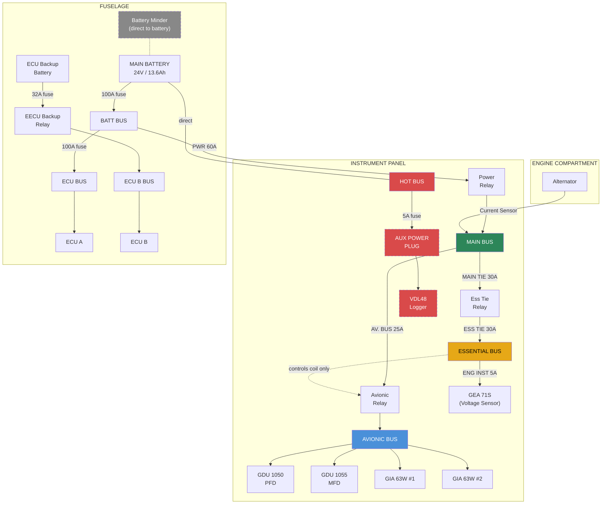

# G1000 NXi Voltage Measurement Correlation Analysis

**Aircraft:** N238PS (Diamond DA40NG)
**Date:** February 8, 2026
**Avionics:** Garmin G1000 NXi
**Reference Logger:** Triplett VDL48 (S/N: 171VD_2506100052)

## Background

The G1000 NXi in N238PS has been intermittently triggering **LOW VOLTS** annunciations during normal flight operations. The aircraft electrical system appeared to be functioning normally — alternator output was healthy and no other electrical anomalies were observed. This raised the question: is the G1000 accurately reporting bus voltage, or is there a measurement error causing false alarms?

To investigate, a Triplett VDL48 voltage data logger was connected directly to the aircraft electrical bus as an independent reference. Two flights were conducted with both the G1000 data logging and the VDL48 recording simultaneously:

| | Flight 1 | Flight 2 |
|---|---|---|
| **Route** | KBOW to KSPG | KSPG to KBOW |
| **Time (UTC)** | 15:51 – 16:47 | 18:10 – 19:25 |
| **Duration** | K~56 min | ~75 min |

The VDL48 recorded continuously across both flights and the ~85-minute ground stop between them, capturing three distinct phases: Flight 1, engine-off idle, and Flight 2.

## Key Finding

**The G1000 NXi systematically under-reports bus voltage compared to the independent VDL48 reference.**

| Metric | Flight 1 | Flight 2 | Combined |
|---|---|---|---|
| G1000 volt1 mean | 26.40 V | 27.32 V | 26.93 V |
| VDL48 reference mean | 28.26 V | 28.31 V | 28.29 V |
| **Mean difference** | **-1.87 V** | **-0.99 V** | **-1.36 V** |
| 95% range | -2.68 to -0.42 V | -1.78 to -0.15 V | -2.67 to -0.18 V |
| Paired t-test | p < 0.001 | p < 0.001 | p < 0.001 |

The difference is highly statistically significant (p < 0.001) with worst-case transient dips reaching -5.6 V below the reference reading. This under-reading is more than sufficient to trigger LOW VOLTS annunciations even when actual bus voltage is normal.

### Garmin's Own Troubleshooting for LOW VOLTS

The Garmin G1000 System Maintenance Manual (190-00545-01) CAUTION Alerts table specifies the LOW VOLTS annunciation and its prescribed solution:

| Annunciation | Alert Message | Solution |
|---|---|---|
| **LOW VOLTS** | On-board voltage is below 24 volts | **Inspect GEA 71 connector & wiring.** Troubleshoot aircraft electrical system according to DA 40 Airplane Maintenance Manual instructions. |

Garmin's own maintenance procedure names the **GEA 71 connector & wiring** as the first inspection target for LOW VOLTS — directly supporting our analysis that the fault is in the GEA 71S's connection path, not in the alternator, voltage regulator, or battery. (Source: [G1000 System Maintenance Manual CAUTION Alerts image](docs/G100%20System%20Maintenance%20Manaual%20DA40%20-%20CAUTION%20ALERTS.png))

## Visualizations

### VDL48 Full Recording Overview

The VDL48 captured three distinct phases: Flight 1 at ~28.3 V (alternator charging), idle period decaying from ~26.3 V to ~25.5 V (battery only), and Flight 2 at ~28.3 V.


### G1000 vs VDL48 Voltage Comparison

The green trace (VDL48) remains steady at ~28.3 V during both flights while the blue trace (G1000 volt1) consistently reads lower with substantially more fluctuation. The red trace shows the instantaneous difference.


### Distribution of Voltage Differences

Both flights show the G1000 reading shifted well below the VDL reference. Flight 1 had a larger offset (-1.87 V) than Flight 2 (-0.99 V).


### Correlation Scatter Plot

Nearly all data points fall below the 1:1 line. The low r-squared value indicates the G1000 fluctuations are largely independent of actual bus voltage changes, pointing to an issue in the G1000's sensing path rather than a simple calibration offset.


## Three-Source Correlation: Adding ECU Battery Voltage

A third independent voltage measurement was added from the Austro Engine AE300 ECU's own ADC (channel 808, "Battery Voltage"). The ECU data was extracted from encrypted `.ae3` hex dump files using the [AustroView](../AustroView/) project. The same two flights exist in the ECU data logger (sessions 80 and 81).

### Three-Way Results

| Pair | Flight 1 | Flight 2 | Combined |
|------|----------|----------|----------|
| **G1000 - VDL48** | **-1.94 V** | **-0.98 V** | **-1.38 V** |
| **G1000 - ECU** | **-2.05 V** | **-0.21 V** | **-0.99 V** |
| **ECU - VDL48** | **+0.11 V** | **-0.77 V** | **-0.40 V** |

**Key findings:**
- **Flight 1**: The ECU closely agrees with the VDL48 (mean offset only +0.11 V). Both read ~28.3 V while the G1000 reads ~26.4 V. This confirms the G1000 is the outlier.
- **Flight 2**: The ECU reads slightly lower than the VDL48 (-0.77 V), but still significantly higher than the G1000. The G1000 remains the lowest of the three.
- **The G1000 is consistently the lowest reading** across both flights and all pairwise comparisons, strongly supporting the high-resistance ground hypothesis.

### Three-Way Time Series

Each flight shows VDL48 (green) and ECU (orange) tracking together while G1000 (blue) reads consistently lower:


### ECU vs VDL48 Scatter

The ECU mostly clusters near the 1:1 line with the VDL48, confirming both independent instruments agree on the actual bus voltage:


### Three-Way Difference Distributions


## Electrical System Architecture

N238PS is a MAM40-858 configuration. Wiring schematics were extracted from the DA40 NG Airplane Maintenance Manual (Doc 6.02.15, CH.92, Drawing Nos. D44-9224-30-01 through D44-9224-30-05). The bus structure diagram is from AMM Section 24-60-00.

### Bus Structure Diagram (AMM 24-60-00, Figure 1)


### DA40 NG Electrical System Schematic (D44-9224-30-01X03, Sheet 1/1)

N238PS is a MAM40-858 conversion. This is the master electrical system schematic showing all buses, relays, battery, alternator, and the critical **ground return wire 24008A4N** (4 AWG) from battery B1 negative to the GS-IP (Ground Stud - Instrument Panel) bus bar:


### Bus Structure & Power Distribution

The DA40 NG has seven electrical buses. The VDL48 reference logger was connected to the **AUX POWER PLUG** on the HOT BUS (direct battery, 5A fuse).



**Note:** Most G1000 LRUs (GDU displays, GIA computers) are on the **AVIONIC BUS**, which is fed from the **MAIN BUS**. However, the **GEA 71S** (the unit that measures and reports bus voltage) is powered from the **Essential Bus** via the **5A ENG INST** breaker. The Avionic Master switch lives on the Essential Bus but only controls the Avionic Relay coil — it does not carry power. The AMM trouble-shooting table (24-60-00, p627) confirms: "There is 28 VDC on the main bus (if G1000 is installed)... but not on the avionic bus" as the first fault condition, indicating the G1000 displays' power originates from the MAIN BUS.

### Ground Return Paths

The G1000 measures bus voltage at its power input pins **relative to its own ground pins**. Any resistance in the ground return path causes the G1000 to read lower than actual bus voltage: `V_measured = V_bus - (I_load x R_ground)`.


The relay panel and engine compartment components (battery, alternator, starter) use separate **GS-RP (Ground Stud - Relay Panel) ground studs** that return directly to battery negative. However, the **ECU (located under the pilot's seat) grounds to GS-IP-3 and GS-IP-4** (per AMM p1936-1937, Drawing D44-9274-10-00) — the same instrument panel ground bus as the G1000. The ECU reads correctly, which proves the shared GS-IP infrastructure (bus bar, wire 24008A4N) is healthy. The fault is isolated to the GEA 71S's own ground at **GS-IP-14**.

### Why Three Instruments Disagree


The alternator voltage regulator (J2424) has its own **dedicated USENSE wire** (24022A22, 22 AWG, pin 5) that senses bus voltage independently, so the alternator regulates correctly regardless of the G1000's ground path issue.

## G1000 Ground Path — Complete Wire-Level Detail

This section documents every connection segment in the G1000 NXi ground return path, from LRU connector pins through to the battery negative terminal.

**Source documents:**
- AMM 24-60-00 Bus Structure Figure 1 (p622) — bus architecture and power paths
- AMM CH.92 wiring diagrams D44-9224-30-01 through -03 — power distribution system (alternator, relays, buses). These do NOT show G1000 LRU-level wiring.
- **G1000 LRU connector pinouts and harness wire numbers** are in AMM CH.31 (Instruments), CH.34 (Navigation), CH.23 (Communications) — not yet extracted

### Ground Path Segment Map

The G1000's ground return has **six segments** connected in series. The total resistance from LRU ground pin to battery negative is the sum of all segment resistances. Any single high-resistance segment causes the under-reading.

```mermaid
flowchart TB
    subgraph SEG1["<b>SEGMENT 1</b><br/>LRU Ground Pins → Harness"]
        direction LR
        GDU1050["<b>GDU 1050 PFD</b><br/>Connector: J5044<br/>Ground pins: chassis + signal<br/>Location: IP, pilot side"]
        GDU1055["<b>GDU 1055 MFD</b><br/>Connector: J5055<br/>Ground pins: chassis + signal<br/>Location: IP, center"]
        GIA1["<b>GIA 63W #1</b><br/>Connector: J63W-1<br/>Multiple GND pins<br/>Location: behind IP<br/>PRIMARY VOLTAGE SENSOR"]
        GIA2["<b>GIA 63W #2</b><br/>Connector: J63W-2<br/>Multiple GND pins<br/>Location: behind IP"]
        GEA71["<b>GEA 71</b><br/>Engine/Airframe unit<br/>Location: behind IP"]
        OTHER["<b>GMA 1347 / GTX 33<br/>GDL 69A / GSU 73</b><br/>Various connectors<br/>Location: behind IP"]
    end

    subgraph SEG2["<b>SEGMENT 2</b><br/>Harness Ground Wires"]
        HARNESS["G1000 wiring harness<br/>22 AWG ground wires<br/>Multiple runs bundled<br/>Routed behind IP"]
    end

    subgraph SEG3["<b>SEGMENT 3</b><br/>Ground Studs"]
        GSIP["<b>GS-IP Ground Studs</b><br/>Ring terminals on threaded studs<br/>Nut + lock washer<br/>Mounted on IP structure<br/>Multiple studs (GS-IP-xx series)"]
    end

    subgraph SEG4["<b>SEGMENT 4</b><br/>Ground Bus Bar"]
        GBAR["<b>Ground Bus Bar</b><br/>Copper/aluminum bar<br/>Bolted to IP frame<br/>Collects all GS-IP studs"]
    end

    subgraph SEG5["<b>SEGMENT 5</b><br/>Structural Bond"]
        BOND["<b>IP Frame → Fuselage Bond</b><br/>Structural ground point<br/>IP frame to fuselage skin<br/>May include bonding strap"]
    end

    subgraph SEG6["<b>SEGMENT 6</b><br/>Fuselage → Battery"]
        FUSE["<b>Fuselage Structure</b><br/>Composite + metal structure<br/>Firewall feedthrough"]
        BATNEG["<b>Battery Negative Terminal</b><br/>Aft fuselage<br/>Heavy gauge cable"]
    end

    GDU1050 & GDU1055 & GIA1 & GIA2 & GEA71 & OTHER --> HARNESS
    HARNESS -->|"22 AWG wires"| GSIP
    GSIP -->|"stud-to-bar"| GBAR
    GBAR -->|"bolted joint"| BOND
    BOND --> FUSE
    FUSE -->|"structure + cable"| BATNEG

    style GIA1 fill:#d94a4a,color:#fff
    style GSIP fill:#e6a817,color:#000
    style GBAR fill:#e6a817,color:#000
    style BOND fill:#e6a817,color:#000
```



### Segment Detail Table

| Seg | From | To | Connection Type | Wire/Cable | Gauge | Failure Modes |
|---|---|---|---|---|---|---|
| **1** | GIA 63W / GDU ground pins | Harness connector mate | Pin-to-socket in LRU connector | Per AMM CH.31/34 | 22 AWG | Backed-out pin, corrosion on pin/socket, loose connector lock |
| **2** | Harness connector | GS-IP stud | Crimped ring terminal on wire | G1000 harness ground wires | 22 AWG | Crimp failure, wire break inside insulation, chafed wire |
| **3** | GS-IP stud | Ground bus bar | Ring terminal bolted to threaded stud | Stud with nut + lock washer | N/A (hardware) | Loose nut, corrosion under ring terminal, paint/anodize under terminal, cracked ring terminal |
| **4** | Ground bus bar | IP frame | Bolted or bonded joint | Bus bar mounting hardware | N/A (hardware) | Loose mounting bolt, corrosion at contact surface, dissimilar metal corrosion |
| **5** | IP frame | Fuselage structure | Structural bond / bonding strap | May be integral or bonding jumper | Varies | Loose bonding strap, paint between surfaces, corrosion at bond |
| **6** | Fuselage structure | Battery negative | Heavy cable + structural path | Battery negative cable | 4-6 AWG | Loose terminal, corrosion (unlikely — ECU reads correctly via same endpoint) |

### G1000 Connectors Referenced in Maintenance History

| Connector | Location | What It Connects | Maintenance Event |
|---|---|---|---|
| P2413 | Behind instrument panel | G1000 HSDB (High-Speed Data Bus) harness | Jul 26, 2024: connector replaced, harness repinned |
| GDL 69A connectors | Behind instrument panel | Datalink transceiver | Feb 15, 2026: pins cleaned (wrong unit — see CLAUDE.md) |

**Note:** The CH.92 schematics (D44-9224-30-01 through -03) cover the power distribution system (alternator, relays, buses, circuit breakers) — not the G1000 LRU wiring itself. The G1000 LRU connector pinouts, harness wire numbers, and ground pin assignments are documented in AMM CH.31 (Instruments), CH.34 (Navigation), and CH.23 (Communications). The alternator regulator (J2424), second alternator/RACC (J2432), and power relays are charging/distribution components — they are not part of the G1000's measurement or ground path.

### Ground Stud Groups

The DA40 NG uses two physically separate ground stud groups. This separation is critical to understanding why only the G1000 reads low:


### G1000 NXi Ground Stud Inventory (from AMM CH.92, D44-9231-60-03)

Complete mapping of all G1000 power ground connections extracted from the G1000 NXi wiring diagrams (AMM pages 1908-1912, Drawing D44-9231-60-03, Sheets 2/6 through 6/6, Rev. 5, 15 July 2024).

#### Power Ground Connections by LRU

| LRU | Connector | Pin | Function | Wire | Gauge | Ground Stud |
|-----|-----------|-----|----------|------|-------|-------------|
| **GIA 63W #1** | 1P604 | 14 | POWER GROUND | 23011A20N | 20 AWG | **GS IP-6 (Ground Stud - Instrument Panel #6)** |
| **GIA 63W #1** | 1P604 | 71 | AIRCRAFT GROUND | 34900B24BL | 24 AWG | (signal ground) |
| **GIA 63W #2** | 2P604 | 14 | POWER GROUND | 23001A20N | 20 AWG | **GS IP-6** |
| **GIA 63W #2** | 2P604 | 71 | AIRCRAFT GROUND | -- | 24 AWG | (signal ground) |
| **GDU 1050 PFD** | 1P1600 | 27 | POWER GROUND | 31106A22N | 22 AWG | **GS IP-4 (Ground Stud - Instrument Panel #4)** |
| **GDU 1050 PFD** | 1P1600 | 98 | AIRCRAFT GROUND | 31101A24BL | 24 AWG | (signal ground) |
| **GDU 1060 MFD** | 2P1601 | 27 | POWER GROUND | 31158A22N | 22 AWG | **GS IP-4** |
| **GEA 71S** | P701 | 20 | POWER GROUND | 77016A22N | 22 AWG | **GS-IP-14 (Ground Stud - Instrument Panel #14)** |
| **GEA 71S** | P701 | 45 | ANALOG IN 4 LO (ground) | 77016A22N (tied to Pin 20) | 22 AWG | **GS-IP-14** |
| **GEA 71S** | P701 | 49 | ANALOG/CURR MON LO | 74005A22N | 22 AWG | **GS-IP-14** |
| **GRS 79 AHRS #1** | P791 | 34 | POWER GROUND | 34903A22N | 22 AWG | **GS IP-5 (Ground Stud - Instrument Panel #5)** (via GS AVB (Ground Stud - Avionics Bus Bar)) |
| **GRS 79 AHRS #2** | P791 | 34 | POWER GROUND | 34901A22N | 22 AWG | **GS IP-5** |
| **GMA 1360 Audio** | P3475 | -- | POWER GROUND | 23201A20N | 20 AWG | **GS IP-4** |
| **Wx 500 Stormscope** | -- | -- | POWER GROUND | 34402A20N | 20 AWG | **GS IP-3 (Ground Stud - Instrument Panel #3)** |
| **GDL 69A SXM** | -- | 20 | POWER GROUND | 23403E22N | 22 AWG | (via harness) |

#### Circuit Breaker Ground Returns

| Circuit | Bus | Breaker | Power Wire | Ground Wire | Ground Stud |
|---------|-----|---------|------------|-------------|-------------|
| GPS/NAV 1 | ESS BUS | 5A | 34000A22 | 34001A22N | **GS IP-3** |
| GPS/NAV 2 | AVIONIC BUS | 5A | 34100A22 | 34101A22N | **GS IP-10 (Ground Stud - Instrument Panel #10)** |
| COM 1 | ESS BUS | 5A | 23000A20 | 23001A20N | **GS IP-4** |
| COM 2 | AVIONIC BUS | 5A | 23200A20 | 23201A20N | -- |

#### Ground Stud Loading Summary

| Ground Stud | Components | Total Load | Priority |
|-------------|-----------|------------|----------|
| **GS-IP-14** | GEA 71S Pin 20 (POWER GROUND) + Pin 45 (ANALOG IN 4 LO) + Pin 49 (current monitor) | HIGH — all GEA ground pins | **CRITICAL** — voltage sensor ground (all three GEA ground connections) |
| **GS IP-6** | GIA 63W #1 + GIA 63W #2 (both 20 AWG) | HIGH — both avionics computers | **HIGH** — avionics computers |
| **GS IP-4** | GDU 1050 PFD + GDU 1060 MFD + GMA 1360 + COM 1 | HIGH — 4 LRUs share one stud | **HIGH** — most loaded stud |
| **GS IP-5** | GRS 79 AHRS #1 + GRS 79 AHRS #2 (via GS AVB bus bar) | MEDIUM | MEDIUM |
| **GS IP-3** | GPS/NAV 1 + Wx 500 Stormscope | MEDIUM | MEDIUM |
| **GS IP-10** | GPS/NAV 2 | LOW — single circuit | LOW |
| **GS IP-8 (Ground Stud - Instrument Panel #8)** | Config/power ground | LOW | LOW |
| **GS AVB** | Intermediate bus bar for GRS 79 + protection circuits (53V TVS diodes) | MEDIUM | MEDIUM |

**Key findings from the schematic extraction:**
1. **GS-IP-14 is the single most important ground stud** — all three GEA 71S ground pins (20, 45, 49) terminate here. The GEA is the voltage sensor — its ground reference determines the displayed voltage
2. **GS IP-4 is the most loaded stud** — four separate LRU ground wires terminate here (PFD, MFD, audio panel, COM 1)
3. All power ground wires use the **"N" suffix** convention (e.g., 23011A20**N**) per Diamond's wire numbering
4. Power grounds are **20-22 AWG**; signal grounds are **24 AWG**
5. The **GS AVB** avionics ground bus bar is an intermediate collection point that routes to GS IP-5, with 53V TVS diode protection circuits
6. **Wire 24008A4N (4 AWG)** provides the dedicated ground return from the GS-IP bus bar to Battery B1 negative — confirmed on D44-9224-30-01X03 Sheet 1/1 (p1859). This is a heavy copper wire, not structural ground through the fuselage. The wire itself has negligible resistance; the problem must be at a terminal connection

### AMM Chapter Cross-Reference

The CH.92 schematics show power distribution. For complete G1000 LRU pin assignments, refer to these additional AMM chapters:

| AMM Chapter | Section | Content | Key LRUs |
|---|---|---|---|
| CH.31 | Instruments / Displays | GDU 1050/1055/1060 wiring, connector pinouts | PFD, MFD |
| CH.34 | Navigation | GIA 63W, GSU 73, GMU 44 wiring, connector pinouts | Avionics computers, AHRS, magnetometer |
| CH.23 | Communications | GMA 1347, GTX 33, GDL 69A wiring, connector pinouts | Audio panel, transponder, datalink |
| CH.24 | Electrical Power | Bus structure, circuit breaker assignments | Power distribution to all LRUs |
| CH.92 | Wiring Diagrams | System-level schematics (what we have) | All — but at system level, not LRU pin level |

## Diagnostic & Troubleshooting Procedure

### Required Equipment

| Item | Specification | Purpose |
|---|---|---|
| Digital multimeter | 4-digit, milliohm capable (e.g., Fluke 87V) | Resistance measurements |
| Milliohm meter (preferred) | Kelvin 4-wire, 0.001 Ω resolution | Precise low-resistance measurement |
| Test leads | Kelvin clips or sharp probes | Contact through corrosion/coating |
| Torque wrench | Per AMM specs for ground stud nuts | Retorquing connections |
| Isopropyl alcohol + abrasive pad | Scotch-Brite or equivalent | Cleaning contact surfaces |
| Triplett VDL48 (or equivalent) | DC voltage data logger, 2-sec sampling | Post-repair verification flight test |

### Step-by-Step Ground Path Resistance Test

**Prerequisite:** Battery master OFF, all avionics OFF. Disconnect battery negative cable for safety during resistance measurements. All resistance measurements should use the lowest ohm range available (milliohm mode if equipped). For DMMs without milliohm mode, subtract lead resistance (short leads together and note the reading).


### Resistance Thresholds & What They Mean

| End-to-End Resistance | Voltage Drop at 20A | Interpretation |
|---|---|---|
| < 0.010 Ω | < 0.2 V | Normal — ground path is clean |
| 0.010 – 0.025 Ω | 0.2 – 0.5 V | Marginal — explain minor offset, may worsen with vibration |
| 0.025 – 0.050 Ω | 0.5 – 1.0 V | Degraded — consistent with observed ~1.4 V average offset |
| 0.050 – 0.100 Ω | 1.0 – 2.0 V | Failed — consistent with observed worst-case dips to -5.6 V |
| > 0.100 Ω | > 2.0 V | Severe — would cause persistent LOW VOLTS in flight |

**Note:** The observed -1.36 V average offset at typical avionic bus loads (15–25 A) implies approximately **0.05–0.09 Ω** total ground path resistance. The worst-case -5.6 V transient dips during high-current events (radio TX at ~8A, autopilot servos) would occur when instantaneous current spikes combine with this resistance.

### Visual Inspection Checklist

Inspect every connection in the ground path, looking for these specific failure modes:

**At each GS-IP ground stud:**
- [ ] Nut torqued to AMM specification (check with calibrated torque wrench)
- [ ] Lock washer present and not flattened/broken
- [ ] Ring terminal fully seated flat against stud surface
- [ ] No paint, primer, anodize, or sealant between ring terminal and stud/bus bar
- [ ] Ring terminal not cracked, bent, or deformed
- [ ] No green/white corrosion (aluminum) or green verdigris (copper)
- [ ] No evidence of arcing or heat discoloration
- [ ] Stud threads not stripped or cross-threaded
- [ ] Multiple ring terminals on same stud: all making good contact (not stacked too high)

**At each G1000 LRU connector (J5044, J5055, J63W-1, J63W-2, etc.):**
- [ ] Connector fully seated and locked (CPA clip engaged if applicable)
- [ ] No backed-out pins visible from rear of connector
- [ ] Pins not corroded, bent, or recessed
- [ ] Connector shell not cracked
- [ ] Harness strain relief intact (wires not pulling on connector)
- [ ] No moisture or contamination inside connector

**At the ground bus bar:**
- [ ] All mounting bolts tight
- [ ] Contact surfaces clean and bright metal-to-metal
- [ ] No cracks in bus bar
- [ ] All stud connections to bar verified

**At the IP frame-to-fuselage bond:**
- [ ] Bonding strap/jumper present (if required by AMM)
- [ ] Strap terminals clean and tight
- [ ] No paint or sealant between bonding surfaces
- [ ] Metal-to-metal contact confirmed

### Priority Ranking (Most Likely Failure Points)

Based on the data analysis (change-point at Feb 2024, second R&R did not resolve, G1000-specific):

| Priority | Location | Why Most Likely | Test |
|---|---|---|---|
| **1** | **GS-IP-14 ground stud** | GEA 71S voltage sensor ground terminates here (wire 77016A22N). Ring terminal loosening, corrosion, or paint under terminal. | Step 3: Stud-to-bus bar resistance |
| **2** | **GS-IP bus bar / wire 24008A4N connection** | The 4 AWG main ground return wire (24008A4N) connects to the bus bar here. Bolted joint can loosen. Dissimilar metal corrosion. This end was NOT disturbed during either engine R&R. | Step 2: Bus bar to battery neg |
| **3** | **Wire 24008A4N terminal at battery negative** | Disturbed during every engine R&R (battery disconnect). If not properly retorqued or if buried under other terminals. R&R #2 also disturbed this — if problem persists, terminal may be chronically undertorqued. | Step 5: Terminal to battery post |
| **4** | **GEA 71S P701 connector Pin 20** | Connector pin corrosion or insufficient pin tension. The GEA is the voltage sensor — its ground pin is the most critical LRU connection. | Step 4: LRU pin to stud |
| **5** | **Other GS-IP studs (IP-4, IP-6)** | GS IP-4 is the most loaded stud (4 LRUs). GS IP-6 carries both GIA computers. Ring terminals loosen from vibration. | Step 3: Stud-to-bus bar resistance |

### Compartment-by-Compartment Inspection Guide

Organized by physical location for systematic troubleshooting. Work through each compartment methodically — the fault was introduced during the Feb 2024 R&R #1 maintenance window and could be anywhere along the G1000's ground return path.

#### INSTRUMENT PANEL (Highest Priority)

This is where all G1000 LRUs are mounted and where the GS-IP ground stud group connects them to the airframe ground. Most likely compartment for the fault — the shop accessed this area during R&R #1 and again during every subsequent repair attempt.

| Item | What to Check | Test Method | Pass Criteria |
|---|---|---|---|
| **GS-IP ground studs** | Torque, corrosion, paint under terminals, cracked ring terminals | Milliohm: each GS-IP stud → IP frame | < 0.005 Ω per stud |
| **Ground bus bar** | Mounting bolt torque, dissimilar metal corrosion (Cu bar on Al frame), cracks | Milliohm: bus bar → IP frame | < 0.005 Ω |
| **GIA 63W #1 connector (J63W-1)** | Pin corrosion, backed-out pins, connector lock, strain relief — THIS IS THE PRIMARY VOLTAGE SENSOR | Milliohm: GIA GND pin → GS-IP stud | < 0.010 Ω |
| **GIA 63W #2 connector (J63W-2)** | Same as above — redundant voltage sensor | Milliohm: GIA GND pin → GS-IP stud | < 0.010 Ω |
| **GDU 1050 PFD connector (J5044)** | Pin corrosion, connector lock — displays the voltage reading | Milliohm: GDU GND pin → GS-IP stud | < 0.010 Ω |
| **GDU 1055 MFD connector (J5055)** | Same as above | Milliohm: GDU GND pin → GS-IP stud | < 0.010 Ω |
| **GEA 71 connector** | Engine/airframe interface — sensor wires pass through firewall | Milliohm: GEA GND pin → GS-IP stud | < 0.010 Ω |
| **GMA 1347 / GTX 33 / GDL 69A / GSU 73** | All remaining G1000 LRU connectors | Milliohm: each GND pin → GS-IP stud | < 0.010 Ω |
| **P2413 connector** | Repinned Jul 2024 — check quality of rework | Visual: pin alignment, crimp quality, solder joints | No bent/recessed pins |
| **Harness routing behind IP** | Chafing, pinched wires, harness tie-down damage from repeated panel access | Visual + continuity test | No damaged insulation |
| **All ring terminal crimps at GS-IP studs** | Crimp integrity — can crack internally without visible damage | Milliohm: wire side of crimp → stud side | < 0.005 Ω across crimp |

**Visual inspection checklist:**
- [ ] Each GS-IP stud nut torqued to AMM spec
- [ ] Lock washers present and not flattened
- [ ] Ring terminals fully seated, no paint/anodize between terminal and stud
- [ ] No green/white corrosion or arcing evidence
- [ ] All LRU connectors fully seated and locked (CPA clips engaged)
- [ ] No backed-out pins visible from rear of any connector
- [ ] Harness strain reliefs intact on all connectors
- [ ] Bus bar mounting bolts tight, contact surfaces bright metal
- [ ] No evidence of tools dropped on or damage to ground bus bar

#### FUSELAGE / BATTERY NEGATIVE TERMINAL (Medium-High Priority)

The GS-IP ground return uses a dedicated **wire 24008A4N (4 AWG)** that runs from the GS-IP bus bar through the firewall to the battery B1 negative terminal (per D44-9224-30-01X03). The wire itself has negligible resistance — the failure points are at its **terminal connections** at each end.

| Item | What to Check | Test Method | Pass Criteria |
|---|---|---|---|
| **Wire 24008A4N at battery negative** | Ring terminal tight, clean, not buried under other terminals. This terminal is disturbed during every engine R&R (battery disconnect/reconnect) | Milliohm: 24008A4N terminal → battery negative post | < 0.005 Ω |
| **Wire 24008A4N at GS-IP bus bar** | Ring terminal tight, clean, proper contact to bus bar | Milliohm: 24008A4N terminal → GS-IP bus bar | < 0.005 Ω |
| **Wire 24008A4N end-to-end** | Full wire continuity including both terminal connections | Milliohm: GS-IP bus bar → battery negative post | < 0.010 Ω |
| **Battery negative terminal stacking** | Multiple ring terminals on battery post — verify all are making good contact, proper stacking order, star washers present | Visual + milliohm: each terminal → post | < 0.005 Ω each |
| **Wire 24008A4N at firewall** | Condition at firewall pass-through — chafing, corrosion, seal integrity | Visual: no damage at firewall penetration | No damage |
| **Under-seat area (pitch servo)** | Harness routing disturbed during pitch servo work (R&R #1 only) | Visual: no pinched wires, correct routing | No damage |

**Visual inspection checklist:**
- [ ] Wire 24008A4N ring terminal at battery negative: clean, tight, not corroded
- [ ] Wire 24008A4N ring terminal at GS-IP bus bar: clean, tight, proper contact
- [ ] Battery negative post: no corrosion, all terminals properly stacked and torqued
- [ ] Wire 24008A4N: no chafing or damage at firewall pass-through
- [ ] Under-seat wiring harnesses properly routed and secured

#### ENGINE COMPARTMENT (Suspect — R&R #1 Specific Work)

The oil leak repair during R&R #1 required accessing the cylinder head cover (top of engine) and oil sump gasket (bottom of engine). Any wiring or ground connections disturbed for this access would NOT have been re-done during R&R #2's piston work. The G1000's ground path passes through the firewall area on its way to the battery.

| Item | What to Check | Test Method | Pass Criteria |
|---|---|---|---|
| **Firewall ground bonding** | Bonding strap(s) from firewall to fuselage structure — in the ground return path | Milliohm: firewall metal → fuselage metal (cockpit side) | < 0.005 Ω |
| **Firewall feedthrough grounding** | Ground continuity through firewall penetrations (connectors, grommets) | Milliohm: cockpit-side firewall → engine-side firewall | < 0.005 Ω |
| **Engine ground straps** | Engine-to-airframe bonding straps — affect overall ground reference | Visual: clean, tight, correct torque | Bright metal contact |
| **Harness routing near cylinder head** | Oil leak repair required access to top of engine — harnesses may have been moved/re-routed | Visual: harnesses in correct routing per AMM, no chafing | No damage or misrouting |
| **Harness routing near oil sump** | Oil sump gasket replacement required access to bottom of engine | Visual: same as above | No damage or misrouting |
| **P2208 connector area** | Wire terminal repaired Jun 2024 — check quality of repair | Visual + milliohm: repaired terminal resistance | < 0.010 Ω |
| **GEA 71 sensor wire pass-throughs** | Sensor wires from engine to GEA 71 behind IP pass through firewall | Visual: seals intact, no chafing at firewall | No damage |

**Note on ECU ground path:** The ECU (under the pilot's seat) grounds to **GS-IP-3 and GS-IP-4** (per AMM p1936-1937, D44-9274-10-00) — the same instrument panel ground bus as the G1000. Since the ECU reads correctly, the shared GS-IP bus bar, wire 24008A4N, and aft termination are proven healthy. Engine compartment ground straps and harness routing are still worth inspecting as they may affect the power side or other connections, but the ECU data rules out wire 24008A4N and the GS-IP bus bar as the fault location.

**Visual inspection checklist:**
- [ ] All engine ground straps clean, tight, correct torque per AMM
- [ ] Firewall bonding strap(s) present and tight
- [ ] No paint, sealant, or corrosion between bonding surfaces
- [ ] Harness routing matches AMM diagrams — no re-routing from R&R work
- [ ] No chafing where harnesses pass through firewall grommets
- [ ] P2208 wire repair from Jun 2024: terminal secure, no discoloration

#### RELAY PANEL / FUSE PANEL (Low Priority — Comparison Reference)

The relay panel houses GS-RP ground studs and the power distribution relays. The Avionic Relay (which powers the AVIONIC BUS that feeds the G1000) lives here and could affect the power side.

| Item | What to Check | Test Method | Pass Criteria |
|---|---|---|---|
| **AV.BUS 25A circuit breaker** | Powers the Avionic Relay — high contact resistance would drop voltage | Milliohm: across CB contacts (breaker ON) | < 0.010 Ω |
| **Avionic Relay contacts** | Relay feeds AVIONIC BUS — worn contacts could drop voltage | Milliohm: relay input → relay output (relay engaged) | < 0.010 Ω |
| **GS-RP ground studs (comparison)** | Measure for reference — should all be very low resistance | Milliohm: each GS-RP stud → battery negative | < 0.005 Ω (expect near-zero) |

**Note:** If the AV.BUS CB or Avionic Relay contacts show high resistance, this would be a **power-side** voltage drop rather than a ground-side drop. The symptom would be similar (G1000 reads low) but the mechanism is different. The diagnostic flowchart (Step 1) catches this: if the end-to-end ground path resistance is low, investigate the power side.

### Post-Repair Verification

After corrective action, verify the repair with **both** a static test and a flight test:

**Static Test:**
1. Reconnect battery
2. Repeat end-to-end resistance measurement (Step 1) — should be < 0.010 Ω
3. Power on avionics, check G1000 voltage reading on ground (should read battery voltage ± 0.3 V)

**Flight Test (critical — ground tests alone cannot reproduce the fault):**
1. Install VDL48 on AUX POWER PLUG (same test configuration as original analysis)
2. Conduct a flight of at least 30 minutes with varied electrical loads (radio transmissions, autopilot engagement, flap cycles)
3. Compare G1000 `volt1` log against VDL48 log using the analysis scripts in this repository:
   ```bash
   python voltage_analysis.py
   ```
4. **Pass criteria:** Mean G1000-VDL offset < 0.3 V, no transient dips > 1.0 V, noise (std dev) < 0.30 V
5. **Fail criteria:** If offset persists, the wrong connection was repaired — re-run diagnostic procedure from Step 1

## Historical Voltage Analysis (184 Flights)

The single-flight analysis above was confirmed across **all 184 G1000 NXi flight logs** downloaded from FlySto.net, spanning July 14, 2023 (first flight after delivery) through February 13, 2026.

### Voltage History with ECU Reference

The G1000 cruise voltage (blue) is compared against 265 independent ECU battery voltage readings (green triangles). Vertical lines mark maintenance events from the aircraft logbooks.


### Change-Point Detection (Pettitt's Test)

A nonparametric Pettitt's test detected a statistically significant change-point at **February 29, 2024** (p = 3.75e-13). The top panel shows the before/after split with ECU reference. The CUSUM chart shows the cumulative deviation inflection. The bottom panel shows voltage noise increased 55% after the change-point.


| Metric | Before (53 flights) | After (131 flights) |
|---|---|---|
| Mean cruise voltage | 27.44 V | 26.90 V |
| Mean noise (std dev) | 0.251 V | 0.390 V |
| **Voltage drop** | | **-0.54 V** |
| **Noise increase** | | **+55%** |

The ECU reads a stable **27.82 V** throughout the entire period — no change-point. The drop is specific to the G1000 measurement path.

### Before vs After Distribution


## Maintenance Correlation

Parsing the N238PS aircraft maintenance logs (115 pages) revealed the cause of the change-point: the **engine was removed and reinstalled on February 28, 2024** for oil leak repair. This required disconnecting and reconnecting all firewall pass-through connections, including ground straps and harness connectors.

### Voltage vs Maintenance Events


### Maintenance Timeline

| Date | TT (hrs) | Event |
|---|---|---|
| **Feb 28, 2024** | **54.5** | **Engine R&R for oil leak** (prop off, engine removed, cyl head cover resealed, oil sump gasket replaced, engine+prop reinstalled) |
| Mar 27, 2024 | 57.7 | Replaced alternator #2 (secondary) |
| Apr 15, 2024 | 61.4 | Replaced voltage regulator |
| Jun 30, 2024 | 100.7 | Replaced voltage regulator (again) + repaired wire terminal at P2208 |
| Jul 26, 2024 | 95.6 | Replaced G1000 P2413 connector (repinned HSDB harness); replaced alt #2 belt |
| Feb 21, 2025 | 136.9 | Replaced main alternator AND voltage regulator (3rd VR replacement) |
| Jul 1, 2025 | 147.5 | Engine R&R (#1 piston crack); main battery failed capacity test at 68%, replaced |
| **Aug 18, 2025** | ~150 | **Owner ground test**: meter at AUX POWER reads 26.3V (open circuit), 25.2V (G1000 on); G1000 displays 23.7V — **1.5V offset confirmed on ground with battery only** |
| Feb 15, 2026 | ~160 | Shop cleaned GDL 69A pins (wrong unit — see below); could not reproduce on ground run |
| **Feb 8, 2026** | ~158 | **VDL48 flight test**: confirmed -1.36V mean offset, -5.6V worst dip (this analysis) |
| **Feb 20, 2026** | ~160 | **GPU (Ground Power Unit) ground test**: 0.19V offset with GPU (vs 1.5V with battery). EPU (External Power Unit) negative connects to GS-RP, bypassing 24008A4N. ESS BUS switch test: MFD goes dark, no voltage on PFD. |

**Pattern:** The shop recognized a voltage issue and attempted to resolve it through component replacement (3 voltage regulators, 2 alternators, 1 wire repair) — but the G1000 under-reading persisted because the root cause is a ground path resistance issue introduced during the engine R&R, not a charging system problem. The ECU reads correctly throughout, proving the alternator and regulators function normally.

### Second Engine R&R — Differential Diagnosis

The engine was removed again in Apr–Jul 2025 for a piston crack (AD 2024-19-10). This required disconnecting and reconnecting the **same firewall pass-through connectors** as the Feb 2024 R&R. Comparing voltage across three periods:

| Period | Flights | Mean Voltage | Mean Noise (σ) |
|---|---|---|---|
| Before R&R #1 (pre Feb 2024) | 50 | 27.46 V | 0.253 V |
| Between R&Rs (Mar 2024 – Apr 2025) | 88 | 26.84 V | 0.374 V |
| After R&R #2 (Jul 2025+) | 46 | 27.03 V | 0.410 V |

The problem **did not resolve** after the second R&R. Voltage remains ~0.4 V below the pre-fault baseline and noise actually increased slightly. This **rules out the firewall pass-through connectors** as the fault location — they were reconnected during R&R #2 with no improvement.

**Narrowed failure location:** The ECU (under the pilot's seat) grounds through GS-IP-3 and GS-IP-4 (per D44-9274-10-00, p1936-1937) — the same GS-IP bus bar and wire 24008A4N as the G1000 — and reads correctly. This rules out the shared ground infrastructure. Two primary suspects remain, both unique to the GEA 71S: (1) **Pin 47 (ANALOG IN 5 LO) Essential Bus ground** — wire 31299A22BL terminates at an unknown ground point (generic ground symbol on schematic); since the GEA reads Pin 46 minus Pin 47, this is the voltage measurement reference; (2) **GS-IP-14 / Pin 20 (POWER GROUND)** — wire 77016A22N. Both are in the instrument panel area and were NOT disturbed during either R&R. **The physical termination of wire 31299A22BL must be traced by the shop.**

### What Changed During R&R #1 That Did NOT Happen During R&R #2?

The Pettitt change-point test pinpoints February 2024 with extremely high statistical confidence (p = 3.75e-13). Something definitely changed during the R&R #1 maintenance window. The question is what was touched during R&R #1 that was NOT touched during R&R #2.

**Work unique to R&R #1 (Feb 2024 — oil leak repair):**
- Cylinder head cover R&I (resealed) — top of engine
- Oil sump gasket replaced — bottom of engine
- Pitch servo work (under seats, same shop visit)

**Work unique to R&R #2 (Jul 2025 — piston crack):**
- Pistons and connecting rods replaced — internal engine
- Battery replaced (failed capacity test at 68%)

**Work common to BOTH R&Rs:**
- Engine removed and reinstalled
- All firewall pass-through connectors disconnected/reconnected
- Engine ground straps disconnected/reconnected
- Engine mount bolts removed/reinstalled

**Analysis:** The oil leak repair required specific engine compartment access (cylinder head cover, oil sump) that the piston replacement did not. Any wiring, harness routing, or ground connections disturbed specifically for oil leak access would NOT have been re-done during R&R #2. Additionally, the subsequent cascade of troubleshooting repairs after R&R #1 (3 voltage regulators, 2 alternators, P2413 repinning, P2208 wire repair) each involved further work in the engine compartment and behind the instrument panel, potentially worsening a marginal connection.

**Key constraint — the ECU test:** The ECU (under the pilot's seat) grounds through **GS-IP-3 and GS-IP-4** (per AMM p1936-1937, D44-9274-10-00) and reads correctly throughout the entire period. Since the ECU shares the GS-IP bus bar, wire 24008A4N, and aft ground termination with the G1000 — and reads correctly — all of that shared infrastructure is proven healthy. The fault is isolated to the GEA 71S's own ground connection at **GS-IP-14** (wire 77016A22N, P701 Pin 20), which was NOT disturbed during either R&R.

**Bottom line:** The fault was most likely introduced as **collateral damage during the R&R #1 maintenance window** — most likely at the GS-IP bus bar or stud connections behind the instrument panel. The battery negative terminal of wire 24008A4N should also be inspected (it was reconnected during both R&Rs — possibly improperly each time). The compartment-by-compartment inspection below covers all possibilities.

## Owner Ground Test (August 18, 2025)

Before the VDL48 flight test, the owner conducted a static ground test to document the voltage discrepancy. This test was performed after the Jul 2025 annual (new battery installed, voltage regulator previously replaced, battery maintained on BatteryMinder).

### Test Conditions and Results

| Condition | Meter at AUX POWER | G1000 Display | Offset |
|-----------|-------------------|---------------|--------|
| **Open circuit** (master OFF, no loads) | **26.3V** | N/A | N/A |
| **G1000 powered up** (master ON, no other loads) | **25.2V** | **23.7V** | **-1.5V** |

The Concorde battery open circuit voltage table shows 25.8V+ indicates 100% state of charge — the 26.3V reading confirms a fully charged, healthy battery.

### Why This Matters

The **1.5V offset exists on the ground with battery only** — no engine, no alternator, minimal current draw. This is significant because:

- It proves the offset is **not alternator-related** and **not load-dependent in the traditional sense** — even the small current draw of the G1000 alone (~2-3A) produces a measurable voltage drop through the high-resistance ground path
- The meter at AUX POWER drops from 26.3V to 25.2V when the G1000 turns on (1.1V drop from battery internal resistance under load) — this is normal
- But the G1000 shows 23.7V vs the 25.2V actual — the **additional 1.5V drop is entirely in the G1000's own measurement/ground path**
- Premier Aircraft mechanic Raymond independently confirmed the same voltage variance using the cigarette lighter connector

### FlySto LOW VOLTS Events

The owner's FlySto account recorded multiple LOW VOLTS annunciations (threshold: `volt1` < 25V) in recent flights:

| Event | Duration Below 25V | Phase of Flight | Voltage Range |
|-------|-------------------|-----------------|---------------|
| Landing #1 | **18 seconds** | Final approach → taxi (RWY09L) | Dips to ~24.5V during approach, oscillating around 25V |
| Landing #2 | **85 seconds** | Final → touchdown → taxi (RWY09L) | Sustained drops to ~24V during taxi, worst dips below 24V |
| In-flight | **5 seconds** | Cruise/descent (~4000') | Brief dip to ~24.8V |

These events correlate with high-current phases: landing configuration (flaps, lights), radio transmissions on final, and taxi (nosewheel steering servo, strobes, landing light).

### GEA 71B Analog Channel Configuration

The voltage measurement path was investigated through the GEA 71B (Engine/Airframe Interface Unit) configuration. The `volt1` reading uses **Analog In 5 on GEA 1** with these settings:

| Parameter | Current Value | Meaning |
|-----------|--------------|---------|
| m (slope) | **1.0000e+00** | 1:1 scaling — no gain correction applied |
| b (offset) | **0.0000e+00** | Zero offset — no software compensation |
| Filter Coeff | 0.1000 | Moderate smoothing |
| Trans Func Type | Linear | `Displayed = m × Raw + b` |
| Min Value | -50V | Display floor |
| Max Value | 50V | Display ceiling |
| Gain | 1 | Unity gain |

**Critical finding:** With `m=1.0` and `b=0.0`, the G1000 displays exactly what arrives at the GEA 71B input pin with no software correction. The 1.5V offset is therefore a **hardware voltage drop**, not a calibration or firmware issue.

**Why adjusting `b` would be wrong:** The CALIBRATION ANALOG SENSOR document (also from Aug 2025) recommends increasing `b` to +1.0 to compensate for the offset. This would be a **band-aid that masks the real problem**:
- The offset is **not constant** — our VDL48 flight data shows it varies from -5.6V to +1.7V depending on current load, vibration, and temperature
- Setting `b=+1.0` would make the reading correct at one operating point but still wrong at others
- The G1000 would under-report during high-current events (still triggering LOW VOLTS) and over-report during low-current conditions
- The underlying high-resistance ground connection would continue to degrade, potentially causing other issues (noise on signal grounds, erratic sensor readings)
- The correct fix is to repair the ground path so that `m=1.0, b=0.0` reads correctly

## Ground Tests (February 20, 2026 — Battery vs GPU, Same Session)

Two back-to-back tests were performed on the same day under identical ground conditions. The only variable was the power source: battery vs external GPU (Ground Power Unit) through the EPU (External Power Unit) plug (AN2551).

| Condition | Meter at AUX POWER | G1000 Display | Offset |
|-----------|-------------------|---------------|--------|
| **Battery only**, G1000 on, no engine | **25.3V** | **24.0V** | **-1.3V** |
| **GPU connected**, G1000 on | **28.79V** | **28.6V** | **-0.19V** |

**Same aircraft, same day, same ground conditions** — the 1.3V offset is present on battery and essentially gone on GPU. This eliminates any argument about intermittency or contact resistance changing over time; the fault is consistently present on battery power and consistently absent on GPU power.

The **24.0V G1000 reading on battery** sits right at the LOW VOLTS annunciation threshold (24V per the Garmin G1000 System Maintenance Manual). Any additional electrical load would trigger the annunciation — which is exactly what happens in flight. The Aug 2025 battery-only test showed a similar offset (23.7V displayed vs 25.2V actual = -1.5V), confirming this is a persistent condition.

### Why GPU Power Reads Differently

The EPU wiring (from D44-9224-30-01X03):

| EPU Pin | Wire | Gauge | Connects To |
|---------|------|-------|-------------|
| Positive | 24403A6 | 6 AWG | BATT BUS (through EPU RELAY) |
| **Negative** | **24405A6N** | **6 AWG** | **Battery B1 negative terminal** (per IPC 24-31; schematic labels this GS-RP) |

**Why does the GPU read correctly while battery does not?**

Per the IPC (24-31 Battery Installation), the battery negative terminal has three connections:

1. **Wire 24008A4N** (4 AWG) — to instrument panel (GS-IP bus bar)
2. **Wire 24405A6N** (6 AWG) — to EPU plug (GPU negative)
3. **Cable 200** (P/N D44-2403-160-00, "Cable, Battery GND") — routes to a structural/airframe ground point


The GPU negative connects to the same battery negative terminal via wire 24405A6N. The **BatteryMinder interface** (installed Sep 2024) also has a ring terminal on this bolt. All ring terminals are stacked on the same battery negative bolt.

### Battery Post Bypass Hypothesis

If the ring terminals on the bolt are well-bonded **to each other** but the whole stack has **poor contact to the battery post itself** (corrosion, loose nut, worn contact surfaces from repeated disturbance), the GPU cable creates a bypass:

**Battery only:** All return current (~20A) must flow from the ring terminal stack through the bad connection to the battery post to complete the circuit. At 0.065Ω contact resistance: 20A × 0.065Ω = **1.3V drop**. Everything on the stack (GS-IP via 24008A4N, structural ground via Cable 200) sits 1.3V above true battery negative. Pin 47's ground reference is elevated → GEA reads 1.3V low.

**GPU connected:** The GPU cable (24405A6N) is also on the ring terminal stack, well-bonded to the other wires. Bus return current takes a shortcut — from 24008A4N through the stack directly to 24405A6N and back to the GPU — **never crossing the bad connection to the battery post**. Only battery charging current (~3A) needs to cross the bad connection. 3A × 0.065Ω = **0.2V drop**. Pin 47's reference is nearly correct → GEA reads nearly correctly.

**In flight (alternator):** The alternator is part of the aircraft's permanent wiring. Its return current goes through engine grounds back to the battery area and must cross the same bad connection — no external bypass. Total current is even higher (alternator + all loads ≈ 25A+), so the drop is worse.

```
Battery only:  Loads → GS-IP → 24008A4N → [STACK] → [BAD CONNECTION] → Battery post
                                              ↑           ↑
                                         well-bonded    ~20A must cross → 1.3V drop

GPU connected: Loads → GS-IP → 24008A4N → [STACK] → 24405A6N → GPU(-)
                                              ↑       (bypass!)
                                         well-bonded   only ~3A charging crosses bad connection → 0.2V drop
```

| Condition | Current through bad connection | Drop (at 0.065Ω) | Observed offset |
|-----------|-------------------------------|-------------------|-----------------|
| Battery only, ground | ~20A (all return) | 1.3V | **-1.3V** |
| GPU, ground | ~3A (charging only) | 0.2V | **-0.19V** |
| Flight (alternator) | ~25A+ (all loads + charging) | 1.6V+ | **-1.4V avg** |

**Stacking order on the battery negative bolt** (per IPC 24-31, closest to post first):

1. **Cable 200** (Battery GND) — closest to post
2. **24008A4N** (instrument panel)
3. **24405A6N** (EPU)
4. **BatteryMinder** (aftermarket addition, last)

The contact between the bottom of the stack (Cable 200) and the battery post is the critical junction — if degraded, all connections above it are affected. The terminal has been disturbed during both engine R&Rs (Feb 2024, Jul 2025) and the battery replacement (Jul 2025). The BatteryMinder (installed Sep 2024) adds a fourth terminal to the stack.

**Quick voltage drop test (owner can perform with just a multimeter):**

With Master ON, G1000 running, battery only (no engine, no GPU):

- **Test A (direct):** Meter on DC volts. Red probe on the **BatteryMinder ring terminal** (top of stack on B1(-) bolt), black probe on the **battery post metal** (below the stack, not the bolt). Good: < 0.05V. Bad (confirms hypothesis): 0.5V to 1.5V+.
- **Test B (if post is inaccessible):** Measure from **B1(+) terminal** to **BatteryMinder ring terminal** on B1(-). Compare to G1000 display. If both read ~24V → stack is elevated, bypass hypothesis confirmed. If meter reads significantly higher than G1000 → problem is upstream in GEA-specific path (Pin 47, GS-IP-14).

**This hypothesis needs verification:** Inspect the contact between the ring terminal stack and the battery post. Trace where Cable 200 terminates — it connects battery negative to the structural grounding system, and Pin 47's unknown ground may return through this path.

**The ECU proves the shared ground infrastructure is healthy but does NOT rule out the BATT BUS → Essential Bus path.** Per AMM p1936-1937 (Drawing D44-9274-10-00, EECU Wiring), the AE300 ECU (under the pilot's seat) grounds to **GS-IP-3 and GS-IP-4** — the same instrument panel ground bus as the G1000. The ECU reads ~27.8V, essentially correct. The ECU is on the **ECU BUS** (directly off BATT BUS through a 100A fuse) — it bypasses the Power Relay, MAIN TIE, Ess Tie Relay, and ESS TIE that the Essential Bus must go through.

**Areas to inspect (in order of accessibility):**

1. **Battery negative terminal and Cable 200 (aft fuselage)** — Per IPC (24-31), three connections at battery negative: wire 24008A4N (instrument panel), wire 24405A6N (EPU), and **Cable 200** (D44-2403-160-00, "Cable, Battery GND" — routes to structural/airframe ground). Also check the **BatteryMinder interface** (installed Sep 2024). This terminal has been disturbed during both R&Rs and battery replacement. Clean all connections, check for corrosion under ring terminals, verify torque. **Trace where Cable 200 terminates and inspect that connection.**

2. **Pin 47 (ANALOG IN 5 LO) Essential Bus ground** — wire 31299A22BL (shielded) connects to the low side of the Essential Bus per the G1000 wiring diagram (D44-9231-60-03). The Electrical System schematic (D44-9224-30-01X03) shows only a generic ground symbol — **the physical termination point is unknown and must be traced**. Since the GEA reads Pin 46 minus Pin 47 (differential measurement), Pin 47 is the actual voltage reference. Any resistance at this ground directly causes a low reading. **Notably, other Diamond variant AMM wiring diagrams explicitly specify a ground stud (e.g. GS-IP-X) for the GEA voltage sense LO pin, but the DA40 NG schematic uses only a generic ground symbol.** The wire must be physically traced.

3. **Positive path: BATT BUS → Essential Bus** — Four relay/breaker contacts (Power Relay PWR 60A, MAIN TIE 30A, Ess Tie Relay, ESS TIE 30A) sit between BATT BUS and the Essential Bus. The ECU bypasses all of them. Measure Essential Bus voltage directly and compare to AUX POWER to determine if the Essential Bus is genuinely lower.

4. **GS-IP-14 / Pin 20 (POWER GROUND)** — wire 77016A22N from P701 Pin 20 to GS-IP-14. The GEA's power ground. May affect the reading through ADC common-mode issues if it floats too far from Pin 47.

This test confirms:
1. The G1000 **can read correctly** — the GEA hardware and firmware are functioning properly (GPU test: 0.19V offset)
2. The offset is **not a calibration or firmware issue** — the GEA reads what it sees at its pins
3. The fault is **vibration/thermal-sensitive** — worsens in flight (Feb 8 data: -1.4V average, -5.6V worst)
4. The **shared GS-IP ground infrastructure is healthy** — ECU uses the same GS-IP bus bar and wire 24008A4N and reads correctly
5. **Pin 47's ground termination must be traced** — the generic ground symbol on the schematic means the physical termination is unknown
6. **The battery negative terminal should be inspected** — it's the common connection point and has been disturbed multiple times

### ESS BUS Switch Test

The ESS BUS switch was also tested. Per the AMM (24-60-00):
- **OFF (normal):** Gives ground to power relay coil → relay closes → battery bus connects to main bus. Essential Bus is fed from Main Bus via Main Tie + Ess Tie Relay.
- **ON (emergency):** Disconnects ground from power relay coil → power relay opens → main bus disconnected. Also gives ground to essential tie relay coil → relay energizes → breaks main-to-essential connection AND connects battery bus directly to essential bus.

When activated, the MFD turns off (Avionic Bus loses power) and the PFD enters reversionary mode with engine parameters. However, **the voltage display is MFD-only** — it does not appear on the PFD in reversionary mode. This test requires a multimeter on the Essential Bus to provide a reference reading. The ground path (Pin 47 sense reference, Pin 20 power ground) does not change — only the power source changes.

## External Comparison: DA40NG Voltage Stability (N541SA)

A comparison data point was provided by another DA40NG owner (geekmug / Scott, aircraft N541SA) on the [Diamond Aviators forum](https://www.diamondaviators.net/forum/viewtopic.php?p=108026#p108026) (Feb 16, 2026). Their FlySto voltage graph shows **substantially more stable voltage** than N238PS, with smooth, consistent readings throughout flight.


This comparison is significant because:
- **Same aircraft type** (DA40NG) with the **same G1000 NXi avionics**
- If the G1000 voltage measurement were inherently noisy or had a systemic calibration bias, it would appear in all DA40NG aircraft — it does not
- N541SA's stable voltage confirms that the G1000 is **capable of reading steady, accurate voltage** when the electrical system and ground paths are in good condition
- The erratic fluctuations and systematic under-reading in N238PS are **aircraft-specific**, not a G1000 platform issue
- This rules out Garmin firmware or sensor design as the cause and further supports the high-resistance ground path hypothesis

## Probable Cause: High-Resistance Ground Connection

The data patterns are consistent with a high-resistance connection in the G1000's voltage measurement or ground return path:

1. **Variable offset, not constant** — A calibration error would produce a fixed offset. The observed difference varies from -5.6 V to +1.7 V with a standard deviation of 0.71 V. This is consistent with current-dependent voltage drops across a resistive connection.

2. **G1000 shows excess noise** — The VDL sees a stable bus (0.27 V std dev) while the G1000 fluctuates much more (0.69 V std dev) on the same bus. The extra variance comes from varying current through a resistive path.

3. **Near-zero correlation (r = 0.09)** — The two instruments measure the same bus yet their readings are essentially uncorrelated. The G1000's voltage fluctuations are driven by its own ground/sensing path impedance, not actual bus voltage changes.

4. **Transient deep dips** — Momentary dips to -5.6 V below reference are consistent with high-current events (radio transmit, servo actuation) pulling current through a resistive power ground path.

5. **Different magnitude between flights** — Flight 1 offset was -1.87 V vs Flight 2 at -0.99 V. Thermal expansion, vibration, or connector seating can alter contact resistance between flights.

Using Ohm's law, even **0.05 ohms** of ground resistance at 20 A load produces a 1.0 V drop that only the G1000 sees through its ground path.

## Repository Structure

```
volt/
├── README.md                  # This file
├── CLAUDE.md                  # Project context and session history
├── voltage_analysis.py        # Two-source analysis (G1000 vs VDL48)
├── correlate_ecu.py           # Three-source analysis (+ AE300 ECU)
├── voltage_history.py         # Historical analysis (184 flights) + change-point detection
├── flysto_download.py         # Bulk download G1000 CSVs from FlySto.net
├── generate_report.py         # Generates self-contained HTML report
├── data/
│   ├── N238PS_KBOW-KSPG_20260208-1551UTC.csv   # G1000 log, Flight 1
│   ├── N238PS_KSPG-KBOW_20260208-1812UTC.csv   # G1000 log, Flight 2
│   ├── LOG_VD.CSV                               # VDL48 voltage logger data
│   ├── source/                                  # All 184 G1000 CSVs (not in git)
│   └── ecu/                                     # ECU .ae3 hex dump files (not in git)
├── docs/
│   ├── G1000 DataLog Fields.pdf                 # G1000 data log field reference
│   ├── AMM_p622_*_Bus_Structure_G1000.png       # Bus structure diagram (24-60-00 Fig.1)
│   ├── AMM_p1857_*_Electrical_System.png        # Main electrical system schematic
│   ├── AMM_p1858_*_Electrical_System_Wiring.png # Electrical system wiring detail
│   ├── AMM_p1859_*_Electrical_System_Conversion.png  # Electrical system (MAM40-858)
│   ├── AMM_p1861_*_Second_Alternator.png        # Second alternator system
│   ├── AMM_p1908_G1000_wiring.png               # G1000 NXi wiring (Sheet 2/6)
│   ├── AMM_p1909_G1000_wiring.png               # G1000 NXi wiring (Sheet 3/6)
│   ├── AMM_p1910_G1000_wiring.png               # G1000 NXi wiring (Sheet 4/6)
│   ├── AMM_p1911_G1000_wiring.png               # G1000 NXi wiring (Sheet 5/6)
│   └── AMM_p1912_G1000_wiring.png               # G1000 NXi wiring (Sheet 6/6)
└── output/
    ├── Voltage_Analysis_Report_N238PS_20260208.html  # Full shareable HTML report
    ├── voltage_report.txt                # Two-source statistical summary
    ├── three_way_voltage_report.txt      # Three-source statistical summary
    ├── vdl_overview.png                  # VDL full recording plot
    ├── flight_comparison.png             # G1000 vs VDL time series
    ├── difference_histograms.png         # Two-source voltage difference distributions
    ├── scatter.png                       # G1000 vs VDL scatter with regression
    ├── three_way_flight1.png             # Three-source Flight 1 overlay
    ├── three_way_flight2.png             # Three-source Flight 2 overlay
    ├── ecu_vs_vdl_scatter.png            # ECU vs VDL scatter
    ├── three_way_histograms.png          # Three-source difference distributions
    ├── voltage_history.png               # 184-flight voltage history with ECU overlay
    ├── voltage_noise_history.png         # Voltage noise (std dev) over time
    ├── voltage_changepoint.png           # Change-point analysis (Pettitt + CUSUM)
    ├── voltage_before_after.png          # Before/after distribution histograms
    ├── voltage_maintenance_correlation.png  # Voltage vs maintenance events timeline
    └── ...
```

## Running the Analysis

Requires Python 3.10+ with numpy, matplotlib, and scipy:

```bash
pip install numpy matplotlib scipy
```

Run the two-source analysis (G1000 vs VDL48):

```bash
python voltage_analysis.py
```

Run the three-source analysis (adds ECU data from AustroView):

```bash
python correlate_ecu.py
```

Run the historical analysis across all 184 flights (requires `data/source/` CSVs):

```bash
python voltage_history.py
```

Download G1000 source logs from FlySto.net (requires credentials):

```bash
python flysto_download.py --list          # List available logs
python flysto_download.py                 # Download all G3000 CSVs to data/source/
python flysto_download.py --last 10       # Download last 10 only
```

Generate the self-contained HTML report:

```bash
python generate_report.py
```

The HTML report embeds all images as base64 and can be shared as a single file. Open in any browser and use File > Print > Save as PDF to create a PDF version.

## Data Sources

- **G1000 NXi data logs**: Exported from the G1000 NXi SD card. CSV format with 1-second sampling, 58 columns including `volt1` (main bus voltage). See `Docs/G1000 DataLog Fields.pdf` for field definitions.
- **VDL48 log**: Triplett VDL48 data logger with 2-second sampling, connected to the **AUX POWER PLUG** in the cockpit. Per AMM 24-00-00 Figure 1, the Aux Power Plug is on the **HOT BUS** (direct battery connection via 5A fuse), giving the VDL48 a clean reference measurement of battery/alternator voltage without relay or breaker drops. The logger's date/time stamp is incorrect (shows 2019-03-01), but the sampling period is accurate. The analysis aligns the VDL segments to G1000 flight times based on voltage pattern segmentation.
- **AE300 ECU data log**: Battery voltage (channel 808) from the Austro Engine AE300 ECU's flash data logger, 1-second sampling. Parsed from encrypted `.ae3` hex dump files using the [AustroView](../AustroView/) project. Sessions 80 and 81 correspond to the same Feb 8 flights.

## Statistical Methods

- Both signals are interpolated onto a common 2-second grid for paired comparison
- VDL data is segmented into flight/idle/flight phases using a 27 V threshold with a 60-second sustained-detection window
- Paired t-tests assess whether the mean difference is significantly different from zero
- Pearson correlation measures how well the two signals track each other
- 95% range is computed as the 2.5th to 97.5th percentile of the difference distribution
